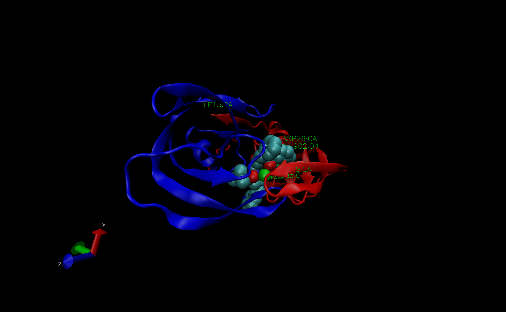

# 1: Introduction to the RCSB Protein Data Bank (PDB)

```{r}
Data_export_summary <- "Data Export Summary.csv"
PDB_statistics <- read.csv(Data_export_summary)
```

>Q1: What percentage of structures in the PDB are solved by X-Ray and Electron Microscopy.

```{r}
X_ray <- sum(PDB_statistics$X.ray)/ sum(PDB_statistics$Total)
EM <- sum(PDB_statistics$EM)/sum(PDB_statistics$Total)
```
```{r}
X_ray*100
```
```{r}
EM*100
```

or we can do all columns! 

>Q2: What proportion of structures in the PDB are protein? 

```{r}
PDB_statistics[1,]$Total/sum(PDB_statistics$Total)*100
```
>Q3: Type HIV in the PDB website search box on the home page and determine how many HIV-1 protease structures are in the current PDB?
structures in the current PDB.

## The PDB format

# 2. Visualizing the HIV-1 protease structure

## Using Atom Selections




> Q4: Water molecules normally have 3 atoms. Why do we see just one atom per water molecule in this structure?
  This is because the image is created by X-ray crystallography with 2A resolution, hydrogens are too small to be seen at this resolution. 

> Q5: There is a conserved water molecule in the binding site. Can you identify this water molecule? What residue number does this water molecule have (see note below)?
  residue number HOH308

> Discussion Topic: Can you think of a way in which indinavir, or even larger ligands and substrates, could enter the binding site?


# 3. Introduction to Bio3D in R

```{r}
library(bio3d)
```

## Reading PDB file data into R

```{r}
pdb <- read.pdb("1hel")
```
```{r}
pdb
```

> Q7: How many amino acid residues are there in this pdb object? 
129

> Q8: Name one of the two non-protein residues? 
185

> Q9: How many protein chains are in this structure? 
1

```{r}
attributes(pdb)
```
To access these individual attributes we use the dollar-attribute name convention that is common with R list objects. For example, to access the atom attribute or component use pdb$atom:

```{r}
head(pdb$atom)
```

```{r}
m <- nma(pdb)
plot(m)
```

```{r}
mktrj(m, file="nma.pdb")
```

