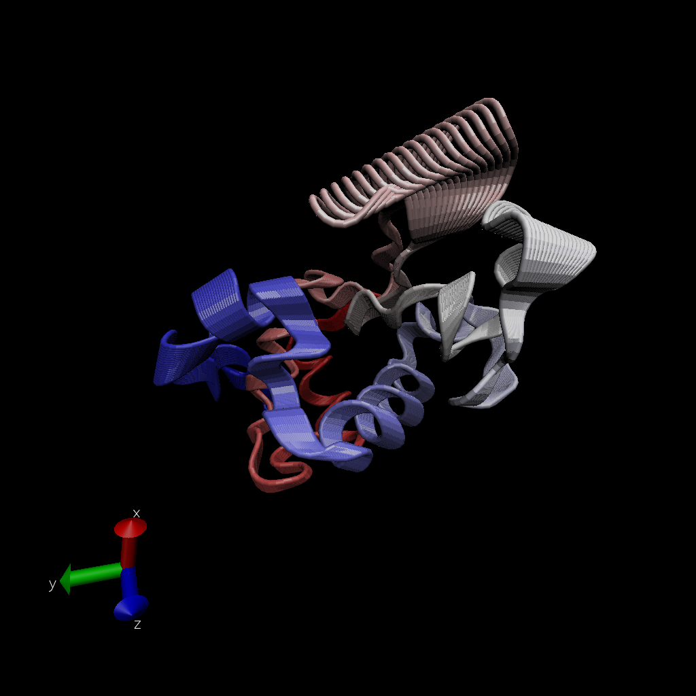

---
title: "Class11_02inclass"
author: 'San Luc (PID: A59010657)'
date: "11/5/2021"
output: html_document
---

# working with bio3d

```{r}
library(bio3d)

pdb <- read.pdb("1hel")
pdb
```

```{r}
head(pdb$atom)
```

let's do a quick bioinformatic prediction of protein dynamics
(flexibility)

```{r}
modes <-nma(pdb)
plot(modes)
```

```{r}
mktrj(modes, file = "nma.pdb")
```

image from VMD



Now we will take a sequence and search on the protein data bank, and
then we will receive the structures.

\#4. Comparative structure analysis of Adenylate Kinase

The goal of this section is to perform principal component analysis
(PCA) on the complete collection of Adenylate kinase structures in the
protein data-bank (PDB).

### Start getting a sequence of interest.

```{r}
library(bio3d)
aa <- get.seq("1ake_A")
aa
```

Searching in the PDB database (the main db for exp structures) for
sequences similar to the aa sequence.

```{r}
blast <- blast.pdb(aa)
```

```{r}
hits <- plot(blast)
```

now I have my top hits from the search in PDB, time to list out some
'top hits'

```{r}
hits$pdb.id
```

We can now use function get.pdb() and pdbslit() to fetch and parse the
identified structures.

```{r}
files <- get.pdb(hits$pdb.id, path="pdbs", split=TRUE, gzip=TRUE)
```

### Align and superpose structures

Now we want to align these structures

Next we will use the pdbaln() function to align and also optionally fit
(i.e. superpose) the identified PDB structures.

```{r}
#Align releated PDBs
pdbs <- pdbaln(files, fit = TRUE)#, exefile="msa")
```

```{r}
pdbs
```

create vector containing PDB codes for figure axis and draw schematic
alignment

```{r}
ids <- basename.pdb(pdbs$id)
plot(pdbs, labels=ids)
```

```{r}
pdbs$xyz
```

### Principal component analysis

Here we will do PCA on the coordinates data of all these structures. PCA
can be performed on the structural ensemble (stored in the pdbs object)
with pca().

```{r}
pc <- pca(pdbs)
plot(pc)
```

Let's visualize the displacement (i.e. movements of the structure) that are captured by PC1

```{r}
mktrj(pc, pc=1, file="pca.pdb")
```


Let's save our important results

```{r}
save(blast, hits, pca, pdbs, file="myresults.RData")
load("myresults.RData")
```


```{r}
rd <- rmsd(pdbs)
hc.rd <- hclust(dist(rd))
grps.rd <- cutree(hc.rd, k=3)
plot(pc.xray, 1:2, col="grey50", bg=grps.rd, pch=21, cex=1)
```
