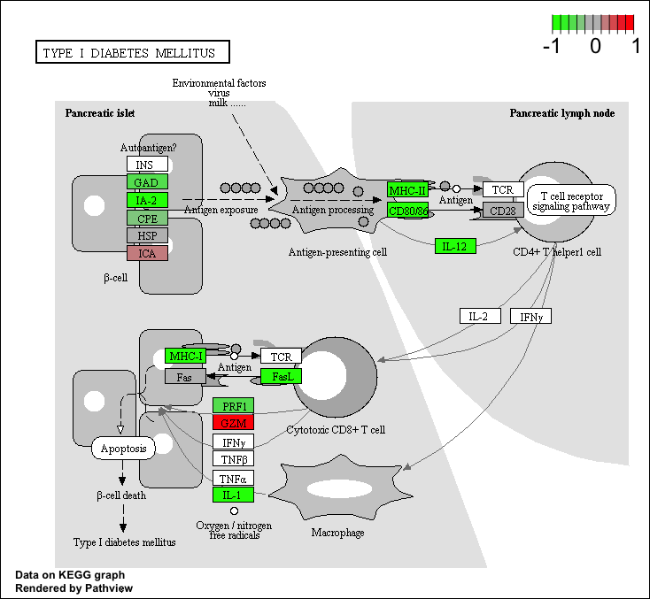

# Import countData and colData

### We need two things:
1. counts data 
2. colData (the metadata that tells us the experimental design.)
```{r}
counts <- read.csv("airway_scaledcounts.csv", row.names=1)
metadata <-  read.csv("airway_metadata.csv")
```

Now we can take a look at each file (maybe don't print the whole counts so we can use head just to have a few of them)

```{r}
head(counts)
```

To know the experimental design, look at metadata file.

```{r}
View(metadata)
```

Side note: let's check the correspondent of the metadata and the count data set up. 

```{r}
all(metadata$id == colnames(counts))

```

> Q1. How many genes are in this dataset? 

```{r}
nrow(counts)
```


> Q2. How many 'control' cell lines do we have?
4

# Toy differential gene expression

### Compare the control to the treated 

Firt we need to access all the control columns in our counts data.


```{r}
control.inds <- metadata$dex == "control"
control.ids <- metadata[control.inds,]$id
```

use these ids to access just the control column of our counts data. 

```{r}
head(counts[ ,control.ids])
```

To find the average value, we can use rowMeans

```{r}
control.mean <- rowMeans(counts[ ,control.ids])
head(control.mean)
```
> Q4. Follow the same procedure for the treated samples (i.e. calculate the mean per gene across drug treated samples and assign to a labeled vector called treated.mean)

```{r}
treated.inds <- metadata$dex == "treated"
treated.ids <- metadata[treated.inds,]$id
treated.mean <- rowMeans(counts[ ,treated.ids])
head(treated.mean)
```


### To combine our mean count data and compare control to treated 

```{r}
meancounts <- data.frame(control.mean, treated.mean)
```

There are `r nrow(counts)` genes in this dataset. 

> Q5 (a). Create a scatter plot showing the mean of the treated samples against the mean of the control samples. Your plot should look something like the following.

```{r}
plot(meancounts)
```

> Q6. Try plotting both axes on a log scale. What is the argument to plot() that allows you to do this? 

```{r}
plot(meancounts, log="xy")
```


### we can calculate the log2, since it is useful to visualize the fold change 

```{r}
log2(20/20)
```
```{r}
log2(40/20)
```
```{r}
log2(10/20)
```

```{r}
meancounts$log2fc <- log2(meancounts[,"treated.mean"]/meancounts[,"control.mean"])
head(meancounts)
```

#### There are a couple of “weird” results: NaN (“not a number”) and -Inf (negative infinity) results. We need to drop the zero counts. 

The which() function tells us the indices of TRUE entries in a logical vector 
However it is not too useful if we only use which without the arr.ind argument. 

```{r}
indices <- which(meancounts[,1:2]==0, arr.ind=TRUE)
head(indices)
```
We only care about the rows here, so if there is a zero in any column I will exclude this row eventually. 
```{r}
to.rm <- unique(sort(indices[,"row"]))
```
```{r}
mycounts <- (meancounts[-to.rm,])
```

We now have `r nrow(mycounts)` genes remaining. 

```{r}
nrow(mycounts)
```

### How many of these genes are up regulated at the log2 fold-chang threshold of +2 or greater? 

### Let’s filter the dataset both ways to see how many genes are up or down-regulated

Upregulated
```{r}
up.reg <- sum(mycounts$log2fc > 2)
up.reg
```
Percentage

```{r}
round(up.reg/nrow(mycounts)*100,2)
```

Downregulated 
```{r}
down.reg <- sum(mycounts$log2fc < (-2))
down.reg
```
Percentage 
```{r}
round(down.reg/nrow(mycounts)*100,2)
```


# DESeq2 analysis
```{r}
library(DESeq2)
```

```{r}
dds <- DESeqDataSetFromMatrix(countData=counts, 
                              colData=metadata, 
                              design=~dex)
dds
```

Run the DESeq analysis pipeline

```{r}
dds <- DESeq(dds)
```
```{r}
res <- results(dds)
head(res)
```

#A volcano plot 

this is a very common data visualization of this type of data that does not really look like a volcano

```{r}
plot(res$log2FoldChange,-log(res$padj))
abline(v=c(-2, 2), col= "gray")
abline(h=-log(0.05), col="gray")
```

Let's finally save our results to date. 

```{r}
write.csv(res, file = "allmyresult.csv")
```


```{r}
library("AnnotationDbi")
library("org.Hs.eg.db")
```

```{r}
columns(org.Hs.eg.db)
```


# Pathway analysis

let's try to bring some biology insight back into this work, for this we will start with KEGG

```{r message=FALSE}
library(pathview)
library(gage)
library(gageData)
```

```{r}
data(kegg.sets.hs)
```

```{r}
# Examine the first 2 pathways in this kegg set for humans
head(kegg.sets.hs, 2)
```
Before we can use KEGG we need to get our gene identifier in the correct format for KEGG, which is ENTREZ format in this case. 

```{r}
res$entrez <- mapIds(org.Hs.eg.db,
       keys = row.names(res),
       keytype = "ENSEMBL",
       column = "ENTREZID",
       MultiVals = "First")

res$genenames <- mapIds(org.Hs.eg.db,
       keys = row.names(res),
       keytype = "ENSEMBL",
       column = "GENENAME",
       MultiVals = "First")

```
assign names to this vector that are the gene IDs that KEGG wants 

```{r}
foldchanges = res$log2FoldChange
names(foldchanges) <- res$entrez
head(foldchanges)
```

Now we are ready for the **gage()** function

```{r}
keggres = gage(foldchanges, gsets=kegg.sets.hs)
```

We can look at the attributes() of this or indeed any R pbject 

```{r}
attributes(keggres)
```

```{r}
head(keggres$less,3)
```

```{r}
pathview(gene.data=foldchanges, pathway.id="hsa04940")
```

