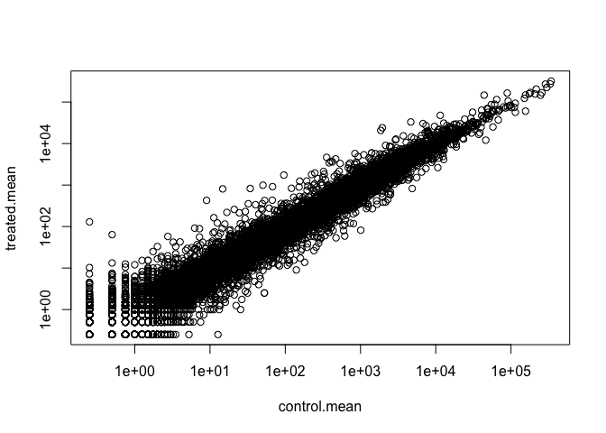

Class15\_RNAseq
================
San Luc (PID: A59010657)
11/17/2021

# Import countData and colData

### We need two things:

1.  counts data
2.  colData (the metadata that tells us the experimental design.)

``` r
counts <- read.csv("airway_scaledcounts.csv", row.names=1)
metadata <-  read.csv("airway_metadata.csv")
```

Now we can take a look at each file (maybe don’t print the whole counts
so we can use head just to have a few of them)

``` r
head(counts)
```

    ##                 SRR1039508 SRR1039509 SRR1039512 SRR1039513 SRR1039516
    ## ENSG00000000003        723        486        904        445       1170
    ## ENSG00000000005          0          0          0          0          0
    ## ENSG00000000419        467        523        616        371        582
    ## ENSG00000000457        347        258        364        237        318
    ## ENSG00000000460         96         81         73         66        118
    ## ENSG00000000938          0          0          1          0          2
    ##                 SRR1039517 SRR1039520 SRR1039521
    ## ENSG00000000003       1097        806        604
    ## ENSG00000000005          0          0          0
    ## ENSG00000000419        781        417        509
    ## ENSG00000000457        447        330        324
    ## ENSG00000000460         94        102         74
    ## ENSG00000000938          0          0          0

To know the experimental design, look at metadata file.

``` r
View(metadata)
```

Side note: let’s check the correspondent of the metadata and the count
data set up.

``` r
all(metadata$id == colnames(counts))
```

    ## [1] TRUE

> Q1. How many genes are in this dataset?

``` r
nrow(counts)
```

    ## [1] 38694

> Q2. How many ‘control’ cell lines do we have? 4

# Toy differential gene expression

### Compare the control to the treated

Firt we need to access all the control columns in our counts data.

``` r
control.inds <- metadata$dex == "control"
control.ids <- metadata[control.inds,]$id
```

use these ids to access just the control column of our counts data.

``` r
head(counts[ ,control.ids])
```

    ##                 SRR1039508 SRR1039512 SRR1039516 SRR1039520
    ## ENSG00000000003        723        904       1170        806
    ## ENSG00000000005          0          0          0          0
    ## ENSG00000000419        467        616        582        417
    ## ENSG00000000457        347        364        318        330
    ## ENSG00000000460         96         73        118        102
    ## ENSG00000000938          0          1          2          0

To find the average value, we can use rowMeans

``` r
control.mean <- rowMeans(counts[ ,control.ids])
head(control.mean)
```

    ## ENSG00000000003 ENSG00000000005 ENSG00000000419 ENSG00000000457 ENSG00000000460 
    ##          900.75            0.00          520.50          339.75           97.25 
    ## ENSG00000000938 
    ##            0.75

> Q4. Follow the same procedure for the treated samples (i.e. calculate
> the mean per gene across drug treated samples and assign to a labeled
> vector called treated.mean)

``` r
treated.inds <- metadata$dex == "treated"
treated.ids <- metadata[treated.inds,]$id
treated.mean <- rowMeans(counts[ ,treated.ids])
head(treated.mean)
```

    ## ENSG00000000003 ENSG00000000005 ENSG00000000419 ENSG00000000457 ENSG00000000460 
    ##          658.00            0.00          546.00          316.50           78.75 
    ## ENSG00000000938 
    ##            0.00

### To combine our mean count data and compare control to treated

``` r
meancounts <- data.frame(control.mean, treated.mean)
```

There are 38694 genes in this dataset.

> Q5 (a). Create a scatter plot showing the mean of the treated samples
> against the mean of the control samples. Your plot should look
> something like the following.

``` r
plot(meancounts)
```

<!-- -->

> Q6. Try plotting both axes on a log scale. What is the argument to
> plot() that allows you to do this?

``` r
plot(meancounts, log="xy")
```

    ## Warning in xy.coords(x, y, xlabel, ylabel, log): 15032 x values <= 0 omitted
    ## from logarithmic plot

    ## Warning in xy.coords(x, y, xlabel, ylabel, log): 15281 y values <= 0 omitted
    ## from logarithmic plot

<!-- -->

### we can calculate the log2, since it is useful to visualize the fold change

``` r
log2(20/20)
```

    ## [1] 0

``` r
log2(40/20)
```

    ## [1] 1

``` r
log2(10/20)
```

    ## [1] -1

``` r
meancounts$log2fc <- log2(meancounts[,"treated.mean"]/meancounts[,"control.mean"])
head(meancounts)
```

    ##                 control.mean treated.mean      log2fc
    ## ENSG00000000003       900.75       658.00 -0.45303916
    ## ENSG00000000005         0.00         0.00         NaN
    ## ENSG00000000419       520.50       546.00  0.06900279
    ## ENSG00000000457       339.75       316.50 -0.10226805
    ## ENSG00000000460        97.25        78.75 -0.30441833
    ## ENSG00000000938         0.75         0.00        -Inf

#### There are a couple of “weird” results: NaN (“not a number”) and -Inf (negative infinity) results. We need to drop the zero counts.

The which() function tells us the indices of TRUE entries in a logical
vector However it is not too useful if we only use which without the
arr.ind argument.

``` r
indices <- which(meancounts[,1:2]==0, arr.ind=TRUE)
head(indices)
```

    ##                 row col
    ## ENSG00000000005   2   1
    ## ENSG00000004848  65   1
    ## ENSG00000004948  70   1
    ## ENSG00000005001  73   1
    ## ENSG00000006059 121   1
    ## ENSG00000006071 123   1

We only care about the rows here, so if there is a zero in any column I
will exclude this row eventually.

``` r
to.rm <- unique(sort(indices[,"row"]))
```

``` r
mycounts <- (meancounts[-to.rm,])
```

We now have 21817 genes remaining.

``` r
nrow(mycounts)
```

    ## [1] 21817

### How many of these genes are up regulated at the log2 fold-chang threshold of +2 or greater?

### Let’s filter the dataset both ways to see how many genes are up or down-regulated

Upregulated

``` r
up.reg <- sum(mycounts$log2fc > 2)
up.reg
```

    ## [1] 250

Percentage

``` r
round(up.reg/nrow(mycounts)*100,2)
```

    ## [1] 1.15

Downregulated

``` r
down.reg <- sum(mycounts$log2fc < (-2))
down.reg
```

    ## [1] 367

Percentage

``` r
round(down.reg/nrow(mycounts)*100,2)
```

    ## [1] 1.68

# DESeq2 analysis

``` r
library(DESeq2)
```

    ## Loading required package: S4Vectors

    ## Loading required package: stats4

    ## Loading required package: BiocGenerics

    ## 
    ## Attaching package: 'BiocGenerics'

    ## The following objects are masked from 'package:stats':
    ## 
    ##     IQR, mad, sd, var, xtabs

    ## The following objects are masked from 'package:base':
    ## 
    ##     anyDuplicated, append, as.data.frame, basename, cbind, colnames,
    ##     dirname, do.call, duplicated, eval, evalq, Filter, Find, get, grep,
    ##     grepl, intersect, is.unsorted, lapply, Map, mapply, match, mget,
    ##     order, paste, pmax, pmax.int, pmin, pmin.int, Position, rank,
    ##     rbind, Reduce, rownames, sapply, setdiff, sort, table, tapply,
    ##     union, unique, unsplit, which.max, which.min

    ## 
    ## Attaching package: 'S4Vectors'

    ## The following objects are masked from 'package:base':
    ## 
    ##     expand.grid, I, unname

    ## Loading required package: IRanges

    ## Loading required package: GenomicRanges

    ## Loading required package: GenomeInfoDb

    ## Loading required package: SummarizedExperiment

    ## Loading required package: MatrixGenerics

    ## Loading required package: matrixStats

    ## 
    ## Attaching package: 'MatrixGenerics'

    ## The following objects are masked from 'package:matrixStats':
    ## 
    ##     colAlls, colAnyNAs, colAnys, colAvgsPerRowSet, colCollapse,
    ##     colCounts, colCummaxs, colCummins, colCumprods, colCumsums,
    ##     colDiffs, colIQRDiffs, colIQRs, colLogSumExps, colMadDiffs,
    ##     colMads, colMaxs, colMeans2, colMedians, colMins, colOrderStats,
    ##     colProds, colQuantiles, colRanges, colRanks, colSdDiffs, colSds,
    ##     colSums2, colTabulates, colVarDiffs, colVars, colWeightedMads,
    ##     colWeightedMeans, colWeightedMedians, colWeightedSds,
    ##     colWeightedVars, rowAlls, rowAnyNAs, rowAnys, rowAvgsPerColSet,
    ##     rowCollapse, rowCounts, rowCummaxs, rowCummins, rowCumprods,
    ##     rowCumsums, rowDiffs, rowIQRDiffs, rowIQRs, rowLogSumExps,
    ##     rowMadDiffs, rowMads, rowMaxs, rowMeans2, rowMedians, rowMins,
    ##     rowOrderStats, rowProds, rowQuantiles, rowRanges, rowRanks,
    ##     rowSdDiffs, rowSds, rowSums2, rowTabulates, rowVarDiffs, rowVars,
    ##     rowWeightedMads, rowWeightedMeans, rowWeightedMedians,
    ##     rowWeightedSds, rowWeightedVars

    ## Loading required package: Biobase

    ## Welcome to Bioconductor
    ## 
    ##     Vignettes contain introductory material; view with
    ##     'browseVignettes()'. To cite Bioconductor, see
    ##     'citation("Biobase")', and for packages 'citation("pkgname")'.

    ## 
    ## Attaching package: 'Biobase'

    ## The following object is masked from 'package:MatrixGenerics':
    ## 
    ##     rowMedians

    ## The following objects are masked from 'package:matrixStats':
    ## 
    ##     anyMissing, rowMedians

``` r
dds <- DESeqDataSetFromMatrix(countData=counts, 
                              colData=metadata, 
                              design=~dex)
```

    ## converting counts to integer mode

    ## Warning in DESeqDataSet(se, design = design, ignoreRank): some variables in
    ## design formula are characters, converting to factors

``` r
dds
```

    ## class: DESeqDataSet 
    ## dim: 38694 8 
    ## metadata(1): version
    ## assays(1): counts
    ## rownames(38694): ENSG00000000003 ENSG00000000005 ... ENSG00000283120
    ##   ENSG00000283123
    ## rowData names(0):
    ## colnames(8): SRR1039508 SRR1039509 ... SRR1039520 SRR1039521
    ## colData names(4): id dex celltype geo_id

Run the DESeq analysis pipeline

``` r
dds <- DESeq(dds)
```

    ## estimating size factors

    ## estimating dispersions

    ## gene-wise dispersion estimates

    ## mean-dispersion relationship

    ## final dispersion estimates

    ## fitting model and testing

``` r
res <- results(dds)
head(res)
```

    ## log2 fold change (MLE): dex treated vs control 
    ## Wald test p-value: dex treated vs control 
    ## DataFrame with 6 rows and 6 columns
    ##                   baseMean log2FoldChange     lfcSE      stat    pvalue
    ##                  <numeric>      <numeric> <numeric> <numeric> <numeric>
    ## ENSG00000000003 747.194195     -0.3507030  0.168246 -2.084470 0.0371175
    ## ENSG00000000005   0.000000             NA        NA        NA        NA
    ## ENSG00000000419 520.134160      0.2061078  0.101059  2.039475 0.0414026
    ## ENSG00000000457 322.664844      0.0245269  0.145145  0.168982 0.8658106
    ## ENSG00000000460  87.682625     -0.1471420  0.257007 -0.572521 0.5669691
    ## ENSG00000000938   0.319167     -1.7322890  3.493601 -0.495846 0.6200029
    ##                      padj
    ##                 <numeric>
    ## ENSG00000000003  0.163035
    ## ENSG00000000005        NA
    ## ENSG00000000419  0.176032
    ## ENSG00000000457  0.961694
    ## ENSG00000000460  0.815849
    ## ENSG00000000938        NA

\#A volcano plot

this is a very common data visualization of this type of data that does
not really look like a volcano

``` r
plot(res$log2FoldChange,-log(res$padj))
abline(v=c(-2, 2), col= "gray")
abline(h=-log(0.05), col="gray")
```

<!-- -->

Let’s finally save our results to date.

``` r
write.csv(res, file = "allmyresult.csv")
```

``` r
library("AnnotationDbi")
```

    ## Warning: package 'AnnotationDbi' was built under R version 4.1.2

``` r
library("org.Hs.eg.db")
```

    ## 

``` r
columns(org.Hs.eg.db)
```

    ##  [1] "ACCNUM"       "ALIAS"        "ENSEMBL"      "ENSEMBLPROT"  "ENSEMBLTRANS"
    ##  [6] "ENTREZID"     "ENZYME"       "EVIDENCE"     "EVIDENCEALL"  "GENENAME"    
    ## [11] "GENETYPE"     "GO"           "GOALL"        "IPI"          "MAP"         
    ## [16] "OMIM"         "ONTOLOGY"     "ONTOLOGYALL"  "PATH"         "PFAM"        
    ## [21] "PMID"         "PROSITE"      "REFSEQ"       "SYMBOL"       "UCSCKG"      
    ## [26] "UNIPROT"

# Pathway analysis

let’s try to bring some biology insight back into this work, for this we
will start with KEGG

``` r
library(pathview)
library(gage)
library(gageData)
```

``` r
data(kegg.sets.hs)
```

``` r
# Examine the first 2 pathways in this kegg set for humans
head(kegg.sets.hs, 2)
```

    ## $`hsa00232 Caffeine metabolism`
    ## [1] "10"   "1544" "1548" "1549" "1553" "7498" "9"   
    ## 
    ## $`hsa00983 Drug metabolism - other enzymes`
    ##  [1] "10"     "1066"   "10720"  "10941"  "151531" "1548"   "1549"   "1551"  
    ##  [9] "1553"   "1576"   "1577"   "1806"   "1807"   "1890"   "221223" "2990"  
    ## [17] "3251"   "3614"   "3615"   "3704"   "51733"  "54490"  "54575"  "54576" 
    ## [25] "54577"  "54578"  "54579"  "54600"  "54657"  "54658"  "54659"  "54963" 
    ## [33] "574537" "64816"  "7083"   "7084"   "7172"   "7363"   "7364"   "7365"  
    ## [41] "7366"   "7367"   "7371"   "7372"   "7378"   "7498"   "79799"  "83549" 
    ## [49] "8824"   "8833"   "9"      "978"

Before we can use KEGG we need to get our gene identifier in the correct
format for KEGG, which is ENTREZ format in this case.

``` r
res$entrez <- mapIds(org.Hs.eg.db,
       keys = row.names(res),
       keytype = "ENSEMBL",
       column = "ENTREZID",
       MultiVals = "First")
```

    ## 'select()' returned 1:many mapping between keys and columns

``` r
res$genenames <- mapIds(org.Hs.eg.db,
       keys = row.names(res),
       keytype = "ENSEMBL",
       column = "GENENAME",
       MultiVals = "First")
```

    ## 'select()' returned 1:many mapping between keys and columns

assign names to this vector that are the gene IDs that KEGG wants

``` r
foldchanges = res$log2FoldChange
names(foldchanges) <- res$entrez
head(foldchanges)
```

    ##        7105       64102        8813       57147       55732        2268 
    ## -0.35070302          NA  0.20610777  0.02452695 -0.14714205 -1.73228897

Now we are ready for the **gage()** function

``` r
keggres = gage(foldchanges, gsets=kegg.sets.hs)
```

We can look at the attributes() of this or indeed any R pbject

``` r
attributes(keggres)
```

    ## $names
    ## [1] "greater" "less"    "stats"

``` r
head(keggres$less,3)
```

    ##                                       p.geomean stat.mean        p.val
    ## hsa05332 Graft-versus-host disease 0.0004250461 -3.473346 0.0004250461
    ## hsa04940 Type I diabetes mellitus  0.0017820293 -3.002352 0.0017820293
    ## hsa05310 Asthma                    0.0020045888 -3.009050 0.0020045888
    ##                                         q.val set.size         exp1
    ## hsa05332 Graft-versus-host disease 0.09053483       40 0.0004250461
    ## hsa04940 Type I diabetes mellitus  0.14232581       42 0.0017820293
    ## hsa05310 Asthma                    0.14232581       29 0.0020045888

``` r
pathview(gene.data=foldchanges, pathway.id="hsa04940")
```

    ## 'select()' returned 1:1 mapping between keys and columns

    ## Info: Working in directory /Users/sanluc/Desktop/Fall2021/BGGN213/class7/bggn213/Class15

    ## Info: Writing image file hsa04940.pathview.png


