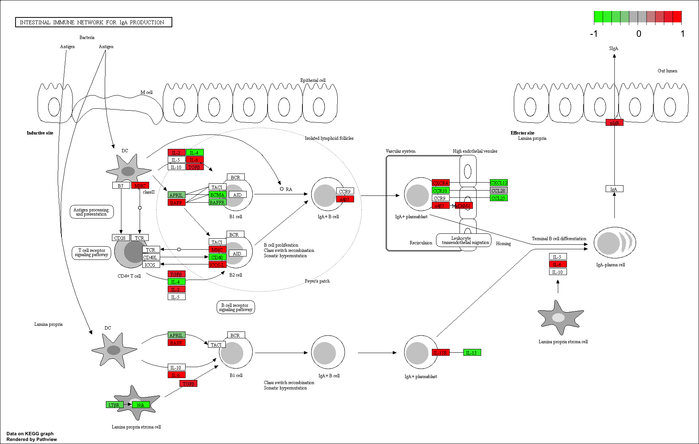
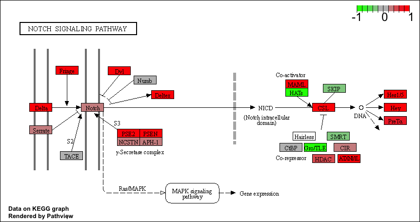
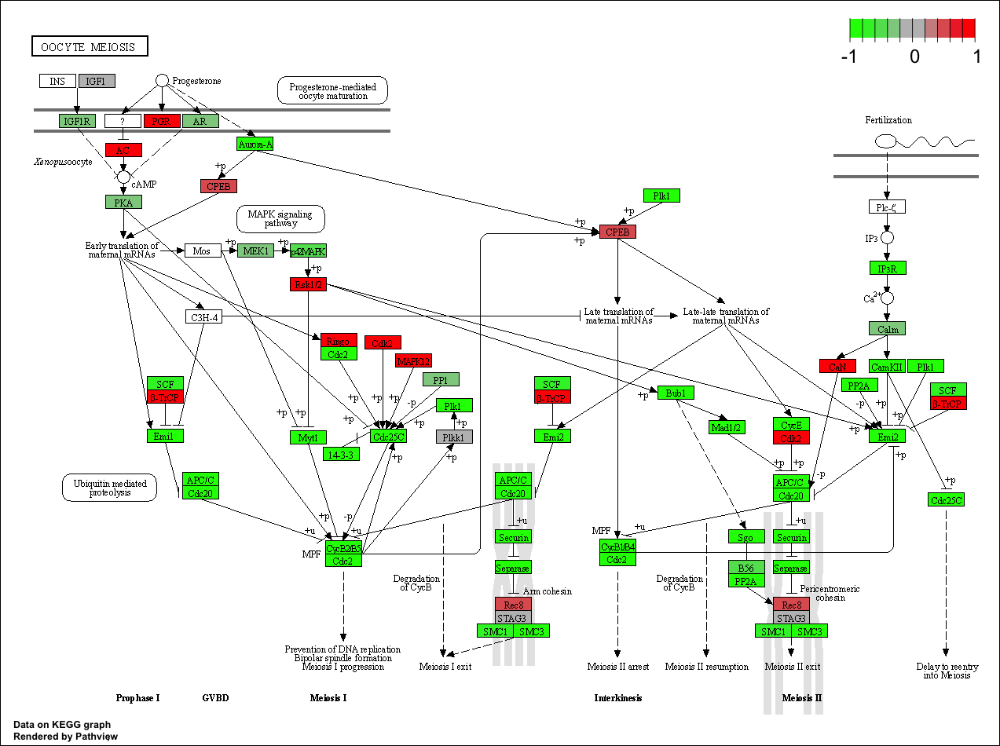

```{r}
library(DESeq2)
```

```{r}
metaFile <- "GSE37704_metadata.csv"
countFile <- "GSE37704_featurecounts.csv"
colData = read.csv(metaFile, row.names=1)
head(colData)
```
```{r}
countData = read.csv(countFile, row.names=1)
head(countData)
```

we need the countData and colData files to match up so we will need to remove that odd first column in countData. 

```{r}
countData <- as.matrix(countData[,-1])
head(countData)
```
Q. Complete the code below to filter countData to exclude genes (i.e. rows) where we have 0 read count across all samples (i.e. columns).

Tip: What will rowSums() of countData return and how could you use it in this context?

```{r}
countData = countData[which(rowSums(countData) != 0), ]
head(countData)
```
# PCA 
```{r}
pca <- prcomp(t(countData))
summary(pca)
```
plot

```{r}
plot(pca$x[, 1:2])
```

```{r}
plot(pca$x[,1:2], pch = 16, col = as.factor(colData$condition))
text(pca$x[,1:2], labels= colData$condition)
```


# Running DESeq2

```{r}
dds = DESeqDataSetFromMatrix(countData=countData,
                             colData=colData,
                             design=~condition)
dds = DESeq(dds)
```

```{r}
dds
res = results(dds)
```
```{r}
summary(res)
```

# Volcono plot

```{r}
plot( res$log2FoldChange, -log(res$padj) )
```


```{r}
# Make a color vector for all genes
mycols <- rep("gray", nrow(res) )

# Color red the genes with absolute fold change above 2
mycols[ abs(res$log2FoldChange) > 2 ] <- "red"

# Color blue those with adjusted p-value less than 0.01
#  and absolute fold change more than 2
inds <- (res$padj < 0.01) & (abs(res$log2FoldChange) > 2 )
mycols[ inds ] <- "blue"

plot( res$log2FoldChange, -log(res$padj), col= mycols, xlab="Log2(FoldChange)", ylab="-Log(P-value)" )
```

# Adding gene annotation

```{r}
library("AnnotationDbi")
library("org.Hs.eg.db")

columns(org.Hs.eg.db)

res$symbol = mapIds(org.Hs.eg.db,
                    keys= row.names(res), 
                    keytype="ENSEMBL",
                    column="SYMBOL",
                    multiVals="first")

res$entrez = mapIds(org.Hs.eg.db,
                    keys= row.names(res), 
                    keytype="ENSEMBL",
                    column="ENTREZID",
                    multiVals="first")

res$name= mapIds(org.Hs.eg.db,
                    keys= row.names(res), 
                    keytype="ENSEMBL",
                    column="GENENAME",
                    multiVals="first")

head(res, 10)
```

```{r}
res = res[order(res$pvalue),]
write.csv(res , file ="deseq_results.csv")
```

# Pathway Analysis

```{r}
library(pathview)
```

```{r}
library(gage)
library(gageData)

data(kegg.sets.hs)
data(sigmet.idx.hs)

```

```{r}
kegg.sets.hs = kegg.sets.hs[sigmet.idx.hs]
```

```{r}
head(kegg.sets.hs, 3)
```

```{r}
foldchanges = res$log2FoldChange
names(foldchanges) = res$entrez
head(foldchanges)
```

```{r}
keggres = gage(foldchanges, gsets=kegg.sets.hs)
```


```{r}
attributes(keggres)
```

```{r}
head(keggres$greater)
```

```{r}
pathview(gene.data=foldchanges, pathway.id="04672")
```


> Now, let's process our results a bit more to automatically pull out the top 5 upregulated pathways, then further process that just to get the pathway IDs needed by the pathview() function. We'll use these KEGG pathway IDs for pathview plotting below 

```{r}
head(keggres$less)
```

```{r}
keggrespathways <- rownames(keggres$greater)[1:5]
keggresids = substr(keggrespathways, start=1, stop=8)
keggresids
```
Finally, lets pass these IDs in keggresids to the pathview() function to draw plots for all the top 5 pathways.

```{r}
pathview(gene.data=foldchanges, pathway.id=keggresids, species="hsa")
```



```{r}
keggresless<- rownames(keggres$less)[1:5]
keggresless = substr(keggresless, start=1, stop=8)
keggresless
```

```{r}
pathview(gene.data=foldchanges, pathway.id=keggresless, species="hsa")
```



# Gene Ontology (GO)
```{r}
data(go.sets.hs)
data(go.subs.hs)
gobpsets = go.sets.hs[go.subs.hs$BP]
gobpres = gage(foldchanges, gsets=gobpsets, same.dir=TRUE)
lapply(gobpres, head)
```

# Reactome Analysis

```{r}
sig_genes <- res[res$padj <= 0.05 & !is.na(res$padj), "symbol"]
print(paste("Total number of significant genes:", length(sig_genes)))
```

```{r}
write.table(sig_genes, file="significant_genes.txt", row.names=FALSE, col.names=FALSE, quote=FALSE)
```


```{r}
head(keggres$greater)
```


> Q: What pathway has the most significant “Entities p-value”? Do the most significant pathways listed match your previous KEGG results? What factors could cause differences between the two methods? Endosomal/Vacuolar Pathway. KEGG results shows quite similar resutls, but since the term is a little broader in the GO and the result of KEGG is more specific, so its harder to compare the two. 


