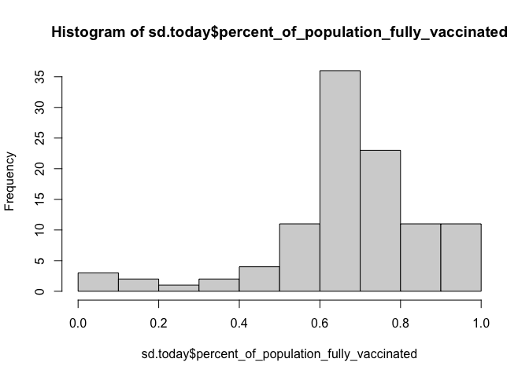
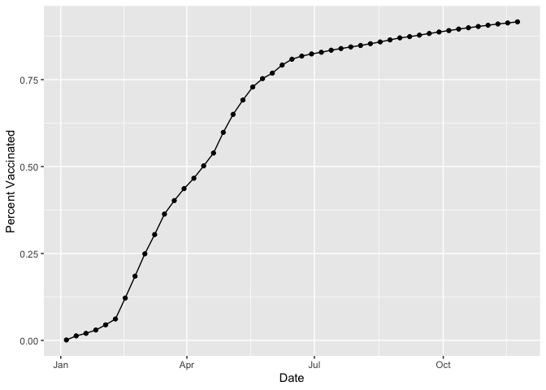
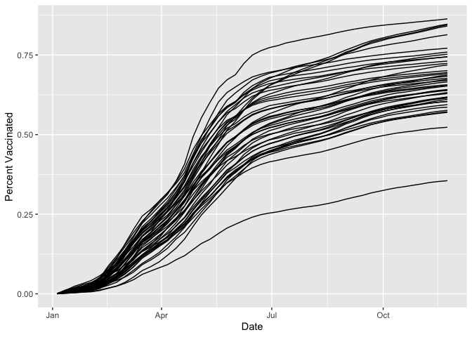
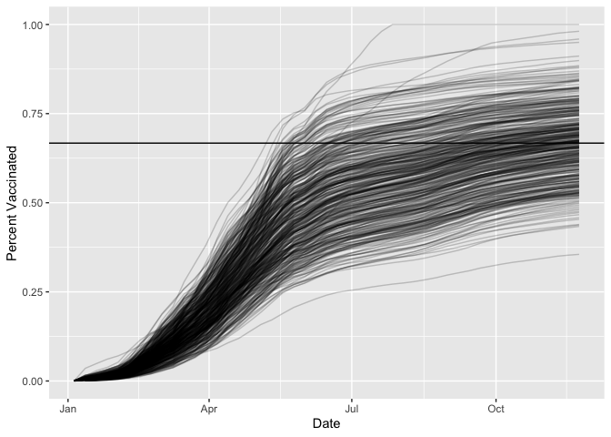

Class17\_Vaccine
================
San Luc (PID: A59010657)
11/24/2021

First we need to import the vaccine file

``` r
vax <- read.csv("covid19vaccinesbyzipcode_test.csv")
head(vax)
```

    ##   as_of_date zip_code_tabulation_area local_health_jurisdiction         county
    ## 1 2021-01-05                    92395            San Bernardino San Bernardino
    ## 2 2021-01-05                    93206                      Kern           Kern
    ## 3 2021-01-05                    91006               Los Angeles    Los Angeles
    ## 4 2021-01-05                    91901                 San Diego      San Diego
    ## 5 2021-01-05                    92230                 Riverside      Riverside
    ## 6 2021-01-05                    92662                    Orange         Orange
    ##   vaccine_equity_metric_quartile                 vem_source
    ## 1                              1 Healthy Places Index Score
    ## 2                              1 Healthy Places Index Score
    ## 3                              3 Healthy Places Index Score
    ## 4                              3 Healthy Places Index Score
    ## 5                              1 Healthy Places Index Score
    ## 6                              4 Healthy Places Index Score
    ##   age12_plus_population age5_plus_population persons_fully_vaccinated
    ## 1               35915.3                40888                       NA
    ## 2                1237.5                 1521                       NA
    ## 3               28742.7                31347                       19
    ## 4               15549.8                16905                       12
    ## 5                2320.2                 2526                       NA
    ## 6                2349.5                 2397                       NA
    ##   persons_partially_vaccinated percent_of_population_fully_vaccinated
    ## 1                           NA                                     NA
    ## 2                           NA                                     NA
    ## 3                          873                               0.000606
    ## 4                          271                               0.000710
    ## 5                           NA                                     NA
    ## 6                           NA                                     NA
    ##   percent_of_population_partially_vaccinated
    ## 1                                         NA
    ## 2                                         NA
    ## 3                                   0.027850
    ## 4                                   0.016031
    ## 5                                         NA
    ## 6                                         NA
    ##   percent_of_population_with_1_plus_dose
    ## 1                                     NA
    ## 2                                     NA
    ## 3                               0.028456
    ## 4                               0.016741
    ## 5                                     NA
    ## 6                                     NA
    ##                                                                redacted
    ## 1 Information redacted in accordance with CA state privacy requirements
    ## 2 Information redacted in accordance with CA state privacy requirements
    ## 3                                                                    No
    ## 4                                                                    No
    ## 5 Information redacted in accordance with CA state privacy requirements
    ## 6 Information redacted in accordance with CA state privacy requirements

> How many entries are in this dataset?

``` r
nrow(vax)
```

    ## [1] 82908

## Let’s use the skimr package and skim() function to get a quick overview of the structure of this dataset.

``` r
skimr::skim(vax)
```

|                                                  |       |
|:-------------------------------------------------|:------|
| Name                                             | vax   |
| Number of rows                                   | 82908 |
| Number of columns                                | 14    |
| \_\_\_\_\_\_\_\_\_\_\_\_\_\_\_\_\_\_\_\_\_\_\_   |       |
| Column type frequency:                           |       |
| character                                        | 5     |
| numeric                                          | 9     |
| \_\_\_\_\_\_\_\_\_\_\_\_\_\_\_\_\_\_\_\_\_\_\_\_ |       |
| Group variables                                  | None  |

Data summary

**Variable type: character**

| skim\_variable              | n\_missing | complete\_rate | min | max | empty | n\_unique | whitespace |
|:----------------------------|-----------:|---------------:|----:|----:|------:|----------:|-----------:|
| as\_of\_date                |          0 |              1 |  10 |  10 |     0 |        47 |          0 |
| local\_health\_jurisdiction |          0 |              1 |   0 |  15 |   235 |        62 |          0 |
| county                      |          0 |              1 |   0 |  15 |   235 |        59 |          0 |
| vem\_source                 |          0 |              1 |  15 |  26 |     0 |         3 |          0 |
| redacted                    |          0 |              1 |   2 |  69 |     0 |         2 |          0 |

**Variable type: numeric**

| skim\_variable                                 | n\_missing | complete\_rate |     mean |       sd |    p0 |      p25 |      p50 |      p75 |     p100 | hist  |
|:-----------------------------------------------|-----------:|---------------:|---------:|---------:|------:|---------:|---------:|---------:|---------:|:------|
| zip\_code\_tabulation\_area                    |          0 |           1.00 | 93665.11 |  1817.39 | 90001 | 92257.75 | 93658.50 | 95380.50 |  97635.0 | ▃▅▅▇▁ |
| vaccine\_equity\_metric\_quartile              |       4089 |           0.95 |     2.44 |     1.11 |     1 |     1.00 |     2.00 |     3.00 |      4.0 | ▇▇▁▇▇ |
| age12\_plus\_population                        |          0 |           1.00 | 18895.04 | 18993.94 |     0 |  1346.95 | 13685.10 | 31756.12 |  88556.7 | ▇▃▂▁▁ |
| age5\_plus\_population                         |          0 |           1.00 | 20875.24 | 21106.04 |     0 |  1460.50 | 15364.00 | 34877.00 | 101902.0 | ▇▃▂▁▁ |
| persons\_fully\_vaccinated                     |       8355 |           0.90 |  9585.35 | 11609.12 |    11 |   516.00 |  4210.00 | 16095.00 |  71219.0 | ▇▂▁▁▁ |
| persons\_partially\_vaccinated                 |       8355 |           0.90 |  1894.87 |  2105.55 |    11 |   198.00 |  1269.00 |  2880.00 |  20159.0 | ▇▁▁▁▁ |
| percent\_of\_population\_fully\_vaccinated     |       8355 |           0.90 |     0.43 |     0.27 |     0 |     0.20 |     0.44 |     0.63 |      1.0 | ▇▆▇▆▂ |
| percent\_of\_population\_partially\_vaccinated |       8355 |           0.90 |     0.10 |     0.10 |     0 |     0.06 |     0.07 |     0.11 |      1.0 | ▇▁▁▁▁ |
| percent\_of\_population\_with\_1\_plus\_dose   |       8355 |           0.90 |     0.51 |     0.26 |     0 |     0.31 |     0.53 |     0.71 |      1.0 | ▅▅▇▇▃ |

We can also do library() and than call the function directly, but since
we are using this function only once, we can do skimr:: to use the
skim() function as well.

We notice that one of the column is a date column, and working with time
and dates get annoying quickly. We can use the package called lubridate
to help us.

``` r
library(lubridate)
```

    ## 
    ## Attaching package: 'lubridate'

    ## The following objects are masked from 'package:base':
    ## 
    ##     date, intersect, setdiff, union

``` r
today()
```

    ## [1] "2021-12-03"

let’s answer the question how many dates since the first entry and the
dataset.

First we should access the first row of column as of date

``` r
vax$as_of_date[1]
```

    ## [1] "2021-01-05"

However this kind of date is read as column, so we need to change it
into something else.

``` r
d <- ymd(vax$as_of_date)
```

We now has changed the date column into something we can use (not
character)

``` r
today()- d[1]
```

    ## Time difference of 332 days

To make things simpler, we can also overwrite the data set to the needed
format.

``` r
vax$as_of_date <- ymd(vax$as_of_date)
```

> Q. When was the dataset updated? what its is the last date in this
> dataset? how many days since the last update?

First lets access the last entry in the as of date column

``` r
vax$as_of_date[nrow(vax)]
```

    ## [1] "2021-11-23"

then we do the math

``` r
today() - vax$as_of_date[nrow(vax)]
```

    ## Time difference of 10 days

> Q. How many days does the data set span?

``` r
vax$as_of_date[nrow(vax)] - vax$as_of_date[1]
```

    ## Time difference of 322 days

> Q. How many different ZIP code areas are there?

What we can do is to use the unique() function and then count them using
length()

``` r
zip <- as.factor(unique(vax$zip_code_tabulation_area))
length(zip)
```

    ## [1] 1764

To work with ZIP codes, we can use the package called zipcodeR

To download we this package we use install.packages(“zipcodeR”,
dependencies = TRUE)

``` r
library(zipcodeR)
```

we can pull census data about ZIP code areas (including median household
income etc.)

``` r
reverse_zipcode(c('92037', "92109") )
```

    ## # A tibble: 2 × 24
    ##   zipcode zipcode_type major_city post_office_city common_city_list county state
    ##   <chr>   <chr>        <chr>      <chr>                      <blob> <chr>  <chr>
    ## 1 92037   Standard     La Jolla   La Jolla, CA           <raw 20 B> San D… CA   
    ## 2 92109   Standard     San Diego  San Diego, CA          <raw 21 B> San D… CA   
    ## # … with 17 more variables: lat <dbl>, lng <dbl>, timezone <chr>,
    ## #   radius_in_miles <dbl>, area_code_list <blob>, population <int>,
    ## #   population_density <dbl>, land_area_in_sqmi <dbl>,
    ## #   water_area_in_sqmi <dbl>, housing_units <int>,
    ## #   occupied_housing_units <int>, median_home_value <int>,
    ## #   median_household_income <int>, bounds_west <dbl>, bounds_east <dbl>,
    ## #   bounds_north <dbl>, bounds_south <dbl>

Let’s put this aside and look at something else more interesting.

Let’s focus onto San Diego County. We want to subset the full CA vax
dataset down to just San Diego County.

We could do this with base R.

``` r
inds <- vax$county == "San Diego"
nrow(vax[inds,])
```

    ## [1] 5029

However, sub-setting can get tedious and complicated quickly when you
have multiple things we want to subset by.

So we gonna use the package called dplyr

``` r
library(dplyr)
```

    ## 
    ## Attaching package: 'dplyr'

    ## The following objects are masked from 'package:stats':
    ## 
    ##     filter, lag

    ## The following objects are masked from 'package:base':
    ## 
    ##     intersect, setdiff, setequal, union

let’s use the filter() function to do our subsetting from now on as it
is more straighforward.

we want to focus in on San Diego County

``` r
sd <- filter(vax, county == "San Diego")
nrow(sd)
```

    ## [1] 5029

More complicated subsetting

``` r
sd.20 <- filter(vax, county == "San Diego",
                age5_plus_population > 20000)
nrow(sd.20)
```

    ## [1] 3055

``` r
sd.today <- filter(vax, county=="San Diego",
                   as_of_date=="2021-11-23")
```

``` r
summary((sd.today$percent_of_population_fully_vaccinated))
```

    ##    Min. 1st Qu.  Median    Mean 3rd Qu.    Max.    NA's 
    ## 0.01017 0.61301 0.67965 0.67400 0.76932 1.00000       3

Let’s make the histogram of these values

We can use baseR histogram

``` r
hist(sd.today$percent_of_population_fully_vaccinated)
```

<!-- -->

let’s look at data from La jolla (our school)

this plot is susceptible to being skewed by ZIP code with small
population.

> Q. what is the population of the 92037 ZIP code area?

``` r
sd.lajolla <- filter(sd.today, zip_code_tabulation_area == "92037")
sd.lajolla
```

    ##   as_of_date zip_code_tabulation_area local_health_jurisdiction    county
    ## 1 2021-11-23                    92037                 San Diego San Diego
    ##   vaccine_equity_metric_quartile                 vem_source
    ## 1                              4 Healthy Places Index Score
    ##   age12_plus_population age5_plus_population persons_fully_vaccinated
    ## 1               33675.6                36144                    33115
    ##   persons_partially_vaccinated percent_of_population_fully_vaccinated
    ## 1                         7660                               0.916196
    ##   percent_of_population_partially_vaccinated
    ## 1                                    0.21193
    ##   percent_of_population_with_1_plus_dose redacted
    ## 1                                      1       No

``` r
sd.lajolla$age5_plus_population
```

    ## [1] 36144

``` r
round(sd.lajolla$percent_of_population_fully_vaccinated, 2)
```

    ## [1] 0.92

> Q.let’s look at the 92122 ZIP code

``` r
sd.costeverde <- filter(sd.today, zip_code_tabulation_area == "92122")
sd.costeverde
```

    ##   as_of_date zip_code_tabulation_area local_health_jurisdiction    county
    ## 1 2021-11-23                    92122                 San Diego San Diego
    ##   vaccine_equity_metric_quartile                 vem_source
    ## 1                              4 Healthy Places Index Score
    ##   age12_plus_population age5_plus_population persons_fully_vaccinated
    ## 1               44091.1                45951                    35450
    ##   persons_partially_vaccinated percent_of_population_fully_vaccinated
    ## 1                         6164                               0.771474
    ##   percent_of_population_partially_vaccinated
    ## 1                                   0.134143
    ##   percent_of_population_with_1_plus_dose redacted
    ## 1                               0.905617       No

``` r
sd.costeverde$age5_plus_population
```

    ## [1] 45951

``` r
round(sd.costeverde$percent_of_population_fully_vaccinated, 2)
```

    ## [1] 0.77

Let’s create a time course-times series for the 92037 ZIP code

``` r
sd.time <- filter(vax, zip_code_tabulation_area == "92037")
sd.time
```

    ##    as_of_date zip_code_tabulation_area local_health_jurisdiction    county
    ## 1  2021-01-05                    92037                 San Diego San Diego
    ## 2  2021-01-12                    92037                 San Diego San Diego
    ## 3  2021-01-19                    92037                 San Diego San Diego
    ## 4  2021-01-26                    92037                 San Diego San Diego
    ## 5  2021-02-02                    92037                 San Diego San Diego
    ## 6  2021-02-09                    92037                 San Diego San Diego
    ## 7  2021-02-16                    92037                 San Diego San Diego
    ## 8  2021-02-23                    92037                 San Diego San Diego
    ## 9  2021-03-02                    92037                 San Diego San Diego
    ## 10 2021-03-09                    92037                 San Diego San Diego
    ## 11 2021-03-16                    92037                 San Diego San Diego
    ## 12 2021-03-23                    92037                 San Diego San Diego
    ## 13 2021-03-30                    92037                 San Diego San Diego
    ## 14 2021-04-06                    92037                 San Diego San Diego
    ## 15 2021-04-13                    92037                 San Diego San Diego
    ## 16 2021-04-20                    92037                 San Diego San Diego
    ## 17 2021-04-27                    92037                 San Diego San Diego
    ## 18 2021-05-04                    92037                 San Diego San Diego
    ## 19 2021-05-11                    92037                 San Diego San Diego
    ## 20 2021-05-18                    92037                 San Diego San Diego
    ## 21 2021-05-25                    92037                 San Diego San Diego
    ## 22 2021-06-01                    92037                 San Diego San Diego
    ## 23 2021-06-08                    92037                 San Diego San Diego
    ## 24 2021-06-15                    92037                 San Diego San Diego
    ## 25 2021-06-22                    92037                 San Diego San Diego
    ## 26 2021-06-29                    92037                 San Diego San Diego
    ## 27 2021-07-06                    92037                 San Diego San Diego
    ## 28 2021-07-13                    92037                 San Diego San Diego
    ## 29 2021-07-20                    92037                 San Diego San Diego
    ## 30 2021-07-27                    92037                 San Diego San Diego
    ## 31 2021-08-03                    92037                 San Diego San Diego
    ## 32 2021-08-10                    92037                 San Diego San Diego
    ## 33 2021-08-17                    92037                 San Diego San Diego
    ## 34 2021-08-24                    92037                 San Diego San Diego
    ## 35 2021-08-31                    92037                 San Diego San Diego
    ## 36 2021-09-07                    92037                 San Diego San Diego
    ## 37 2021-09-14                    92037                 San Diego San Diego
    ## 38 2021-09-21                    92037                 San Diego San Diego
    ## 39 2021-09-28                    92037                 San Diego San Diego
    ## 40 2021-10-05                    92037                 San Diego San Diego
    ## 41 2021-10-12                    92037                 San Diego San Diego
    ## 42 2021-10-19                    92037                 San Diego San Diego
    ## 43 2021-10-26                    92037                 San Diego San Diego
    ## 44 2021-11-02                    92037                 San Diego San Diego
    ## 45 2021-11-09                    92037                 San Diego San Diego
    ## 46 2021-11-16                    92037                 San Diego San Diego
    ## 47 2021-11-23                    92037                 San Diego San Diego
    ##    vaccine_equity_metric_quartile                 vem_source
    ## 1                               4 Healthy Places Index Score
    ## 2                               4 Healthy Places Index Score
    ## 3                               4 Healthy Places Index Score
    ## 4                               4 Healthy Places Index Score
    ## 5                               4 Healthy Places Index Score
    ## 6                               4 Healthy Places Index Score
    ## 7                               4 Healthy Places Index Score
    ## 8                               4 Healthy Places Index Score
    ## 9                               4 Healthy Places Index Score
    ## 10                              4 Healthy Places Index Score
    ## 11                              4 Healthy Places Index Score
    ## 12                              4 Healthy Places Index Score
    ## 13                              4 Healthy Places Index Score
    ## 14                              4 Healthy Places Index Score
    ## 15                              4 Healthy Places Index Score
    ## 16                              4 Healthy Places Index Score
    ## 17                              4 Healthy Places Index Score
    ## 18                              4 Healthy Places Index Score
    ## 19                              4 Healthy Places Index Score
    ## 20                              4 Healthy Places Index Score
    ## 21                              4 Healthy Places Index Score
    ## 22                              4 Healthy Places Index Score
    ## 23                              4 Healthy Places Index Score
    ## 24                              4 Healthy Places Index Score
    ## 25                              4 Healthy Places Index Score
    ## 26                              4 Healthy Places Index Score
    ## 27                              4 Healthy Places Index Score
    ## 28                              4 Healthy Places Index Score
    ## 29                              4 Healthy Places Index Score
    ## 30                              4 Healthy Places Index Score
    ## 31                              4 Healthy Places Index Score
    ## 32                              4 Healthy Places Index Score
    ## 33                              4 Healthy Places Index Score
    ## 34                              4 Healthy Places Index Score
    ## 35                              4 Healthy Places Index Score
    ## 36                              4 Healthy Places Index Score
    ## 37                              4 Healthy Places Index Score
    ## 38                              4 Healthy Places Index Score
    ## 39                              4 Healthy Places Index Score
    ## 40                              4 Healthy Places Index Score
    ## 41                              4 Healthy Places Index Score
    ## 42                              4 Healthy Places Index Score
    ## 43                              4 Healthy Places Index Score
    ## 44                              4 Healthy Places Index Score
    ## 45                              4 Healthy Places Index Score
    ## 46                              4 Healthy Places Index Score
    ## 47                              4 Healthy Places Index Score
    ##    age12_plus_population age5_plus_population persons_fully_vaccinated
    ## 1                33675.6                36144                       46
    ## 2                33675.6                36144                      473
    ## 3                33675.6                36144                      733
    ## 4                33675.6                36144                     1081
    ## 5                33675.6                36144                     1617
    ## 6                33675.6                36144                     2227
    ## 7                33675.6                36144                     4406
    ## 8                33675.6                36144                     6680
    ## 9                33675.6                36144                     9002
    ## 10               33675.6                36144                    11007
    ## 11               33675.6                36144                    13134
    ## 12               33675.6                36144                    14532
    ## 13               33675.6                36144                    15780
    ## 14               33675.6                36144                    16857
    ## 15               33675.6                36144                    18145
    ## 16               33675.6                36144                    19477
    ## 17               33675.6                36144                    21626
    ## 18               33675.6                36144                    23498
    ## 19               33675.6                36144                    24987
    ## 20               33675.6                36144                    26342
    ## 21               33675.6                36144                    27212
    ## 22               33675.6                36144                    27785
    ## 23               33675.6                36144                    28624
    ## 24               33675.6                36144                    29230
    ## 25               33675.6                36144                    29557
    ## 26               33675.6                36144                    29779
    ## 27               33675.6                36144                    29953
    ## 28               33675.6                36144                    30167
    ## 29               33675.6                36144                    30339
    ## 30               33675.6                36144                    30507
    ## 31               33675.6                36144                    30658
    ## 32               33675.6                36144                    30843
    ## 33               33675.6                36144                    31027
    ## 34               33675.6                36144                    31241
    ## 35               33675.6                36144                    31449
    ## 36               33675.6                36144                    31579
    ## 37               33675.6                36144                    31732
    ## 38               33675.6                36144                    31905
    ## 39               33675.6                36144                    32059
    ## 40               33675.6                36144                    32207
    ## 41               33675.6                36144                    32363
    ## 42               33675.6                36144                    32500
    ## 43               33675.6                36144                    32634
    ## 44               33675.6                36144                    32763
    ## 45               33675.6                36144                    32894
    ## 46               33675.6                36144                    33002
    ## 47               33675.6                36144                    33115
    ##    persons_partially_vaccinated percent_of_population_fully_vaccinated
    ## 1                          1268                               0.001273
    ## 2                          1569                               0.013087
    ## 3                          3512                               0.020280
    ## 4                          6212                               0.029908
    ## 5                          8408                               0.044738
    ## 6                          9655                               0.061615
    ## 7                          8756                               0.121901
    ## 8                          7791                               0.184816
    ## 9                          7051                               0.249059
    ## 10                         6441                               0.304532
    ## 11                         5547                               0.363380
    ## 12                         6011                               0.402058
    ## 13                         6416                               0.436587
    ## 14                         7537                               0.466384
    ## 15                         8149                               0.502020
    ## 16                         8242                               0.538872
    ## 17                         7352                               0.598329
    ## 18                         6340                               0.650122
    ## 19                         5388                               0.691318
    ## 20                         5012                               0.728807
    ## 21                         4890                               0.752877
    ## 22                         4640                               0.768731
    ## 23                         4097                               0.791943
    ## 24                         3766                               0.808710
    ## 25                         3716                               0.817757
    ## 26                         3735                               0.823899
    ## 27                         3753                               0.828713
    ## 28                         3756                               0.834634
    ## 29                         3822                               0.839392
    ## 30                         3921                               0.844041
    ## 31                         4013                               0.848218
    ## 32                         4080                               0.853337
    ## 33                         4193                               0.858427
    ## 34                         4325                               0.864348
    ## 35                         4438                               0.870103
    ## 36                         4544                               0.873700
    ## 37                         4639                               0.877933
    ## 38                         4731                               0.882719
    ## 39                         4866                               0.886980
    ## 40                         4993                               0.891075
    ## 41                         5128                               0.895391
    ## 42                         5198                               0.899181
    ## 43                         5433                               0.902888
    ## 44                         5732                               0.906458
    ## 45                         6433                               0.910082
    ## 46                         7159                               0.913070
    ## 47                         7660                               0.916196
    ##    percent_of_population_partially_vaccinated
    ## 1                                    0.035082
    ## 2                                    0.043410
    ## 3                                    0.097167
    ## 4                                    0.171868
    ## 5                                    0.232625
    ## 6                                    0.267126
    ## 7                                    0.242253
    ## 8                                    0.215554
    ## 9                                    0.195081
    ## 10                                   0.178204
    ## 11                                   0.153469
    ## 12                                   0.166307
    ## 13                                   0.177512
    ## 14                                   0.208527
    ## 15                                   0.225459
    ## 16                                   0.228032
    ## 17                                   0.203409
    ## 18                                   0.175409
    ## 19                                   0.149070
    ## 20                                   0.138668
    ## 21                                   0.135292
    ## 22                                   0.128375
    ## 23                                   0.113352
    ## 24                                   0.104194
    ## 25                                   0.102811
    ## 26                                   0.103337
    ## 27                                   0.103835
    ## 28                                   0.103918
    ## 29                                   0.105744
    ## 30                                   0.108483
    ## 31                                   0.111028
    ## 32                                   0.112882
    ## 33                                   0.116008
    ## 34                                   0.119660
    ## 35                                   0.122787
    ## 36                                   0.125719
    ## 37                                   0.128348
    ## 38                                   0.130893
    ## 39                                   0.134628
    ## 40                                   0.138142
    ## 41                                   0.141877
    ## 42                                   0.143814
    ## 43                                   0.150315
    ## 44                                   0.158588
    ## 45                                   0.177983
    ## 46                                   0.198069
    ## 47                                   0.211930
    ##    percent_of_population_with_1_plus_dose redacted
    ## 1                                0.036355       No
    ## 2                                0.056497       No
    ## 3                                0.117447       No
    ## 4                                0.201776       No
    ## 5                                0.277363       No
    ## 6                                0.328741       No
    ## 7                                0.364154       No
    ## 8                                0.400370       No
    ## 9                                0.444140       No
    ## 10                               0.482736       No
    ## 11                               0.516849       No
    ## 12                               0.568365       No
    ## 13                               0.614099       No
    ## 14                               0.674911       No
    ## 15                               0.727479       No
    ## 16                               0.766904       No
    ## 17                               0.801738       No
    ## 18                               0.825531       No
    ## 19                               0.840388       No
    ## 20                               0.867475       No
    ## 21                               0.888169       No
    ## 22                               0.897106       No
    ## 23                               0.905295       No
    ## 24                               0.912904       No
    ## 25                               0.920568       No
    ## 26                               0.927236       No
    ## 27                               0.932548       No
    ## 28                               0.938552       No
    ## 29                               0.945136       No
    ## 30                               0.952524       No
    ## 31                               0.959246       No
    ## 32                               0.966219       No
    ## 33                               0.974435       No
    ## 34                               0.984008       No
    ## 35                               0.992890       No
    ## 36                               0.999419       No
    ## 37                               1.000000       No
    ## 38                               1.000000       No
    ## 39                               1.000000       No
    ## 40                               1.000000       No
    ## 41                               1.000000       No
    ## 42                               1.000000       No
    ## 43                               1.000000       No
    ## 44                               1.000000       No
    ## 45                               1.000000       No
    ## 46                               1.000000       No
    ## 47                               1.000000       No

``` r
library(ggplot2)
```

``` r
ggplot(sd.time) + 
  aes(x = as_of_date, y = percent_of_population_fully_vaccinated) + 
  geom_point() + 
  geom_line(group=1) + 
  labs(x = "Date", y = "Percent Vaccinated")
```

<!-- -->

Let’s do for all San Diego county with population as large as 92037

How many lines (ZIP code) do we have?

``` r
sd.all <- filter(vax, county == "San Diego",
                 age5_plus_population > 36144)
length(unique(sd.all$zip_code_tabulation_area))
```

    ## [1] 43

``` r
ggplot(sd.all) + 
  aes(x = as_of_date, y = percent_of_population_fully_vaccinated, group = zip_code_tabulation_area) + 
  geom_line() + 
  labs( x = "Date", y = "Percent Vaccinated")
```

    ## Warning: Removed 1 row(s) containing missing values (geom_path).

<!-- -->

Let’s look at big population of california

``` r
ca <- filter(vax, age5_plus_population > 36144)
length(unique(ca$zip_code_tabulation_area ))
```

    ## [1] 411

``` r
ggplot(ca) + 
  aes(x = as_of_date, y = percent_of_population_fully_vaccinated, group = zip_code_tabulation_area) + 
  geom_line(alpha = 0.2) + 
  labs( x = "Date", y = "Percent Vaccinated") + 
  geom_hline(yintercept = 0.6672)
```

    ## Warning: Removed 176 row(s) containing missing values (geom_path).

<!-- -->

What is the mean across the state for these 36k+ population areas?

``` r
ca.now <- filter(ca, as_of_date == "2021-11-23")
summary(ca.now$percent_of_population_fully_vaccinated)
```

    ##    Min. 1st Qu.  Median    Mean 3rd Qu.    Max. 
    ##  0.3552  0.5939  0.6696  0.6672  0.7338  1.0000

Now we can use the mean value and come back and plug that back into the
ggplot.
