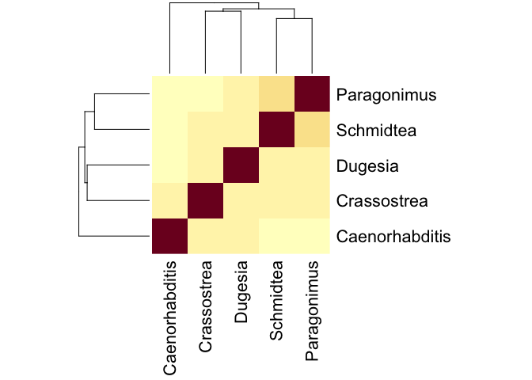
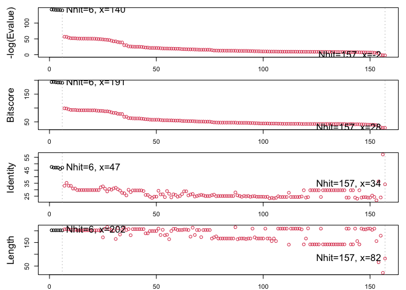

favorite\_gene\_project
================
San Luc (PID: A59010657)
11/26/2021

``` r
library(bio3d)
```

Read the alignment sequence using read.fasta()

``` r
MSA <- read.fasta("msa.txt")
```

To calculate the sequence identity matrix, we will use seqidentity()

``` r
seqid <- seqidentity(MSA)
seqid
```

    ##                Caenorhabditis Crassostrea Dugesia Schmidtea Paragonimus
    ## Caenorhabditis          1.000       0.335   0.330     0.286       0.292
    ## Crassostrea             0.335       1.000   0.365     0.347       0.344
    ## Dugesia                 0.330       0.365   1.000     0.359       0.402
    ## Schmidtea               0.286       0.347   0.359     1.000       0.440
    ## Paragonimus             0.292       0.344   0.402     0.440       1.000

To create a heatmap, use the sequence identity above and the function
heatmap()

``` r
heatmap(seqid, margins = c(10,10))
```

<!-- -->

``` r
rowSums(seqid)
```

    ## Caenorhabditis    Crassostrea        Dugesia      Schmidtea    Paragonimus 
    ##          2.243          2.391          2.456          2.432          2.478

``` r
sum(seqid[1,])
```

    ## [1] 2.243

``` r
sum(seqid[2,])
```

    ## [1] 2.391

``` r
sum(seqid[3,])
```

    ## [1] 2.456

``` r
sum(seqid[4,])
```

    ## [1] 2.432

``` r
sum(seqid[5,])
```

    ## [1] 2.478

Since there are a lot of gaps between these, we will use the original
sequence instead.

``` r
ori <- read.fasta("parag.fst")
ori
```

    ##                      1        .         .         .         .         .         60 
    ## KAF8572165.1:3-204   LTYFNGRGRAEYIRMVLHAADLEFEDHRIEMNDWPTIKPTIAGGQLPVLDVTTCCGKSKQ
    ##                      1        .         .         .         .         .         60 
    ## 
    ##                     61        .         .         .         .         .         120 
    ## KAF8572165.1:3-204   MNESMAIARWFARKHHMMGSNDEEYYEVERVIGQCSDIYQDVYRIFRATGEEKQKLLKQF
    ##                     61        .         .         .         .         .         120 
    ## 
    ##                    121        .         .         .         .         .         180 
    ## KAF8572165.1:3-204   TEGNGPRLLKVISKHLEASPTGLVVGDKPTLADFCILCAIDQVEVTVPGLSKDKFPIFER
    ##                    121        .         .         .         .         .         180 
    ## 
    ##                    181        .         . 202 
    ## KAF8572165.1:3-204   HRETVLKKHAKLAAYMETRPTT
    ##                    181        .         . 202 
    ## 
    ## Call:
    ##   read.fasta(file = "parag.fst")
    ## 
    ## Class:
    ##   fasta
    ## 
    ## Alignment dimensions:
    ##   1 sequence rows; 202 position columns (202 non-gap, 0 gap) 
    ## 
    ## + attr: id, ali, call

``` r
blast <- blast.pdb(ori)
```

    ##  Searching ... please wait (updates every 5 seconds) RID = UN9ZC1F0013 
    ##  .........................
    ##  Reporting 157 hits

``` r
blast
```

    ## $hit.tbl
    ##         queryid subjectids identity alignmentlength mismatches gapopens q.start
    ## 1   Query_65513     1OE7_A   47.525             202        106        0       1
    ## 2   Query_65513     1U3I_A   47.030             202        107        0       1
    ## 3   Query_65513     2F8F_A   47.030             202        107        0       1
    ## 4   Query_65513     2C8U_A   47.030             202        107        0       1
    ## 5   Query_65513     2WB9_A   46.040             202        109        0       1
    ## 6   Query_65513     2CAI_A   47.030             202        107        0       1
    ## 7   Query_65513     2ON5_A   33.010             206        127        4       1
    ## 8   Query_65513     2WS2_A   35.266             207        119        6       1
    ## 9   Query_65513     3W8S_A   33.010             206        127        5       1
    ## 10  Query_65513     1GSQ_A   33.005             203        126        4       1
    ## 11  Query_65513     1PD2_1   30.882             204        127        5       1
    ## 12  Query_65513     6N69_A   30.882             204        127        5       1
    ## 13  Query_65513     3EE2_A   29.703             202        132        5       1
    ## 14  Query_65513     5YWE_A   29.703             202        132        5       1
    ## 15  Query_65513     2VCQ_A   29.703             202        132        5       1
    ## 16  Query_65513     4EDY_A   29.703             202        132        5       1
    ## 17  Query_65513     4EDZ_A   29.703             202        132        5       1
    ## 18  Query_65513     6N4E_A   29.703             202        132        5       1
    ## 19  Query_65513     4EC0_A   29.703             202        132        5       1
    ## 20  Query_65513     3KXO_A   29.703             202        132        5       1
    ## 21  Query_65513     6W8H_A   29.703             202        132        5       1
    ## 22  Query_65513     5AIV_A   29.703             202        132        5       1
    ## 23  Query_65513     1IYH_A   29.703             202        132        5       1
    ## 24  Query_65513     5H5L_A   31.841             201        128        5       1
    ## 25  Query_65513     4Q5F_A   32.558             172        107        3       1
    ## 26  Query_65513     1ZL9_A   30.769             208        130        5       1
    ## 27  Query_65513     5B7C_A   28.704             216        132        7       1
    ## 28  Query_65513     2ON7_A   30.583             206        132        4       1
    ## 29  Query_65513     3VPQ_A   30.049             203        131        6       3
    ## 30  Query_65513     1TU7_A   31.000             200        128        5       1
    ## 31  Query_65513     2HNL_A   31.515             165        104        3       1
    ## 32  Query_65513     1TW9_A   30.332             211        126        7       1
    ## 33  Query_65513     5D73_A   29.348             184        121        4       1
    ## 34  Query_65513     4Q5R_A   27.586             203        139        4       1
    ## 35  Query_65513     1YQ1_A   27.230             213        132        7       1
    ## 36  Query_65513     1M0U_A   25.616             203        143        4       1
    ## 37  Query_65513     6GSU_A   29.952             207        125        7       1
    ## 38  Query_65513     1B4P_A   28.177             181        119        5       1
    ## 39  Query_65513     6GSV_A   29.469             207        126        7       1
    ## 40  Query_65513     5FWG_A   29.469             207        126        7       1
    ## 41  Query_65513     6GSW_A   29.469             207        126        7       1
    ## 42  Query_65513     1GSB_A   29.469             207        126        7       1
    ## 43  Query_65513     1MTC_A   29.469             207        126        7       1
    ## 44  Query_65513     6GSX_A   28.986             207        127        7       1
    ## 45  Query_65513     1B48_A   25.926             189        129        5       1
    ## 46  Query_65513     1GUK_A   25.926             189        129        5       1
    ## 47  Query_65513     4ZXG_A   24.623             199        124        8       1
    ## 48  Query_65513     3FR3_A   23.618             199        123        8       1
    ## 49  Query_65513     1OKT_A   24.623             199        124        8       1
    ## 50  Query_65513     2AAW_A   24.623             199        124        8       1
    ## 51  Query_65513     3GTU_B   29.187             209        124        9       1
    ## 52  Query_65513     6ZJ9_A   26.374             182        125        4       1
    ## 53  Query_65513     2GSR_A   26.471             204        129        7       1
    ## 54  Query_65513     1GUL_A   24.309             181        134        2       1
    ## 55  Query_65513     3FYG_A   28.962             183        115        5       1
    ## 56  Query_65513     1VF1_A   26.829             164        118        1       1
    ## 57  Query_65513     3FR6_A   24.121             199        125        8       1
    ## 58  Query_65513     4GTU_A   26.442             208        131        7       1
    ## 59  Query_65513     1HNA_A   25.962             208        132        7       1
    ## 60  Query_65513     1XW5_A   24.631             203        141        6       1
    ## 61  Query_65513     2C4J_A   25.123             203        140        6       1
    ## 62  Query_65513     2FHE_A   26.601             203        132        8       1
    ## 63  Query_65513     4L5O_A   28.780             205        125       10       1
    ## 64  Query_65513     3ISO_A   28.780             205        125       10       1
    ## 65  Query_65513     2OA7_A   25.616             203        134        7       1
    ## 66  Query_65513     1GSU_A   26.286             175        115        4       1
    ## 67  Query_65513     4W66_A   26.761             213        138        7       1
    ## 68  Query_65513     1TDI_A   24.725             182        128        4       1
    ## 69  Query_65513     2OAD_A   25.123             203        135        7       1
    ## 70  Query_65513     1XW6_A   25.616             203        139        6       1
    ## 71  Query_65513     1C72_A   26.012             173        118        3       1
    ## 72  Query_65513     1GTU_A   25.616             203        139        6       1
    ## 73  Query_65513     1BAY_A   25.123             203        135        7       1
    ## 74  Query_65513     1GTI_A   25.123             203        135        7       1
    ## 75  Query_65513     3O76_A   25.123             203        135        7       1
    ## 76  Query_65513     3I69_A   25.749             167        116        3       1
    ## 77  Query_65513     2DC5_A   26.163             172        113        4       1
    ## 78  Query_65513     4Q5Q_A   25.000             176        116        5       1
    ## 79  Query_65513     3L0H_A   25.150             167        117        3       1
    ## 80  Query_65513     1PKW_A   25.150             167        117        3       1
    ## 81  Query_65513     5JCU_A   25.150             167        117        3       1
    ## 82  Query_65513     1USB_A   25.150             167        117        3       1
    ## 83  Query_65513     1GSD_A   25.150             167        117        3       1
    ## 84  Query_65513     6YAW_A   25.150             167        117        3       1
    ## 85  Query_65513     1YDK_A   25.150             167        117        3       1
    ## 86  Query_65513     4HJ2_A   25.150             167        117        3       1
    ## 87  Query_65513     4Q5N_A   27.907             215        117        9       1
    ## 88  Query_65513     3ZFL_A   25.610             164        120        1       1
    ## 89  Query_65513     1PL2_A   25.150             167        117        3       1
    ## 90  Query_65513     2R6K_A   24.551             167        118        3       1
    ## 91  Query_65513     1XWG_A   25.150             167        117        3       1
    ## 92  Query_65513     3Q74_A   24.848             165        116        3       3
    ## 93  Query_65513     3ZFB_A   25.150             167        117        3       1
    ## 94  Query_65513     1GSE_A   24.551             167        118        3       1
    ## 95  Query_65513     2J9H_A   24.880             209        128        8       1
    ## 96  Query_65513     5AN1_A   25.000             172        107        4       1
    ## 97  Query_65513     3KTL_A   24.551             167        118        3       1
    ## 98  Query_65513     3U6V_A   24.551             167        118        3       1
    ## 99  Query_65513     4ACS_A   24.551             167        118        3       1
    ## 100 Query_65513     2VCT_A   24.551             167        118        3       1
    ## 101 Query_65513     17GS_A   24.402             209        129        8       1
    ## 102 Query_65513     2R3X_A   24.551             167        118        3       1
    ## 103 Query_65513     1F3A_A   23.353             167        120        3       1
    ## 104 Query_65513     1EV4_A   23.718             156        111        3       1
    ## 105 Query_65513     1F3B_A   23.353             167        120        3       1
    ## 106 Query_65513     1EV9_A   23.718             156        111        3       1
    ## 107 Query_65513     3IE3_A   24.880             209        128        9       1
    ## 108 Query_65513     4PGT_A   24.402             209        129        8       1
    ## 109 Query_65513     22GS_A   24.402             209        129        8       1
    ## 110 Query_65513     5L6X_A   24.402             209        129        8       1
    ## 111 Query_65513     10GS_A   24.402             209        129        8       1
    ## 112 Query_65513     2WRT_A   27.660             141         91        6      60
    ## 113 Query_65513     1PGT_A   24.402             209        129        8       1
    ## 114 Query_65513     6LLX_A   24.402             209        129        8       1
    ## 115 Query_65513     11GS_A   24.402             209        129        8       1
    ## 116 Query_65513     1LBK_A   24.402             209        129        8       1
    ## 117 Query_65513     5DAK_B   24.402             209        129        8       1
    ## 118 Query_65513     4GSS_A   24.757             206        132        8       1
    ## 119 Query_65513     3CRT_A   29.577             142         89        6      60
    ## 120 Query_65513     1AGS_A   23.952             167        119        3       1
    ## 121 Query_65513     6AP9_A   24.286             210        129        8       1
    ## 122 Query_65513     3QMZ_S   29.577             142         89        6      60
    ## 123 Query_65513     1U87_A   29.577             142         89        6      60
    ## 124 Query_65513     3D0Z_A   29.577             142         89        6      60
    ## 125 Query_65513     1Y6E_A   29.577             142         89        6      60
    ## 126 Query_65513     1GTA_A   29.577             142         89        6      60
    ## 127 Query_65513     1EOG_A   24.402             209        129        8       1
    ## 128 Query_65513     6JI6_A   29.577             142         89        6      60
    ## 129 Query_65513     4ECB_A   29.577             142         89        6      60
    ## 130 Query_65513     4ECC_A   29.577             142         89        6      60
    ## 131 Query_65513     1GNE_A   29.577             142         89        6      60
    ## 132 Query_65513     1B8X_A   29.577             142         89        6      60
    ## 133 Query_65513     1DUG_A   29.577             142         89        6      60
    ## 134 Query_65513     7BJ6_A   29.577             142         89        6      60
    ## 135 Query_65513     7BJ0_A   29.577             142         89        6      60
    ## 136 Query_65513     7BIR_A   29.577             142         89        6      60
    ## 137 Query_65513     1BG5_A   29.577             142         89        6      60
    ## 138 Query_65513     6ZD9_A   29.577             142         89        6      60
    ## 139 Query_65513     1PX6_A   23.923             209        130        8       1
    ## 140 Query_65513     3CSI_A   23.923             209        130        8       1
    ## 141 Query_65513     4AI6_A   29.577             142         89        6      60
    ## 142 Query_65513     7NT8_A   29.577             142         89        6      60
    ## 143 Query_65513     1PX7_A   23.923             209        130        8       1
    ## 144 Query_65513     1ML6_A   23.077             156        112        3       1
    ## 145 Query_65513     4WR4_A   29.577             142         89        6      60
    ## 146 Query_65513     1MD3_A   23.923             209        130        8       1
    ## 147 Query_65513     3HJM_A   24.272             206        133        8       1
    ## 148 Query_65513     3KM6_A   24.272             206        133        8       1
    ## 149 Query_65513     1EOH_A   23.923             209        130        8       1
    ## 150 Query_65513     1MD4_A   23.923             209        130        8       1
    ## 151 Query_65513     1FHE_A   25.490             204        135        8       1
    ## 152 Query_65513     1KBN_A   24.402             209        129        8       1
    ## 153 Query_65513     5LCZ_A   21.795             156        114        3       1
    ## 154 Query_65513     3LG6_A   36.364              66         40        1     132
    ## 155 Query_65513     5F0G_A   24.022             179        119        6       3
    ## 156 Query_65513     1EO1_A   57.143              21          9        0     104
    ## 157 Query_65513     4J2F_A   34.146              82         41        5     102
    ##     q.end s.start s.end   evalue bitscore positives mlog.evalue pdb.id    acc
    ## 1     202       8   209 9.26e-63    194.0     61.39 142.8371568 1OE7_A 1OE7_A
    ## 2     202       8   209 1.58e-62    194.0     61.39 142.3028509 1U3I_A 1U3I_A
    ## 3     202       8   209 3.70e-62    193.0     61.39 141.4519429 2F8F_A 2F8F_A
    ## 4     202       8   209 4.55e-62    192.0     61.39 141.2451485 2C8U_A 2C8U_A
    ## 5     202       8   209 6.24e-62    192.0     65.84 140.9292956 2WB9_A 2WB9_A
    ## 6     202       8   209 1.32e-61    191.0     60.89 140.1800589 2CAI_A 2CAI_A
    ## 7     202       6   204 2.10e-25     99.0     46.12  56.8226900 2ON5_A 2ON5_A
    ## 8     202       6   202 3.21e-25     98.2     50.24  56.3983564 2WS2_A 2WS2_A
    ## 9     202       6   204 4.93e-24     95.5     48.54  53.6667032 3W8S_A 3W8S_A
    ## 10    201       5   199 2.54e-23     93.2     47.29  52.0272931 1GSQ_A 1GSQ_A
    ## 11    202       6   197 2.67e-23     93.2     48.53  51.9773787 1PD2_1 1PD2_1
    ## 12    202       9   200 3.14e-23     93.2     48.53  51.8152343 6N69_A 6N69_A
    ## 13    202       6   197 6.23e-23     92.4     50.00  51.1300808 3EE2_A 3EE2_A
    ## 14    202       5   196 7.68e-23     92.0     50.00  50.9208376 5YWE_A 5YWE_A
    ## 15    202       6   197 8.20e-23     92.0     50.00  50.8553230 2VCQ_A 2VCQ_A
    ## 16    202       6   197 8.20e-23     92.0     50.00  50.8553230 4EDY_A 4EDY_A
    ## 17    202       6   197 8.46e-23     92.0     50.00  50.8241080 4EDZ_A 4EDZ_A
    ## 18    202       7   198 9.13e-23     92.0     50.00  50.7478914 6N4E_A 6N4E_A
    ## 19    202       7   198 9.52e-23     91.7     50.00  50.7060623 4EC0_A 4EC0_A
    ## 20    202       9   200 1.01e-22     91.7     50.00  50.6469217 3KXO_A 3KXO_A
    ## 21    202      20   211 1.13e-22     92.0     50.00  50.5346544 6W8H_A 6W8H_A
    ## 22    202       6   197 1.98e-22     90.9     49.50  49.9737752 5AIV_A 5AIV_A
    ## 23    202       5   196 3.88e-22     90.1     49.50  49.3010369 1IYH_A 1IYH_A
    ## 24    200       6   198 5.47e-22     89.7     50.25  48.9575934 5H5L_A 5H5L_A
    ## 25    168      18   184 1.11e-21     89.4     51.74  48.2499269 4Q5F_A 4Q5F_A
    ## 26    202       6   205 2.35e-21     88.2     46.15  47.4998716 1ZL9_A 1ZL9_A
    ## 27    202      26   233 3.99e-21     88.2     49.54  46.9704957 5B7C_A 5B7C_A
    ## 28    202       6   204 6.75e-21     87.0     48.06  46.4447444 2ON7_A 2ON7_A
    ## 29    202       8   202 6.21e-20     84.3     48.28  44.2255410 3VPQ_A 3VPQ_A
    ## 30    199       5   195 4.14e-19     82.4     49.50  42.3284210 1TU7_A 1TU7_A
    ## 31    161      30   189 5.10e-19     82.4     53.94  42.1198762 2HNL_A 2HNL_A
    ## 32    202       6   204 5.10e-18     79.3     47.87  39.8172911 1TW9_A 1TW9_A
    ## 33    183       5   180 1.33e-17     78.6     48.91  38.8587676 5D73_A 5D73_A
    ## 34    202       7   202 1.45e-17     78.2     47.29  38.7723830 4Q5R_A 4Q5R_A
    ## 35    202       6   206 9.03e-14     68.2     44.60  30.0356389 1YQ1_A 1YQ1_A
    ## 36    202      52   247 1.18e-13     68.6     48.28  29.7680918 1M0U_A 1M0U_A
    ## 37    198       4   199 3.94e-12     63.9     43.96  26.2598404 6GSU_A 6GSU_A
    ## 38    176       4   178 5.60e-12     63.5     45.86  25.9082545 1B4P_A 1B4P_A
    ## 39    198       4   199 9.10e-12     62.8     43.96  25.4227467 6GSV_A 6GSV_A
    ## 40    198       4   199 1.45e-11     62.4     43.00  24.9568725 5FWG_A 5FWG_A
    ## 41    198       4   199 1.51e-11     62.4     43.48  24.9163264 6GSW_A 6GSW_A
    ## 42    198       4   199 1.51e-11     62.4     43.48  24.9163264 1GSB_A 1GSB_A
    ## 43    198       4   199 2.23e-11     61.6     43.48  24.5264344 1MTC_A 1MTC_A
    ## 44    198       4   199 5.34e-11     60.8     43.48  23.6532104 6GSX_A 6GSX_A
    ## 45    185       6   187 1.52e-10     59.7     48.15  22.6071406 1B48_A 1B48_A
    ## 46    185       7   188 1.63e-10     59.3     48.15  22.5372709 1GUK_A 1GUK_A
    ## 47    185       5   191 4.52e-10     58.2     43.72  21.5173389 4ZXG_A 4ZXG_A
    ## 48    185       7   190 5.13e-10     57.8     43.72  21.3907453 3FR3_A 3FR3_A
    ## 49    185       7   193 5.27e-10     57.8     43.72  21.3638206 1OKT_A 1OKT_A
    ## 50    185      18   204 6.32e-10     57.8     43.72  21.1821317 2AAW_A 2AAW_A
    ## 51    198       8   203 7.79e-10     57.8     44.50  20.9730101 3GTU_B 3GTU_B
    ## 52    179       7   182 1.59e-09     56.6     49.45  20.2595318 6ZJ9_A 6ZJ9_A
    ## 53    198       5   193 2.70e-09     55.8     43.14  19.7300141 2GSR_A 2GSR_A
    ## 54    181       7   184 3.05e-09     55.8     44.75  19.6081242 1GUL_A 1GUL_A
    ## 55    176       4   178 3.46e-09     55.8     40.98  19.4819972 3FYG_A 3FYG_A
    ## 56    164       7   168 4.17e-09     55.5     45.73  19.2953498 1VF1_A 1VF1_A
    ## 57    185       7   193 4.60e-09     55.5     43.22  19.1972095 3FR6_A 3FR6_A
    ## 58    198       4   199 5.35e-09     55.1     44.23  19.0461693 4GTU_A 4GTU_A
    ## 59    198       4   199 7.12e-09     54.7     45.67  18.7603581 1HNA_A 1HNA_A
    ## 60    198       4   199 7.55e-09     54.7     46.80  18.7017183 1XW5_A 1XW5_A
    ## 61    198       5   200 8.50e-09     54.7     46.80  18.5831997 2C4J_A 2C4J_A
    ## 62    198       4   194 2.06e-08     53.5     46.80  17.6979748 2FHE_A 2FHE_A
    ## 63    198       5   195 2.29e-08     53.5     46.34  17.5921289 4L5O_A 4L5O_A
    ## 64    198       5   195 2.90e-08     53.1     45.85  17.3559700 3ISO_A 3ISO_A
    ## 65    198       5   195 3.90e-08     52.8     42.86  17.0597042 2OA7_A 2OA7_A
    ## 66    168       4   171 4.50e-08     52.8     44.00  16.9166033 1GSU_A 1GSU_A
    ## 67    202      10   215 4.74e-08     52.8     43.19  16.8646436 4W66_A 4W66_A
    ## 68    179       7   182 7.24e-08     52.0     47.25  16.4410595 1TDI_A 1TDI_A
    ## 69    198       5   195 8.56e-08     51.6     42.86  16.2735806 2OAD_A 2OAD_A
    ## 70    198       5   200 1.41e-07     51.2     44.83  15.7745059 1XW6_A 1XW6_A
    ## 71    168       4   171 1.51e-07     51.2     43.35  15.7059860 1C72_A 1C72_A
    ## 72    198       4   199 1.53e-07     51.2     44.83  15.6928279 1GTU_A 1GTU_A
    ## 73    198       5   195 1.60e-07     50.8     42.36  15.6480920 1BAY_A 1BAY_A
    ## 74    198       5   195 1.65e-07     50.8     42.36  15.6173204 1GTI_A 1GTI_A
    ## 75    198       5   195 1.71e-07     50.8     42.36  15.5816023 3O76_A 3O76_A
    ## 76    164       7   168 5.61e-07     49.3     47.90  14.3935449 3I69_A 3I69_A
    ## 77    165      12   176 1.77e-06     48.1     42.44  13.2445310 2DC5_A 2DC5_A
    ## 78    168       6   173 2.00e-06     47.8     44.89  13.1223634 4Q5Q_A 4Q5Q_A
    ## 79    164       7   168 2.78e-06     47.4     47.31  12.7930596 3L0H_A 3L0H_A
    ## 80    164       7   168 2.88e-06     47.4     47.31  12.7577203 1PKW_A 1PKW_A
    ## 81    164       6   167 2.92e-06     47.4     47.31  12.7439269 5JCU_A 5JCU_A
    ## 82    164      10   171 3.03e-06     47.4     47.31  12.7069479 1USB_A 1USB_A
    ## 83    164       6   167 3.21e-06     47.4     47.31  12.6492396 1GSD_A 1GSD_A
    ## 84    164       7   168 3.27e-06     47.4     47.31  12.6307206 6YAW_A 6YAW_A
    ## 85    164       7   168 3.36e-06     47.4     47.31  12.6035696 1YDK_A 1YDK_A
    ## 86    164       4   165 3.38e-06     47.4     47.31  12.5976348 4HJ2_A 4HJ2_A
    ## 87    197       6   200 3.46e-06     47.4     43.26  12.5742420 4Q5N_A 4Q5N_A
    ## 88    164       7   168 4.98e-06     46.6     44.51  12.2100807 3ZFL_A 3ZFL_A
    ## 89    164       7   168 5.38e-06     46.6     46.71  12.1328222 1PL2_A 1PL2_A
    ## 90    164       7   168 5.53e-06     46.6     47.31  12.1053227 2R6K_A 2R6K_A
    ## 91    164       6   167 5.55e-06     46.6     46.71  12.1017126 1XWG_A 1XWG_A
    ## 92    164       8   167 5.88e-06     46.6     47.27  12.0439538 3Q74_A 3Q74_A
    ## 93    164       7   168 7.10e-06     46.2     47.31  11.8554158 3ZFB_A 3ZFB_A
    ## 94    164       6   167 9.95e-06     45.8     47.31  11.5179380 1GSE_A 1GSE_A
    ## 95    198       5   195 1.03e-05     45.8     42.11  11.4833667 2J9H_A 2J9H_A
    ## 96    162       5   164 1.86e-05     45.1     39.53  10.8923490 5AN1_A 5AN1_A
    ## 97    164       6   167 1.88e-05     45.1     46.71  10.8816537 3KTL_A 3KTL_A
    ## 98    164       7   168 2.23e-05     44.7     46.71  10.7109239 3U6V_A 3U6V_A
    ## 99    164       7   168 3.05e-05     44.3     47.90  10.3977839 4ACS_A 4ACS_A
    ## 100   164       7   168 3.39e-05     44.3     47.31  10.2920955 2VCT_A 2VCT_A
    ## 101   198       6   196 3.46e-05     44.3     41.15  10.2716569 17GS_A 17GS_A
    ## 102   164       7   168 3.65e-05     44.3     46.71  10.2181983 2R3X_A 2R3X_A
    ## 103   164       6   167 4.90e-05     43.9     46.71   9.9236903 1F3A_A 1F3A_A
    ## 104   153       6   156 4.92e-05     43.9     46.79   9.9196169 1EV4_A 1EV4_A
    ## 105   164       6   167 5.05e-05     43.9     46.71   9.8935372 1F3B_A 1F3B_A
    ## 106   153       6   156 5.21e-05     43.9     46.79   9.8623456 1EV9_A 1EV9_A
    ## 107   198       5   195 6.58e-05     43.5     41.63   9.6288907 3IE3_A 3IE3_A
    ## 108   198       6   196 6.68e-05     43.5     41.15   9.6138075 4PGT_A 4PGT_A
    ## 109   198       6   196 7.14e-05     43.1     41.15   9.5472127 22GS_A 22GS_A
    ## 110   198       6   196 7.35e-05     43.1     41.15   9.5182252 5L6X_A 5L6X_A
    ## 111   198       5   195 7.59e-05     43.1     41.15   9.4860939 10GS_A 10GS_A
    ## 112   198      64   195 7.71e-05     43.1     45.39   9.4704073 2WRT_A 2WRT_A
    ## 113   198       6   196 7.78e-05     43.1     41.15   9.4613691 1PGT_A 1PGT_A
    ## 114   198      11   201 7.87e-05     43.1     41.15   9.4498674 6LLX_A 6LLX_A
    ## 115   198       6   196 8.01e-05     43.1     41.15   9.4322347 11GS_A 11GS_A
    ## 116   198       5   195 8.69e-05     43.1     41.15   9.3507525 1LBK_A 1LBK_A
    ## 117   198       6   196 9.41e-05     43.1     41.15   9.2711525 5DAK_B 5DAK_B
    ## 118   198       5   195 9.62e-05     42.7     41.26   9.2490812 4GSS_A 4GSS_A
    ## 119   196      64   199 1.03e-04     42.7     47.18   9.1807816 3CRT_A 3CRT_A
    ## 120   164       6   167 1.04e-04     42.7     46.71   9.1711197 1AGS_A 1AGS_A
    ## 121   198       6   197 1.09e-04     42.7     40.95   9.1241627 6AP9_A 6AP9_A
    ## 122   196      63   198 1.11e-04     42.7     47.18   9.1059804 3QMZ_S 3QMZ_S
    ## 123   196      64   199 1.16e-04     42.7     47.18   9.0619204 1U87_A 1U87_A
    ## 124   196      64   199 1.17e-04     42.7     47.18   9.0533366 3D0Z_A 3D0Z_A
    ## 125   196      63   198 1.17e-04     42.7     47.18   9.0533366 1Y6E_A 1Y6E_A
    ## 126   196      64   199 1.17e-04     42.7     47.18   9.0533366 1GTA_A 1GTA_A
    ## 127   198       4   194 1.21e-04     42.7     40.67   9.0197200 1EOG_A 1EOG_A
    ## 128   196      64   199 1.29e-04     42.7     47.18   8.9556982 6JI6_A 6JI6_A
    ## 129   196      74   209 1.34e-04     42.7     47.18   8.9176708 4ECB_A 4ECB_A
    ## 130   196      77   212 1.36e-04     42.7     47.18   8.9028557 4ECC_A 4ECC_A
    ## 131   196      63   198 1.38e-04     42.7     47.18   8.8882569 1GNE_A 1GNE_A
    ## 132   196      63   198 1.40e-04     42.7     47.18   8.8738681 1B8X_A 1B8X_A
    ## 133   196      63   198 1.48e-04     42.4     47.18   8.8182983 1DUG_A 1DUG_A
    ## 134   196      64   199 1.57e-04     42.7     47.18   8.7592648 7BJ6_A 7BJ6_A
    ## 135   196      64   199 1.77e-04     42.7     47.18   8.6393608 7BJ0_A 7BJ0_A
    ## 136   196      64   199 1.80e-04     42.7     47.18   8.6225537 7BIR_A 7BIR_A
    ## 137   196      64   199 1.81e-04     42.4     47.18   8.6170135 1BG5_A 1BG5_A
    ## 138   196      64   199 2.00e-04     42.7     47.18   8.5171932 6ZD9_A 6ZD9_A
    ## 139   198       5   195 2.61e-04     41.6     41.15   8.2509902 1PX6_A 1PX6_A
    ## 140   198       5   195 2.63e-04     41.6     40.67   8.2433565 3CSI_A 3CSI_A
    ## 141   196      63   198 2.86e-04     42.4     47.18   8.1595187 4AI6_A 4AI6_A
    ## 142   196      64   199 2.88e-04     42.4     47.18   8.1525501 7NT8_A 7NT8_A
    ## 143   198       5   195 3.21e-04     41.2     41.15   8.0440694 1PX7_A 1PX7_A
    ## 144   153       6   156 3.23e-04     41.6     46.79   8.0378582 1ML6_A 1ML6_A
    ## 145   196      88   223 4.80e-04     41.2     46.48   7.6417245 4WR4_A 4WR4_A
    ## 146   198       5   195 5.29e-04     40.8     40.67   7.5445221 1MD3_A 1MD3_A
    ## 147   198       5   195 5.39e-04     40.8     40.29   7.5257950 3HJM_A 3HJM_A
    ## 148   198       5   195 7.30e-04     40.4     40.29   7.2224660 3KM6_A 3KM6_A
    ## 149   198       5   195 7.94e-04     40.0     40.67   7.1384271 1EOH_A 1EOH_A
    ## 150   198       5   195 1.00e-03     39.7     40.67   6.9077553 1MD4_A 1MD4_A
    ## 151   199       4   195 1.00e-03     39.7     44.61   6.9077553 1FHE_A 1FHE_A
    ## 152   198       5   195 2.00e-03     39.3     40.67   6.2146081 1KBN_A 1KBN_A
    ## 153   153       7   157 3.00e-03     38.5     46.79   5.8091430 5LCZ_A 5LCZ_A
    ## 154   197     161   224 1.30e-02     36.6     54.55   4.3428059 3LG6_A 3LG6_A
    ## 155   172       5   175 2.30e+00     30.0     36.31  -0.8329091 5F0G_A 5F0G_A
    ## 156   124      88   108 4.60e+00     28.5     76.19  -1.5260563 1EO1_A 1EO1_A
    ## 157   176     108   183 7.80e+00     28.5     46.34  -2.0541237 4J2F_A 4J2F_A
    ## 
    ## $raw
    ##         queryid subjectids identity alignmentlength mismatches gapopens q.start
    ## 1   Query_65513     1OE7_A   47.525             202        106        0       1
    ## 2   Query_65513     1U3I_A   47.030             202        107        0       1
    ## 3   Query_65513     2F8F_A   47.030             202        107        0       1
    ## 4   Query_65513     2C8U_A   47.030             202        107        0       1
    ## 5   Query_65513     2WB9_A   46.040             202        109        0       1
    ## 6   Query_65513     2CAI_A   47.030             202        107        0       1
    ## 7   Query_65513     2ON5_A   33.010             206        127        4       1
    ## 8   Query_65513     2WS2_A   35.266             207        119        6       1
    ## 9   Query_65513     3W8S_A   33.010             206        127        5       1
    ## 10  Query_65513     1GSQ_A   33.005             203        126        4       1
    ## 11  Query_65513     1PD2_1   30.882             204        127        5       1
    ## 12  Query_65513     6N69_A   30.882             204        127        5       1
    ## 13  Query_65513     3EE2_A   29.703             202        132        5       1
    ## 14  Query_65513     5YWE_A   29.703             202        132        5       1
    ## 15  Query_65513     2VCQ_A   29.703             202        132        5       1
    ## 16  Query_65513     4EDY_A   29.703             202        132        5       1
    ## 17  Query_65513     4EDZ_A   29.703             202        132        5       1
    ## 18  Query_65513     6N4E_A   29.703             202        132        5       1
    ## 19  Query_65513     4EC0_A   29.703             202        132        5       1
    ## 20  Query_65513     3KXO_A   29.703             202        132        5       1
    ## 21  Query_65513     6W8H_A   29.703             202        132        5       1
    ## 22  Query_65513     5AIV_A   29.703             202        132        5       1
    ## 23  Query_65513     1IYH_A   29.703             202        132        5       1
    ## 24  Query_65513     5H5L_A   31.841             201        128        5       1
    ## 25  Query_65513     4Q5F_A   32.558             172        107        3       1
    ## 26  Query_65513     1ZL9_A   30.769             208        130        5       1
    ## 27  Query_65513     5B7C_A   28.704             216        132        7       1
    ## 28  Query_65513     2ON7_A   30.583             206        132        4       1
    ## 29  Query_65513     3VPQ_A   30.049             203        131        6       3
    ## 30  Query_65513     1TU7_A   31.000             200        128        5       1
    ## 31  Query_65513     2HNL_A   31.515             165        104        3       1
    ## 32  Query_65513     1TW9_A   30.332             211        126        7       1
    ## 33  Query_65513     5D73_A   29.348             184        121        4       1
    ## 34  Query_65513     4Q5R_A   27.586             203        139        4       1
    ## 35  Query_65513     1YQ1_A   27.230             213        132        7       1
    ## 36  Query_65513     1M0U_A   25.616             203        143        4       1
    ## 37  Query_65513     6GSU_A   29.952             207        125        7       1
    ## 38  Query_65513     1B4P_A   28.177             181        119        5       1
    ## 39  Query_65513     6GSV_A   29.469             207        126        7       1
    ## 40  Query_65513     5FWG_A   29.469             207        126        7       1
    ## 41  Query_65513     6GSW_A   29.469             207        126        7       1
    ## 42  Query_65513     1GSB_A   29.469             207        126        7       1
    ## 43  Query_65513     1MTC_A   29.469             207        126        7       1
    ## 44  Query_65513     6GSX_A   28.986             207        127        7       1
    ## 45  Query_65513     1B48_A   25.926             189        129        5       1
    ## 46  Query_65513     1GUK_A   25.926             189        129        5       1
    ## 47  Query_65513     4ZXG_A   24.623             199        124        8       1
    ## 48  Query_65513     3FR3_A   23.618             199        123        8       1
    ## 49  Query_65513     1OKT_A   24.623             199        124        8       1
    ## 50  Query_65513     2AAW_A   24.623             199        124        8       1
    ## 51  Query_65513     3GTU_B   29.187             209        124        9       1
    ## 52  Query_65513     6ZJ9_A   26.374             182        125        4       1
    ## 53  Query_65513     2GSR_A   26.471             204        129        7       1
    ## 54  Query_65513     1GUL_A   24.309             181        134        2       1
    ## 55  Query_65513     3FYG_A   28.962             183        115        5       1
    ## 56  Query_65513     1VF1_A   26.829             164        118        1       1
    ## 57  Query_65513     3FR6_A   24.121             199        125        8       1
    ## 58  Query_65513     4GTU_A   26.442             208        131        7       1
    ## 59  Query_65513     1HNA_A   25.962             208        132        7       1
    ## 60  Query_65513     1XW5_A   24.631             203        141        6       1
    ## 61  Query_65513     2C4J_A   25.123             203        140        6       1
    ## 62  Query_65513     2FHE_A   26.601             203        132        8       1
    ## 63  Query_65513     4L5O_A   28.780             205        125       10       1
    ## 64  Query_65513     3ISO_A   28.780             205        125       10       1
    ## 65  Query_65513     2OA7_A   25.616             203        134        7       1
    ## 66  Query_65513     1GSU_A   26.286             175        115        4       1
    ## 67  Query_65513     4W66_A   26.761             213        138        7       1
    ## 68  Query_65513     1TDI_A   24.725             182        128        4       1
    ## 69  Query_65513     2OAD_A   25.123             203        135        7       1
    ## 70  Query_65513     1XW6_A   25.616             203        139        6       1
    ## 71  Query_65513     1C72_A   26.012             173        118        3       1
    ## 72  Query_65513     1GTU_A   25.616             203        139        6       1
    ## 73  Query_65513     1BAY_A   25.123             203        135        7       1
    ## 74  Query_65513     1GTI_A   25.123             203        135        7       1
    ## 75  Query_65513     3O76_A   25.123             203        135        7       1
    ## 76  Query_65513     3I69_A   25.749             167        116        3       1
    ## 77  Query_65513     2DC5_A   26.163             172        113        4       1
    ## 78  Query_65513     4Q5Q_A   25.000             176        116        5       1
    ## 79  Query_65513     3L0H_A   25.150             167        117        3       1
    ## 80  Query_65513     1PKW_A   25.150             167        117        3       1
    ## 81  Query_65513     5JCU_A   25.150             167        117        3       1
    ## 82  Query_65513     1USB_A   25.150             167        117        3       1
    ## 83  Query_65513     1GSD_A   25.150             167        117        3       1
    ## 84  Query_65513     6YAW_A   25.150             167        117        3       1
    ## 85  Query_65513     1YDK_A   25.150             167        117        3       1
    ## 86  Query_65513     4HJ2_A   25.150             167        117        3       1
    ## 87  Query_65513     4Q5N_A   27.907             215        117        9       1
    ## 88  Query_65513     3ZFL_A   25.610             164        120        1       1
    ## 89  Query_65513     1PL2_A   25.150             167        117        3       1
    ## 90  Query_65513     2R6K_A   24.551             167        118        3       1
    ## 91  Query_65513     1XWG_A   25.150             167        117        3       1
    ## 92  Query_65513     3Q74_A   24.848             165        116        3       3
    ## 93  Query_65513     3ZFB_A   25.150             167        117        3       1
    ## 94  Query_65513     1GSE_A   24.551             167        118        3       1
    ## 95  Query_65513     2J9H_A   24.880             209        128        8       1
    ## 96  Query_65513     5AN1_A   25.000             172        107        4       1
    ## 97  Query_65513     3KTL_A   24.551             167        118        3       1
    ## 98  Query_65513     3U6V_A   24.551             167        118        3       1
    ## 99  Query_65513     4ACS_A   24.551             167        118        3       1
    ## 100 Query_65513     2VCT_A   24.551             167        118        3       1
    ## 101 Query_65513     17GS_A   24.402             209        129        8       1
    ## 102 Query_65513     2R3X_A   24.551             167        118        3       1
    ## 103 Query_65513     1F3A_A   23.353             167        120        3       1
    ## 104 Query_65513     1EV4_A   23.718             156        111        3       1
    ## 105 Query_65513     1F3B_A   23.353             167        120        3       1
    ## 106 Query_65513     1EV9_A   23.718             156        111        3       1
    ## 107 Query_65513     3IE3_A   24.880             209        128        9       1
    ## 108 Query_65513     4PGT_A   24.402             209        129        8       1
    ## 109 Query_65513     22GS_A   24.402             209        129        8       1
    ## 110 Query_65513     5L6X_A   24.402             209        129        8       1
    ## 111 Query_65513     10GS_A   24.402             209        129        8       1
    ## 112 Query_65513     2WRT_A   27.660             141         91        6      60
    ## 113 Query_65513     1PGT_A   24.402             209        129        8       1
    ## 114 Query_65513     6LLX_A   24.402             209        129        8       1
    ## 115 Query_65513     11GS_A   24.402             209        129        8       1
    ## 116 Query_65513     1LBK_A   24.402             209        129        8       1
    ## 117 Query_65513     5DAK_B   24.402             209        129        8       1
    ## 118 Query_65513     4GSS_A   24.757             206        132        8       1
    ## 119 Query_65513     3CRT_A   29.577             142         89        6      60
    ## 120 Query_65513     1AGS_A   23.952             167        119        3       1
    ## 121 Query_65513     6AP9_A   24.286             210        129        8       1
    ## 122 Query_65513     3QMZ_S   29.577             142         89        6      60
    ## 123 Query_65513     1U87_A   29.577             142         89        6      60
    ## 124 Query_65513     3D0Z_A   29.577             142         89        6      60
    ## 125 Query_65513     1Y6E_A   29.577             142         89        6      60
    ## 126 Query_65513     1GTA_A   29.577             142         89        6      60
    ## 127 Query_65513     1EOG_A   24.402             209        129        8       1
    ## 128 Query_65513     6JI6_A   29.577             142         89        6      60
    ## 129 Query_65513     4ECB_A   29.577             142         89        6      60
    ## 130 Query_65513     4ECC_A   29.577             142         89        6      60
    ## 131 Query_65513     1GNE_A   29.577             142         89        6      60
    ## 132 Query_65513     1B8X_A   29.577             142         89        6      60
    ## 133 Query_65513     1DUG_A   29.577             142         89        6      60
    ## 134 Query_65513     7BJ6_A   29.577             142         89        6      60
    ## 135 Query_65513     7BJ0_A   29.577             142         89        6      60
    ## 136 Query_65513     7BIR_A   29.577             142         89        6      60
    ## 137 Query_65513     1BG5_A   29.577             142         89        6      60
    ## 138 Query_65513     6ZD9_A   29.577             142         89        6      60
    ## 139 Query_65513     1PX6_A   23.923             209        130        8       1
    ## 140 Query_65513     3CSI_A   23.923             209        130        8       1
    ## 141 Query_65513     4AI6_A   29.577             142         89        6      60
    ## 142 Query_65513     7NT8_A   29.577             142         89        6      60
    ## 143 Query_65513     1PX7_A   23.923             209        130        8       1
    ## 144 Query_65513     1ML6_A   23.077             156        112        3       1
    ## 145 Query_65513     4WR4_A   29.577             142         89        6      60
    ## 146 Query_65513     1MD3_A   23.923             209        130        8       1
    ## 147 Query_65513     3HJM_A   24.272             206        133        8       1
    ## 148 Query_65513     3KM6_A   24.272             206        133        8       1
    ## 149 Query_65513     1EOH_A   23.923             209        130        8       1
    ## 150 Query_65513     1MD4_A   23.923             209        130        8       1
    ## 151 Query_65513     1FHE_A   25.490             204        135        8       1
    ## 152 Query_65513     1KBN_A   24.402             209        129        8       1
    ## 153 Query_65513     5LCZ_A   21.795             156        114        3       1
    ## 154 Query_65513     3LG6_A   36.364              66         40        1     132
    ## 155 Query_65513     5F0G_A   24.022             179        119        6       3
    ## 156 Query_65513     1EO1_A   57.143              21          9        0     104
    ## 157 Query_65513     4J2F_A   34.146              82         41        5     102
    ##     q.end s.start s.end   evalue bitscore positives
    ## 1     202       8   209 9.26e-63    194.0     61.39
    ## 2     202       8   209 1.58e-62    194.0     61.39
    ## 3     202       8   209 3.70e-62    193.0     61.39
    ## 4     202       8   209 4.55e-62    192.0     61.39
    ## 5     202       8   209 6.24e-62    192.0     65.84
    ## 6     202       8   209 1.32e-61    191.0     60.89
    ## 7     202       6   204 2.10e-25     99.0     46.12
    ## 8     202       6   202 3.21e-25     98.2     50.24
    ## 9     202       6   204 4.93e-24     95.5     48.54
    ## 10    201       5   199 2.54e-23     93.2     47.29
    ## 11    202       6   197 2.67e-23     93.2     48.53
    ## 12    202       9   200 3.14e-23     93.2     48.53
    ## 13    202       6   197 6.23e-23     92.4     50.00
    ## 14    202       5   196 7.68e-23     92.0     50.00
    ## 15    202       6   197 8.20e-23     92.0     50.00
    ## 16    202       6   197 8.20e-23     92.0     50.00
    ## 17    202       6   197 8.46e-23     92.0     50.00
    ## 18    202       7   198 9.13e-23     92.0     50.00
    ## 19    202       7   198 9.52e-23     91.7     50.00
    ## 20    202       9   200 1.01e-22     91.7     50.00
    ## 21    202      20   211 1.13e-22     92.0     50.00
    ## 22    202       6   197 1.98e-22     90.9     49.50
    ## 23    202       5   196 3.88e-22     90.1     49.50
    ## 24    200       6   198 5.47e-22     89.7     50.25
    ## 25    168      18   184 1.11e-21     89.4     51.74
    ## 26    202       6   205 2.35e-21     88.2     46.15
    ## 27    202      26   233 3.99e-21     88.2     49.54
    ## 28    202       6   204 6.75e-21     87.0     48.06
    ## 29    202       8   202 6.21e-20     84.3     48.28
    ## 30    199       5   195 4.14e-19     82.4     49.50
    ## 31    161      30   189 5.10e-19     82.4     53.94
    ## 32    202       6   204 5.10e-18     79.3     47.87
    ## 33    183       5   180 1.33e-17     78.6     48.91
    ## 34    202       7   202 1.45e-17     78.2     47.29
    ## 35    202       6   206 9.03e-14     68.2     44.60
    ## 36    202      52   247 1.18e-13     68.6     48.28
    ## 37    198       4   199 3.94e-12     63.9     43.96
    ## 38    176       4   178 5.60e-12     63.5     45.86
    ## 39    198       4   199 9.10e-12     62.8     43.96
    ## 40    198       4   199 1.45e-11     62.4     43.00
    ## 41    198       4   199 1.51e-11     62.4     43.48
    ## 42    198       4   199 1.51e-11     62.4     43.48
    ## 43    198       4   199 2.23e-11     61.6     43.48
    ## 44    198       4   199 5.34e-11     60.8     43.48
    ## 45    185       6   187 1.52e-10     59.7     48.15
    ## 46    185       7   188 1.63e-10     59.3     48.15
    ## 47    185       5   191 4.52e-10     58.2     43.72
    ## 48    185       7   190 5.13e-10     57.8     43.72
    ## 49    185       7   193 5.27e-10     57.8     43.72
    ## 50    185      18   204 6.32e-10     57.8     43.72
    ## 51    198       8   203 7.79e-10     57.8     44.50
    ## 52    179       7   182 1.59e-09     56.6     49.45
    ## 53    198       5   193 2.70e-09     55.8     43.14
    ## 54    181       7   184 3.05e-09     55.8     44.75
    ## 55    176       4   178 3.46e-09     55.8     40.98
    ## 56    164       7   168 4.17e-09     55.5     45.73
    ## 57    185       7   193 4.60e-09     55.5     43.22
    ## 58    198       4   199 5.35e-09     55.1     44.23
    ## 59    198       4   199 7.12e-09     54.7     45.67
    ## 60    198       4   199 7.55e-09     54.7     46.80
    ## 61    198       5   200 8.50e-09     54.7     46.80
    ## 62    198       4   194 2.06e-08     53.5     46.80
    ## 63    198       5   195 2.29e-08     53.5     46.34
    ## 64    198       5   195 2.90e-08     53.1     45.85
    ## 65    198       5   195 3.90e-08     52.8     42.86
    ## 66    168       4   171 4.50e-08     52.8     44.00
    ## 67    202      10   215 4.74e-08     52.8     43.19
    ## 68    179       7   182 7.24e-08     52.0     47.25
    ## 69    198       5   195 8.56e-08     51.6     42.86
    ## 70    198       5   200 1.41e-07     51.2     44.83
    ## 71    168       4   171 1.51e-07     51.2     43.35
    ## 72    198       4   199 1.53e-07     51.2     44.83
    ## 73    198       5   195 1.60e-07     50.8     42.36
    ## 74    198       5   195 1.65e-07     50.8     42.36
    ## 75    198       5   195 1.71e-07     50.8     42.36
    ## 76    164       7   168 5.61e-07     49.3     47.90
    ## 77    165      12   176 1.77e-06     48.1     42.44
    ## 78    168       6   173 2.00e-06     47.8     44.89
    ## 79    164       7   168 2.78e-06     47.4     47.31
    ## 80    164       7   168 2.88e-06     47.4     47.31
    ## 81    164       6   167 2.92e-06     47.4     47.31
    ## 82    164      10   171 3.03e-06     47.4     47.31
    ## 83    164       6   167 3.21e-06     47.4     47.31
    ## 84    164       7   168 3.27e-06     47.4     47.31
    ## 85    164       7   168 3.36e-06     47.4     47.31
    ## 86    164       4   165 3.38e-06     47.4     47.31
    ## 87    197       6   200 3.46e-06     47.4     43.26
    ## 88    164       7   168 4.98e-06     46.6     44.51
    ## 89    164       7   168 5.38e-06     46.6     46.71
    ## 90    164       7   168 5.53e-06     46.6     47.31
    ## 91    164       6   167 5.55e-06     46.6     46.71
    ## 92    164       8   167 5.88e-06     46.6     47.27
    ## 93    164       7   168 7.10e-06     46.2     47.31
    ## 94    164       6   167 9.95e-06     45.8     47.31
    ## 95    198       5   195 1.03e-05     45.8     42.11
    ## 96    162       5   164 1.86e-05     45.1     39.53
    ## 97    164       6   167 1.88e-05     45.1     46.71
    ## 98    164       7   168 2.23e-05     44.7     46.71
    ## 99    164       7   168 3.05e-05     44.3     47.90
    ## 100   164       7   168 3.39e-05     44.3     47.31
    ## 101   198       6   196 3.46e-05     44.3     41.15
    ## 102   164       7   168 3.65e-05     44.3     46.71
    ## 103   164       6   167 4.90e-05     43.9     46.71
    ## 104   153       6   156 4.92e-05     43.9     46.79
    ## 105   164       6   167 5.05e-05     43.9     46.71
    ## 106   153       6   156 5.21e-05     43.9     46.79
    ## 107   198       5   195 6.58e-05     43.5     41.63
    ## 108   198       6   196 6.68e-05     43.5     41.15
    ## 109   198       6   196 7.14e-05     43.1     41.15
    ## 110   198       6   196 7.35e-05     43.1     41.15
    ## 111   198       5   195 7.59e-05     43.1     41.15
    ## 112   198      64   195 7.71e-05     43.1     45.39
    ## 113   198       6   196 7.78e-05     43.1     41.15
    ## 114   198      11   201 7.87e-05     43.1     41.15
    ## 115   198       6   196 8.01e-05     43.1     41.15
    ## 116   198       5   195 8.69e-05     43.1     41.15
    ## 117   198       6   196 9.41e-05     43.1     41.15
    ## 118   198       5   195 9.62e-05     42.7     41.26
    ## 119   196      64   199 1.03e-04     42.7     47.18
    ## 120   164       6   167 1.04e-04     42.7     46.71
    ## 121   198       6   197 1.09e-04     42.7     40.95
    ## 122   196      63   198 1.11e-04     42.7     47.18
    ## 123   196      64   199 1.16e-04     42.7     47.18
    ## 124   196      64   199 1.17e-04     42.7     47.18
    ## 125   196      63   198 1.17e-04     42.7     47.18
    ## 126   196      64   199 1.17e-04     42.7     47.18
    ## 127   198       4   194 1.21e-04     42.7     40.67
    ## 128   196      64   199 1.29e-04     42.7     47.18
    ## 129   196      74   209 1.34e-04     42.7     47.18
    ## 130   196      77   212 1.36e-04     42.7     47.18
    ## 131   196      63   198 1.38e-04     42.7     47.18
    ## 132   196      63   198 1.40e-04     42.7     47.18
    ## 133   196      63   198 1.48e-04     42.4     47.18
    ## 134   196      64   199 1.57e-04     42.7     47.18
    ## 135   196      64   199 1.77e-04     42.7     47.18
    ## 136   196      64   199 1.80e-04     42.7     47.18
    ## 137   196      64   199 1.81e-04     42.4     47.18
    ## 138   196      64   199 2.00e-04     42.7     47.18
    ## 139   198       5   195 2.61e-04     41.6     41.15
    ## 140   198       5   195 2.63e-04     41.6     40.67
    ## 141   196      63   198 2.86e-04     42.4     47.18
    ## 142   196      64   199 2.88e-04     42.4     47.18
    ## 143   198       5   195 3.21e-04     41.2     41.15
    ## 144   153       6   156 3.23e-04     41.6     46.79
    ## 145   196      88   223 4.80e-04     41.2     46.48
    ## 146   198       5   195 5.29e-04     40.8     40.67
    ## 147   198       5   195 5.39e-04     40.8     40.29
    ## 148   198       5   195 7.30e-04     40.4     40.29
    ## 149   198       5   195 7.94e-04     40.0     40.67
    ## 150   198       5   195 1.00e-03     39.7     40.67
    ## 151   199       4   195 1.00e-03     39.7     44.61
    ## 152   198       5   195 2.00e-03     39.3     40.67
    ## 153   153       7   157 3.00e-03     38.5     46.79
    ## 154   197     161   224 1.30e-02     36.6     54.55
    ## 155   172       5   175 2.30e+00     30.0     36.31
    ## 156   124      88   108 4.60e+00     28.5     76.19
    ## 157   176     108   183 7.80e+00     28.5     46.34
    ## 
    ## $url
    ##                                                                                                                                                                           UN9ZC1F0013 
    ## "https://blast.ncbi.nlm.nih.gov/Blast.cgi?CMD=Get&FORMAT_OBJECT=Alignment&ALIGNMENT_VIEW=Tabular&RESULTS_FILE=on&FORMAT_TYPE=CSV&ALIGNMENTS=20000&DESCRIPTIONS=20000&RID=UN9ZC1F0013" 
    ## 
    ## attr(,"class")
    ## [1] "blast"

``` r
attributes(blast)
```

    ## $names
    ## [1] "hit.tbl" "raw"     "url"    
    ## 
    ## $class
    ## [1] "blast"

``` r
head(blast,3)
```

    ## $hit.tbl
    ##         queryid subjectids identity alignmentlength mismatches gapopens q.start
    ## 1   Query_65513     1OE7_A   47.525             202        106        0       1
    ## 2   Query_65513     1U3I_A   47.030             202        107        0       1
    ## 3   Query_65513     2F8F_A   47.030             202        107        0       1
    ## 4   Query_65513     2C8U_A   47.030             202        107        0       1
    ## 5   Query_65513     2WB9_A   46.040             202        109        0       1
    ## 6   Query_65513     2CAI_A   47.030             202        107        0       1
    ## 7   Query_65513     2ON5_A   33.010             206        127        4       1
    ## 8   Query_65513     2WS2_A   35.266             207        119        6       1
    ## 9   Query_65513     3W8S_A   33.010             206        127        5       1
    ## 10  Query_65513     1GSQ_A   33.005             203        126        4       1
    ## 11  Query_65513     1PD2_1   30.882             204        127        5       1
    ## 12  Query_65513     6N69_A   30.882             204        127        5       1
    ## 13  Query_65513     3EE2_A   29.703             202        132        5       1
    ## 14  Query_65513     5YWE_A   29.703             202        132        5       1
    ## 15  Query_65513     2VCQ_A   29.703             202        132        5       1
    ## 16  Query_65513     4EDY_A   29.703             202        132        5       1
    ## 17  Query_65513     4EDZ_A   29.703             202        132        5       1
    ## 18  Query_65513     6N4E_A   29.703             202        132        5       1
    ## 19  Query_65513     4EC0_A   29.703             202        132        5       1
    ## 20  Query_65513     3KXO_A   29.703             202        132        5       1
    ## 21  Query_65513     6W8H_A   29.703             202        132        5       1
    ## 22  Query_65513     5AIV_A   29.703             202        132        5       1
    ## 23  Query_65513     1IYH_A   29.703             202        132        5       1
    ## 24  Query_65513     5H5L_A   31.841             201        128        5       1
    ## 25  Query_65513     4Q5F_A   32.558             172        107        3       1
    ## 26  Query_65513     1ZL9_A   30.769             208        130        5       1
    ## 27  Query_65513     5B7C_A   28.704             216        132        7       1
    ## 28  Query_65513     2ON7_A   30.583             206        132        4       1
    ## 29  Query_65513     3VPQ_A   30.049             203        131        6       3
    ## 30  Query_65513     1TU7_A   31.000             200        128        5       1
    ## 31  Query_65513     2HNL_A   31.515             165        104        3       1
    ## 32  Query_65513     1TW9_A   30.332             211        126        7       1
    ## 33  Query_65513     5D73_A   29.348             184        121        4       1
    ## 34  Query_65513     4Q5R_A   27.586             203        139        4       1
    ## 35  Query_65513     1YQ1_A   27.230             213        132        7       1
    ## 36  Query_65513     1M0U_A   25.616             203        143        4       1
    ## 37  Query_65513     6GSU_A   29.952             207        125        7       1
    ## 38  Query_65513     1B4P_A   28.177             181        119        5       1
    ## 39  Query_65513     6GSV_A   29.469             207        126        7       1
    ## 40  Query_65513     5FWG_A   29.469             207        126        7       1
    ## 41  Query_65513     6GSW_A   29.469             207        126        7       1
    ## 42  Query_65513     1GSB_A   29.469             207        126        7       1
    ## 43  Query_65513     1MTC_A   29.469             207        126        7       1
    ## 44  Query_65513     6GSX_A   28.986             207        127        7       1
    ## 45  Query_65513     1B48_A   25.926             189        129        5       1
    ## 46  Query_65513     1GUK_A   25.926             189        129        5       1
    ## 47  Query_65513     4ZXG_A   24.623             199        124        8       1
    ## 48  Query_65513     3FR3_A   23.618             199        123        8       1
    ## 49  Query_65513     1OKT_A   24.623             199        124        8       1
    ## 50  Query_65513     2AAW_A   24.623             199        124        8       1
    ## 51  Query_65513     3GTU_B   29.187             209        124        9       1
    ## 52  Query_65513     6ZJ9_A   26.374             182        125        4       1
    ## 53  Query_65513     2GSR_A   26.471             204        129        7       1
    ## 54  Query_65513     1GUL_A   24.309             181        134        2       1
    ## 55  Query_65513     3FYG_A   28.962             183        115        5       1
    ## 56  Query_65513     1VF1_A   26.829             164        118        1       1
    ## 57  Query_65513     3FR6_A   24.121             199        125        8       1
    ## 58  Query_65513     4GTU_A   26.442             208        131        7       1
    ## 59  Query_65513     1HNA_A   25.962             208        132        7       1
    ## 60  Query_65513     1XW5_A   24.631             203        141        6       1
    ## 61  Query_65513     2C4J_A   25.123             203        140        6       1
    ## 62  Query_65513     2FHE_A   26.601             203        132        8       1
    ## 63  Query_65513     4L5O_A   28.780             205        125       10       1
    ## 64  Query_65513     3ISO_A   28.780             205        125       10       1
    ## 65  Query_65513     2OA7_A   25.616             203        134        7       1
    ## 66  Query_65513     1GSU_A   26.286             175        115        4       1
    ## 67  Query_65513     4W66_A   26.761             213        138        7       1
    ## 68  Query_65513     1TDI_A   24.725             182        128        4       1
    ## 69  Query_65513     2OAD_A   25.123             203        135        7       1
    ## 70  Query_65513     1XW6_A   25.616             203        139        6       1
    ## 71  Query_65513     1C72_A   26.012             173        118        3       1
    ## 72  Query_65513     1GTU_A   25.616             203        139        6       1
    ## 73  Query_65513     1BAY_A   25.123             203        135        7       1
    ## 74  Query_65513     1GTI_A   25.123             203        135        7       1
    ## 75  Query_65513     3O76_A   25.123             203        135        7       1
    ## 76  Query_65513     3I69_A   25.749             167        116        3       1
    ## 77  Query_65513     2DC5_A   26.163             172        113        4       1
    ## 78  Query_65513     4Q5Q_A   25.000             176        116        5       1
    ## 79  Query_65513     3L0H_A   25.150             167        117        3       1
    ## 80  Query_65513     1PKW_A   25.150             167        117        3       1
    ## 81  Query_65513     5JCU_A   25.150             167        117        3       1
    ## 82  Query_65513     1USB_A   25.150             167        117        3       1
    ## 83  Query_65513     1GSD_A   25.150             167        117        3       1
    ## 84  Query_65513     6YAW_A   25.150             167        117        3       1
    ## 85  Query_65513     1YDK_A   25.150             167        117        3       1
    ## 86  Query_65513     4HJ2_A   25.150             167        117        3       1
    ## 87  Query_65513     4Q5N_A   27.907             215        117        9       1
    ## 88  Query_65513     3ZFL_A   25.610             164        120        1       1
    ## 89  Query_65513     1PL2_A   25.150             167        117        3       1
    ## 90  Query_65513     2R6K_A   24.551             167        118        3       1
    ## 91  Query_65513     1XWG_A   25.150             167        117        3       1
    ## 92  Query_65513     3Q74_A   24.848             165        116        3       3
    ## 93  Query_65513     3ZFB_A   25.150             167        117        3       1
    ## 94  Query_65513     1GSE_A   24.551             167        118        3       1
    ## 95  Query_65513     2J9H_A   24.880             209        128        8       1
    ## 96  Query_65513     5AN1_A   25.000             172        107        4       1
    ## 97  Query_65513     3KTL_A   24.551             167        118        3       1
    ## 98  Query_65513     3U6V_A   24.551             167        118        3       1
    ## 99  Query_65513     4ACS_A   24.551             167        118        3       1
    ## 100 Query_65513     2VCT_A   24.551             167        118        3       1
    ## 101 Query_65513     17GS_A   24.402             209        129        8       1
    ## 102 Query_65513     2R3X_A   24.551             167        118        3       1
    ## 103 Query_65513     1F3A_A   23.353             167        120        3       1
    ## 104 Query_65513     1EV4_A   23.718             156        111        3       1
    ## 105 Query_65513     1F3B_A   23.353             167        120        3       1
    ## 106 Query_65513     1EV9_A   23.718             156        111        3       1
    ## 107 Query_65513     3IE3_A   24.880             209        128        9       1
    ## 108 Query_65513     4PGT_A   24.402             209        129        8       1
    ## 109 Query_65513     22GS_A   24.402             209        129        8       1
    ## 110 Query_65513     5L6X_A   24.402             209        129        8       1
    ## 111 Query_65513     10GS_A   24.402             209        129        8       1
    ## 112 Query_65513     2WRT_A   27.660             141         91        6      60
    ## 113 Query_65513     1PGT_A   24.402             209        129        8       1
    ## 114 Query_65513     6LLX_A   24.402             209        129        8       1
    ## 115 Query_65513     11GS_A   24.402             209        129        8       1
    ## 116 Query_65513     1LBK_A   24.402             209        129        8       1
    ## 117 Query_65513     5DAK_B   24.402             209        129        8       1
    ## 118 Query_65513     4GSS_A   24.757             206        132        8       1
    ## 119 Query_65513     3CRT_A   29.577             142         89        6      60
    ## 120 Query_65513     1AGS_A   23.952             167        119        3       1
    ## 121 Query_65513     6AP9_A   24.286             210        129        8       1
    ## 122 Query_65513     3QMZ_S   29.577             142         89        6      60
    ## 123 Query_65513     1U87_A   29.577             142         89        6      60
    ## 124 Query_65513     3D0Z_A   29.577             142         89        6      60
    ## 125 Query_65513     1Y6E_A   29.577             142         89        6      60
    ## 126 Query_65513     1GTA_A   29.577             142         89        6      60
    ## 127 Query_65513     1EOG_A   24.402             209        129        8       1
    ## 128 Query_65513     6JI6_A   29.577             142         89        6      60
    ## 129 Query_65513     4ECB_A   29.577             142         89        6      60
    ## 130 Query_65513     4ECC_A   29.577             142         89        6      60
    ## 131 Query_65513     1GNE_A   29.577             142         89        6      60
    ## 132 Query_65513     1B8X_A   29.577             142         89        6      60
    ## 133 Query_65513     1DUG_A   29.577             142         89        6      60
    ## 134 Query_65513     7BJ6_A   29.577             142         89        6      60
    ## 135 Query_65513     7BJ0_A   29.577             142         89        6      60
    ## 136 Query_65513     7BIR_A   29.577             142         89        6      60
    ## 137 Query_65513     1BG5_A   29.577             142         89        6      60
    ## 138 Query_65513     6ZD9_A   29.577             142         89        6      60
    ## 139 Query_65513     1PX6_A   23.923             209        130        8       1
    ## 140 Query_65513     3CSI_A   23.923             209        130        8       1
    ## 141 Query_65513     4AI6_A   29.577             142         89        6      60
    ## 142 Query_65513     7NT8_A   29.577             142         89        6      60
    ## 143 Query_65513     1PX7_A   23.923             209        130        8       1
    ## 144 Query_65513     1ML6_A   23.077             156        112        3       1
    ## 145 Query_65513     4WR4_A   29.577             142         89        6      60
    ## 146 Query_65513     1MD3_A   23.923             209        130        8       1
    ## 147 Query_65513     3HJM_A   24.272             206        133        8       1
    ## 148 Query_65513     3KM6_A   24.272             206        133        8       1
    ## 149 Query_65513     1EOH_A   23.923             209        130        8       1
    ## 150 Query_65513     1MD4_A   23.923             209        130        8       1
    ## 151 Query_65513     1FHE_A   25.490             204        135        8       1
    ## 152 Query_65513     1KBN_A   24.402             209        129        8       1
    ## 153 Query_65513     5LCZ_A   21.795             156        114        3       1
    ## 154 Query_65513     3LG6_A   36.364              66         40        1     132
    ## 155 Query_65513     5F0G_A   24.022             179        119        6       3
    ## 156 Query_65513     1EO1_A   57.143              21          9        0     104
    ## 157 Query_65513     4J2F_A   34.146              82         41        5     102
    ##     q.end s.start s.end   evalue bitscore positives mlog.evalue pdb.id    acc
    ## 1     202       8   209 9.26e-63    194.0     61.39 142.8371568 1OE7_A 1OE7_A
    ## 2     202       8   209 1.58e-62    194.0     61.39 142.3028509 1U3I_A 1U3I_A
    ## 3     202       8   209 3.70e-62    193.0     61.39 141.4519429 2F8F_A 2F8F_A
    ## 4     202       8   209 4.55e-62    192.0     61.39 141.2451485 2C8U_A 2C8U_A
    ## 5     202       8   209 6.24e-62    192.0     65.84 140.9292956 2WB9_A 2WB9_A
    ## 6     202       8   209 1.32e-61    191.0     60.89 140.1800589 2CAI_A 2CAI_A
    ## 7     202       6   204 2.10e-25     99.0     46.12  56.8226900 2ON5_A 2ON5_A
    ## 8     202       6   202 3.21e-25     98.2     50.24  56.3983564 2WS2_A 2WS2_A
    ## 9     202       6   204 4.93e-24     95.5     48.54  53.6667032 3W8S_A 3W8S_A
    ## 10    201       5   199 2.54e-23     93.2     47.29  52.0272931 1GSQ_A 1GSQ_A
    ## 11    202       6   197 2.67e-23     93.2     48.53  51.9773787 1PD2_1 1PD2_1
    ## 12    202       9   200 3.14e-23     93.2     48.53  51.8152343 6N69_A 6N69_A
    ## 13    202       6   197 6.23e-23     92.4     50.00  51.1300808 3EE2_A 3EE2_A
    ## 14    202       5   196 7.68e-23     92.0     50.00  50.9208376 5YWE_A 5YWE_A
    ## 15    202       6   197 8.20e-23     92.0     50.00  50.8553230 2VCQ_A 2VCQ_A
    ## 16    202       6   197 8.20e-23     92.0     50.00  50.8553230 4EDY_A 4EDY_A
    ## 17    202       6   197 8.46e-23     92.0     50.00  50.8241080 4EDZ_A 4EDZ_A
    ## 18    202       7   198 9.13e-23     92.0     50.00  50.7478914 6N4E_A 6N4E_A
    ## 19    202       7   198 9.52e-23     91.7     50.00  50.7060623 4EC0_A 4EC0_A
    ## 20    202       9   200 1.01e-22     91.7     50.00  50.6469217 3KXO_A 3KXO_A
    ## 21    202      20   211 1.13e-22     92.0     50.00  50.5346544 6W8H_A 6W8H_A
    ## 22    202       6   197 1.98e-22     90.9     49.50  49.9737752 5AIV_A 5AIV_A
    ## 23    202       5   196 3.88e-22     90.1     49.50  49.3010369 1IYH_A 1IYH_A
    ## 24    200       6   198 5.47e-22     89.7     50.25  48.9575934 5H5L_A 5H5L_A
    ## 25    168      18   184 1.11e-21     89.4     51.74  48.2499269 4Q5F_A 4Q5F_A
    ## 26    202       6   205 2.35e-21     88.2     46.15  47.4998716 1ZL9_A 1ZL9_A
    ## 27    202      26   233 3.99e-21     88.2     49.54  46.9704957 5B7C_A 5B7C_A
    ## 28    202       6   204 6.75e-21     87.0     48.06  46.4447444 2ON7_A 2ON7_A
    ## 29    202       8   202 6.21e-20     84.3     48.28  44.2255410 3VPQ_A 3VPQ_A
    ## 30    199       5   195 4.14e-19     82.4     49.50  42.3284210 1TU7_A 1TU7_A
    ## 31    161      30   189 5.10e-19     82.4     53.94  42.1198762 2HNL_A 2HNL_A
    ## 32    202       6   204 5.10e-18     79.3     47.87  39.8172911 1TW9_A 1TW9_A
    ## 33    183       5   180 1.33e-17     78.6     48.91  38.8587676 5D73_A 5D73_A
    ## 34    202       7   202 1.45e-17     78.2     47.29  38.7723830 4Q5R_A 4Q5R_A
    ## 35    202       6   206 9.03e-14     68.2     44.60  30.0356389 1YQ1_A 1YQ1_A
    ## 36    202      52   247 1.18e-13     68.6     48.28  29.7680918 1M0U_A 1M0U_A
    ## 37    198       4   199 3.94e-12     63.9     43.96  26.2598404 6GSU_A 6GSU_A
    ## 38    176       4   178 5.60e-12     63.5     45.86  25.9082545 1B4P_A 1B4P_A
    ## 39    198       4   199 9.10e-12     62.8     43.96  25.4227467 6GSV_A 6GSV_A
    ## 40    198       4   199 1.45e-11     62.4     43.00  24.9568725 5FWG_A 5FWG_A
    ## 41    198       4   199 1.51e-11     62.4     43.48  24.9163264 6GSW_A 6GSW_A
    ## 42    198       4   199 1.51e-11     62.4     43.48  24.9163264 1GSB_A 1GSB_A
    ## 43    198       4   199 2.23e-11     61.6     43.48  24.5264344 1MTC_A 1MTC_A
    ## 44    198       4   199 5.34e-11     60.8     43.48  23.6532104 6GSX_A 6GSX_A
    ## 45    185       6   187 1.52e-10     59.7     48.15  22.6071406 1B48_A 1B48_A
    ## 46    185       7   188 1.63e-10     59.3     48.15  22.5372709 1GUK_A 1GUK_A
    ## 47    185       5   191 4.52e-10     58.2     43.72  21.5173389 4ZXG_A 4ZXG_A
    ## 48    185       7   190 5.13e-10     57.8     43.72  21.3907453 3FR3_A 3FR3_A
    ## 49    185       7   193 5.27e-10     57.8     43.72  21.3638206 1OKT_A 1OKT_A
    ## 50    185      18   204 6.32e-10     57.8     43.72  21.1821317 2AAW_A 2AAW_A
    ## 51    198       8   203 7.79e-10     57.8     44.50  20.9730101 3GTU_B 3GTU_B
    ## 52    179       7   182 1.59e-09     56.6     49.45  20.2595318 6ZJ9_A 6ZJ9_A
    ## 53    198       5   193 2.70e-09     55.8     43.14  19.7300141 2GSR_A 2GSR_A
    ## 54    181       7   184 3.05e-09     55.8     44.75  19.6081242 1GUL_A 1GUL_A
    ## 55    176       4   178 3.46e-09     55.8     40.98  19.4819972 3FYG_A 3FYG_A
    ## 56    164       7   168 4.17e-09     55.5     45.73  19.2953498 1VF1_A 1VF1_A
    ## 57    185       7   193 4.60e-09     55.5     43.22  19.1972095 3FR6_A 3FR6_A
    ## 58    198       4   199 5.35e-09     55.1     44.23  19.0461693 4GTU_A 4GTU_A
    ## 59    198       4   199 7.12e-09     54.7     45.67  18.7603581 1HNA_A 1HNA_A
    ## 60    198       4   199 7.55e-09     54.7     46.80  18.7017183 1XW5_A 1XW5_A
    ## 61    198       5   200 8.50e-09     54.7     46.80  18.5831997 2C4J_A 2C4J_A
    ## 62    198       4   194 2.06e-08     53.5     46.80  17.6979748 2FHE_A 2FHE_A
    ## 63    198       5   195 2.29e-08     53.5     46.34  17.5921289 4L5O_A 4L5O_A
    ## 64    198       5   195 2.90e-08     53.1     45.85  17.3559700 3ISO_A 3ISO_A
    ## 65    198       5   195 3.90e-08     52.8     42.86  17.0597042 2OA7_A 2OA7_A
    ## 66    168       4   171 4.50e-08     52.8     44.00  16.9166033 1GSU_A 1GSU_A
    ## 67    202      10   215 4.74e-08     52.8     43.19  16.8646436 4W66_A 4W66_A
    ## 68    179       7   182 7.24e-08     52.0     47.25  16.4410595 1TDI_A 1TDI_A
    ## 69    198       5   195 8.56e-08     51.6     42.86  16.2735806 2OAD_A 2OAD_A
    ## 70    198       5   200 1.41e-07     51.2     44.83  15.7745059 1XW6_A 1XW6_A
    ## 71    168       4   171 1.51e-07     51.2     43.35  15.7059860 1C72_A 1C72_A
    ## 72    198       4   199 1.53e-07     51.2     44.83  15.6928279 1GTU_A 1GTU_A
    ## 73    198       5   195 1.60e-07     50.8     42.36  15.6480920 1BAY_A 1BAY_A
    ## 74    198       5   195 1.65e-07     50.8     42.36  15.6173204 1GTI_A 1GTI_A
    ## 75    198       5   195 1.71e-07     50.8     42.36  15.5816023 3O76_A 3O76_A
    ## 76    164       7   168 5.61e-07     49.3     47.90  14.3935449 3I69_A 3I69_A
    ## 77    165      12   176 1.77e-06     48.1     42.44  13.2445310 2DC5_A 2DC5_A
    ## 78    168       6   173 2.00e-06     47.8     44.89  13.1223634 4Q5Q_A 4Q5Q_A
    ## 79    164       7   168 2.78e-06     47.4     47.31  12.7930596 3L0H_A 3L0H_A
    ## 80    164       7   168 2.88e-06     47.4     47.31  12.7577203 1PKW_A 1PKW_A
    ## 81    164       6   167 2.92e-06     47.4     47.31  12.7439269 5JCU_A 5JCU_A
    ## 82    164      10   171 3.03e-06     47.4     47.31  12.7069479 1USB_A 1USB_A
    ## 83    164       6   167 3.21e-06     47.4     47.31  12.6492396 1GSD_A 1GSD_A
    ## 84    164       7   168 3.27e-06     47.4     47.31  12.6307206 6YAW_A 6YAW_A
    ## 85    164       7   168 3.36e-06     47.4     47.31  12.6035696 1YDK_A 1YDK_A
    ## 86    164       4   165 3.38e-06     47.4     47.31  12.5976348 4HJ2_A 4HJ2_A
    ## 87    197       6   200 3.46e-06     47.4     43.26  12.5742420 4Q5N_A 4Q5N_A
    ## 88    164       7   168 4.98e-06     46.6     44.51  12.2100807 3ZFL_A 3ZFL_A
    ## 89    164       7   168 5.38e-06     46.6     46.71  12.1328222 1PL2_A 1PL2_A
    ## 90    164       7   168 5.53e-06     46.6     47.31  12.1053227 2R6K_A 2R6K_A
    ## 91    164       6   167 5.55e-06     46.6     46.71  12.1017126 1XWG_A 1XWG_A
    ## 92    164       8   167 5.88e-06     46.6     47.27  12.0439538 3Q74_A 3Q74_A
    ## 93    164       7   168 7.10e-06     46.2     47.31  11.8554158 3ZFB_A 3ZFB_A
    ## 94    164       6   167 9.95e-06     45.8     47.31  11.5179380 1GSE_A 1GSE_A
    ## 95    198       5   195 1.03e-05     45.8     42.11  11.4833667 2J9H_A 2J9H_A
    ## 96    162       5   164 1.86e-05     45.1     39.53  10.8923490 5AN1_A 5AN1_A
    ## 97    164       6   167 1.88e-05     45.1     46.71  10.8816537 3KTL_A 3KTL_A
    ## 98    164       7   168 2.23e-05     44.7     46.71  10.7109239 3U6V_A 3U6V_A
    ## 99    164       7   168 3.05e-05     44.3     47.90  10.3977839 4ACS_A 4ACS_A
    ## 100   164       7   168 3.39e-05     44.3     47.31  10.2920955 2VCT_A 2VCT_A
    ## 101   198       6   196 3.46e-05     44.3     41.15  10.2716569 17GS_A 17GS_A
    ## 102   164       7   168 3.65e-05     44.3     46.71  10.2181983 2R3X_A 2R3X_A
    ## 103   164       6   167 4.90e-05     43.9     46.71   9.9236903 1F3A_A 1F3A_A
    ## 104   153       6   156 4.92e-05     43.9     46.79   9.9196169 1EV4_A 1EV4_A
    ## 105   164       6   167 5.05e-05     43.9     46.71   9.8935372 1F3B_A 1F3B_A
    ## 106   153       6   156 5.21e-05     43.9     46.79   9.8623456 1EV9_A 1EV9_A
    ## 107   198       5   195 6.58e-05     43.5     41.63   9.6288907 3IE3_A 3IE3_A
    ## 108   198       6   196 6.68e-05     43.5     41.15   9.6138075 4PGT_A 4PGT_A
    ## 109   198       6   196 7.14e-05     43.1     41.15   9.5472127 22GS_A 22GS_A
    ## 110   198       6   196 7.35e-05     43.1     41.15   9.5182252 5L6X_A 5L6X_A
    ## 111   198       5   195 7.59e-05     43.1     41.15   9.4860939 10GS_A 10GS_A
    ## 112   198      64   195 7.71e-05     43.1     45.39   9.4704073 2WRT_A 2WRT_A
    ## 113   198       6   196 7.78e-05     43.1     41.15   9.4613691 1PGT_A 1PGT_A
    ## 114   198      11   201 7.87e-05     43.1     41.15   9.4498674 6LLX_A 6LLX_A
    ## 115   198       6   196 8.01e-05     43.1     41.15   9.4322347 11GS_A 11GS_A
    ## 116   198       5   195 8.69e-05     43.1     41.15   9.3507525 1LBK_A 1LBK_A
    ## 117   198       6   196 9.41e-05     43.1     41.15   9.2711525 5DAK_B 5DAK_B
    ## 118   198       5   195 9.62e-05     42.7     41.26   9.2490812 4GSS_A 4GSS_A
    ## 119   196      64   199 1.03e-04     42.7     47.18   9.1807816 3CRT_A 3CRT_A
    ## 120   164       6   167 1.04e-04     42.7     46.71   9.1711197 1AGS_A 1AGS_A
    ## 121   198       6   197 1.09e-04     42.7     40.95   9.1241627 6AP9_A 6AP9_A
    ## 122   196      63   198 1.11e-04     42.7     47.18   9.1059804 3QMZ_S 3QMZ_S
    ## 123   196      64   199 1.16e-04     42.7     47.18   9.0619204 1U87_A 1U87_A
    ## 124   196      64   199 1.17e-04     42.7     47.18   9.0533366 3D0Z_A 3D0Z_A
    ## 125   196      63   198 1.17e-04     42.7     47.18   9.0533366 1Y6E_A 1Y6E_A
    ## 126   196      64   199 1.17e-04     42.7     47.18   9.0533366 1GTA_A 1GTA_A
    ## 127   198       4   194 1.21e-04     42.7     40.67   9.0197200 1EOG_A 1EOG_A
    ## 128   196      64   199 1.29e-04     42.7     47.18   8.9556982 6JI6_A 6JI6_A
    ## 129   196      74   209 1.34e-04     42.7     47.18   8.9176708 4ECB_A 4ECB_A
    ## 130   196      77   212 1.36e-04     42.7     47.18   8.9028557 4ECC_A 4ECC_A
    ## 131   196      63   198 1.38e-04     42.7     47.18   8.8882569 1GNE_A 1GNE_A
    ## 132   196      63   198 1.40e-04     42.7     47.18   8.8738681 1B8X_A 1B8X_A
    ## 133   196      63   198 1.48e-04     42.4     47.18   8.8182983 1DUG_A 1DUG_A
    ## 134   196      64   199 1.57e-04     42.7     47.18   8.7592648 7BJ6_A 7BJ6_A
    ## 135   196      64   199 1.77e-04     42.7     47.18   8.6393608 7BJ0_A 7BJ0_A
    ## 136   196      64   199 1.80e-04     42.7     47.18   8.6225537 7BIR_A 7BIR_A
    ## 137   196      64   199 1.81e-04     42.4     47.18   8.6170135 1BG5_A 1BG5_A
    ## 138   196      64   199 2.00e-04     42.7     47.18   8.5171932 6ZD9_A 6ZD9_A
    ## 139   198       5   195 2.61e-04     41.6     41.15   8.2509902 1PX6_A 1PX6_A
    ## 140   198       5   195 2.63e-04     41.6     40.67   8.2433565 3CSI_A 3CSI_A
    ## 141   196      63   198 2.86e-04     42.4     47.18   8.1595187 4AI6_A 4AI6_A
    ## 142   196      64   199 2.88e-04     42.4     47.18   8.1525501 7NT8_A 7NT8_A
    ## 143   198       5   195 3.21e-04     41.2     41.15   8.0440694 1PX7_A 1PX7_A
    ## 144   153       6   156 3.23e-04     41.6     46.79   8.0378582 1ML6_A 1ML6_A
    ## 145   196      88   223 4.80e-04     41.2     46.48   7.6417245 4WR4_A 4WR4_A
    ## 146   198       5   195 5.29e-04     40.8     40.67   7.5445221 1MD3_A 1MD3_A
    ## 147   198       5   195 5.39e-04     40.8     40.29   7.5257950 3HJM_A 3HJM_A
    ## 148   198       5   195 7.30e-04     40.4     40.29   7.2224660 3KM6_A 3KM6_A
    ## 149   198       5   195 7.94e-04     40.0     40.67   7.1384271 1EOH_A 1EOH_A
    ## 150   198       5   195 1.00e-03     39.7     40.67   6.9077553 1MD4_A 1MD4_A
    ## 151   199       4   195 1.00e-03     39.7     44.61   6.9077553 1FHE_A 1FHE_A
    ## 152   198       5   195 2.00e-03     39.3     40.67   6.2146081 1KBN_A 1KBN_A
    ## 153   153       7   157 3.00e-03     38.5     46.79   5.8091430 5LCZ_A 5LCZ_A
    ## 154   197     161   224 1.30e-02     36.6     54.55   4.3428059 3LG6_A 3LG6_A
    ## 155   172       5   175 2.30e+00     30.0     36.31  -0.8329091 5F0G_A 5F0G_A
    ## 156   124      88   108 4.60e+00     28.5     76.19  -1.5260563 1EO1_A 1EO1_A
    ## 157   176     108   183 7.80e+00     28.5     46.34  -2.0541237 4J2F_A 4J2F_A
    ## 
    ## $raw
    ##         queryid subjectids identity alignmentlength mismatches gapopens q.start
    ## 1   Query_65513     1OE7_A   47.525             202        106        0       1
    ## 2   Query_65513     1U3I_A   47.030             202        107        0       1
    ## 3   Query_65513     2F8F_A   47.030             202        107        0       1
    ## 4   Query_65513     2C8U_A   47.030             202        107        0       1
    ## 5   Query_65513     2WB9_A   46.040             202        109        0       1
    ## 6   Query_65513     2CAI_A   47.030             202        107        0       1
    ## 7   Query_65513     2ON5_A   33.010             206        127        4       1
    ## 8   Query_65513     2WS2_A   35.266             207        119        6       1
    ## 9   Query_65513     3W8S_A   33.010             206        127        5       1
    ## 10  Query_65513     1GSQ_A   33.005             203        126        4       1
    ## 11  Query_65513     1PD2_1   30.882             204        127        5       1
    ## 12  Query_65513     6N69_A   30.882             204        127        5       1
    ## 13  Query_65513     3EE2_A   29.703             202        132        5       1
    ## 14  Query_65513     5YWE_A   29.703             202        132        5       1
    ## 15  Query_65513     2VCQ_A   29.703             202        132        5       1
    ## 16  Query_65513     4EDY_A   29.703             202        132        5       1
    ## 17  Query_65513     4EDZ_A   29.703             202        132        5       1
    ## 18  Query_65513     6N4E_A   29.703             202        132        5       1
    ## 19  Query_65513     4EC0_A   29.703             202        132        5       1
    ## 20  Query_65513     3KXO_A   29.703             202        132        5       1
    ## 21  Query_65513     6W8H_A   29.703             202        132        5       1
    ## 22  Query_65513     5AIV_A   29.703             202        132        5       1
    ## 23  Query_65513     1IYH_A   29.703             202        132        5       1
    ## 24  Query_65513     5H5L_A   31.841             201        128        5       1
    ## 25  Query_65513     4Q5F_A   32.558             172        107        3       1
    ## 26  Query_65513     1ZL9_A   30.769             208        130        5       1
    ## 27  Query_65513     5B7C_A   28.704             216        132        7       1
    ## 28  Query_65513     2ON7_A   30.583             206        132        4       1
    ## 29  Query_65513     3VPQ_A   30.049             203        131        6       3
    ## 30  Query_65513     1TU7_A   31.000             200        128        5       1
    ## 31  Query_65513     2HNL_A   31.515             165        104        3       1
    ## 32  Query_65513     1TW9_A   30.332             211        126        7       1
    ## 33  Query_65513     5D73_A   29.348             184        121        4       1
    ## 34  Query_65513     4Q5R_A   27.586             203        139        4       1
    ## 35  Query_65513     1YQ1_A   27.230             213        132        7       1
    ## 36  Query_65513     1M0U_A   25.616             203        143        4       1
    ## 37  Query_65513     6GSU_A   29.952             207        125        7       1
    ## 38  Query_65513     1B4P_A   28.177             181        119        5       1
    ## 39  Query_65513     6GSV_A   29.469             207        126        7       1
    ## 40  Query_65513     5FWG_A   29.469             207        126        7       1
    ## 41  Query_65513     6GSW_A   29.469             207        126        7       1
    ## 42  Query_65513     1GSB_A   29.469             207        126        7       1
    ## 43  Query_65513     1MTC_A   29.469             207        126        7       1
    ## 44  Query_65513     6GSX_A   28.986             207        127        7       1
    ## 45  Query_65513     1B48_A   25.926             189        129        5       1
    ## 46  Query_65513     1GUK_A   25.926             189        129        5       1
    ## 47  Query_65513     4ZXG_A   24.623             199        124        8       1
    ## 48  Query_65513     3FR3_A   23.618             199        123        8       1
    ## 49  Query_65513     1OKT_A   24.623             199        124        8       1
    ## 50  Query_65513     2AAW_A   24.623             199        124        8       1
    ## 51  Query_65513     3GTU_B   29.187             209        124        9       1
    ## 52  Query_65513     6ZJ9_A   26.374             182        125        4       1
    ## 53  Query_65513     2GSR_A   26.471             204        129        7       1
    ## 54  Query_65513     1GUL_A   24.309             181        134        2       1
    ## 55  Query_65513     3FYG_A   28.962             183        115        5       1
    ## 56  Query_65513     1VF1_A   26.829             164        118        1       1
    ## 57  Query_65513     3FR6_A   24.121             199        125        8       1
    ## 58  Query_65513     4GTU_A   26.442             208        131        7       1
    ## 59  Query_65513     1HNA_A   25.962             208        132        7       1
    ## 60  Query_65513     1XW5_A   24.631             203        141        6       1
    ## 61  Query_65513     2C4J_A   25.123             203        140        6       1
    ## 62  Query_65513     2FHE_A   26.601             203        132        8       1
    ## 63  Query_65513     4L5O_A   28.780             205        125       10       1
    ## 64  Query_65513     3ISO_A   28.780             205        125       10       1
    ## 65  Query_65513     2OA7_A   25.616             203        134        7       1
    ## 66  Query_65513     1GSU_A   26.286             175        115        4       1
    ## 67  Query_65513     4W66_A   26.761             213        138        7       1
    ## 68  Query_65513     1TDI_A   24.725             182        128        4       1
    ## 69  Query_65513     2OAD_A   25.123             203        135        7       1
    ## 70  Query_65513     1XW6_A   25.616             203        139        6       1
    ## 71  Query_65513     1C72_A   26.012             173        118        3       1
    ## 72  Query_65513     1GTU_A   25.616             203        139        6       1
    ## 73  Query_65513     1BAY_A   25.123             203        135        7       1
    ## 74  Query_65513     1GTI_A   25.123             203        135        7       1
    ## 75  Query_65513     3O76_A   25.123             203        135        7       1
    ## 76  Query_65513     3I69_A   25.749             167        116        3       1
    ## 77  Query_65513     2DC5_A   26.163             172        113        4       1
    ## 78  Query_65513     4Q5Q_A   25.000             176        116        5       1
    ## 79  Query_65513     3L0H_A   25.150             167        117        3       1
    ## 80  Query_65513     1PKW_A   25.150             167        117        3       1
    ## 81  Query_65513     5JCU_A   25.150             167        117        3       1
    ## 82  Query_65513     1USB_A   25.150             167        117        3       1
    ## 83  Query_65513     1GSD_A   25.150             167        117        3       1
    ## 84  Query_65513     6YAW_A   25.150             167        117        3       1
    ## 85  Query_65513     1YDK_A   25.150             167        117        3       1
    ## 86  Query_65513     4HJ2_A   25.150             167        117        3       1
    ## 87  Query_65513     4Q5N_A   27.907             215        117        9       1
    ## 88  Query_65513     3ZFL_A   25.610             164        120        1       1
    ## 89  Query_65513     1PL2_A   25.150             167        117        3       1
    ## 90  Query_65513     2R6K_A   24.551             167        118        3       1
    ## 91  Query_65513     1XWG_A   25.150             167        117        3       1
    ## 92  Query_65513     3Q74_A   24.848             165        116        3       3
    ## 93  Query_65513     3ZFB_A   25.150             167        117        3       1
    ## 94  Query_65513     1GSE_A   24.551             167        118        3       1
    ## 95  Query_65513     2J9H_A   24.880             209        128        8       1
    ## 96  Query_65513     5AN1_A   25.000             172        107        4       1
    ## 97  Query_65513     3KTL_A   24.551             167        118        3       1
    ## 98  Query_65513     3U6V_A   24.551             167        118        3       1
    ## 99  Query_65513     4ACS_A   24.551             167        118        3       1
    ## 100 Query_65513     2VCT_A   24.551             167        118        3       1
    ## 101 Query_65513     17GS_A   24.402             209        129        8       1
    ## 102 Query_65513     2R3X_A   24.551             167        118        3       1
    ## 103 Query_65513     1F3A_A   23.353             167        120        3       1
    ## 104 Query_65513     1EV4_A   23.718             156        111        3       1
    ## 105 Query_65513     1F3B_A   23.353             167        120        3       1
    ## 106 Query_65513     1EV9_A   23.718             156        111        3       1
    ## 107 Query_65513     3IE3_A   24.880             209        128        9       1
    ## 108 Query_65513     4PGT_A   24.402             209        129        8       1
    ## 109 Query_65513     22GS_A   24.402             209        129        8       1
    ## 110 Query_65513     5L6X_A   24.402             209        129        8       1
    ## 111 Query_65513     10GS_A   24.402             209        129        8       1
    ## 112 Query_65513     2WRT_A   27.660             141         91        6      60
    ## 113 Query_65513     1PGT_A   24.402             209        129        8       1
    ## 114 Query_65513     6LLX_A   24.402             209        129        8       1
    ## 115 Query_65513     11GS_A   24.402             209        129        8       1
    ## 116 Query_65513     1LBK_A   24.402             209        129        8       1
    ## 117 Query_65513     5DAK_B   24.402             209        129        8       1
    ## 118 Query_65513     4GSS_A   24.757             206        132        8       1
    ## 119 Query_65513     3CRT_A   29.577             142         89        6      60
    ## 120 Query_65513     1AGS_A   23.952             167        119        3       1
    ## 121 Query_65513     6AP9_A   24.286             210        129        8       1
    ## 122 Query_65513     3QMZ_S   29.577             142         89        6      60
    ## 123 Query_65513     1U87_A   29.577             142         89        6      60
    ## 124 Query_65513     3D0Z_A   29.577             142         89        6      60
    ## 125 Query_65513     1Y6E_A   29.577             142         89        6      60
    ## 126 Query_65513     1GTA_A   29.577             142         89        6      60
    ## 127 Query_65513     1EOG_A   24.402             209        129        8       1
    ## 128 Query_65513     6JI6_A   29.577             142         89        6      60
    ## 129 Query_65513     4ECB_A   29.577             142         89        6      60
    ## 130 Query_65513     4ECC_A   29.577             142         89        6      60
    ## 131 Query_65513     1GNE_A   29.577             142         89        6      60
    ## 132 Query_65513     1B8X_A   29.577             142         89        6      60
    ## 133 Query_65513     1DUG_A   29.577             142         89        6      60
    ## 134 Query_65513     7BJ6_A   29.577             142         89        6      60
    ## 135 Query_65513     7BJ0_A   29.577             142         89        6      60
    ## 136 Query_65513     7BIR_A   29.577             142         89        6      60
    ## 137 Query_65513     1BG5_A   29.577             142         89        6      60
    ## 138 Query_65513     6ZD9_A   29.577             142         89        6      60
    ## 139 Query_65513     1PX6_A   23.923             209        130        8       1
    ## 140 Query_65513     3CSI_A   23.923             209        130        8       1
    ## 141 Query_65513     4AI6_A   29.577             142         89        6      60
    ## 142 Query_65513     7NT8_A   29.577             142         89        6      60
    ## 143 Query_65513     1PX7_A   23.923             209        130        8       1
    ## 144 Query_65513     1ML6_A   23.077             156        112        3       1
    ## 145 Query_65513     4WR4_A   29.577             142         89        6      60
    ## 146 Query_65513     1MD3_A   23.923             209        130        8       1
    ## 147 Query_65513     3HJM_A   24.272             206        133        8       1
    ## 148 Query_65513     3KM6_A   24.272             206        133        8       1
    ## 149 Query_65513     1EOH_A   23.923             209        130        8       1
    ## 150 Query_65513     1MD4_A   23.923             209        130        8       1
    ## 151 Query_65513     1FHE_A   25.490             204        135        8       1
    ## 152 Query_65513     1KBN_A   24.402             209        129        8       1
    ## 153 Query_65513     5LCZ_A   21.795             156        114        3       1
    ## 154 Query_65513     3LG6_A   36.364              66         40        1     132
    ## 155 Query_65513     5F0G_A   24.022             179        119        6       3
    ## 156 Query_65513     1EO1_A   57.143              21          9        0     104
    ## 157 Query_65513     4J2F_A   34.146              82         41        5     102
    ##     q.end s.start s.end   evalue bitscore positives
    ## 1     202       8   209 9.26e-63    194.0     61.39
    ## 2     202       8   209 1.58e-62    194.0     61.39
    ## 3     202       8   209 3.70e-62    193.0     61.39
    ## 4     202       8   209 4.55e-62    192.0     61.39
    ## 5     202       8   209 6.24e-62    192.0     65.84
    ## 6     202       8   209 1.32e-61    191.0     60.89
    ## 7     202       6   204 2.10e-25     99.0     46.12
    ## 8     202       6   202 3.21e-25     98.2     50.24
    ## 9     202       6   204 4.93e-24     95.5     48.54
    ## 10    201       5   199 2.54e-23     93.2     47.29
    ## 11    202       6   197 2.67e-23     93.2     48.53
    ## 12    202       9   200 3.14e-23     93.2     48.53
    ## 13    202       6   197 6.23e-23     92.4     50.00
    ## 14    202       5   196 7.68e-23     92.0     50.00
    ## 15    202       6   197 8.20e-23     92.0     50.00
    ## 16    202       6   197 8.20e-23     92.0     50.00
    ## 17    202       6   197 8.46e-23     92.0     50.00
    ## 18    202       7   198 9.13e-23     92.0     50.00
    ## 19    202       7   198 9.52e-23     91.7     50.00
    ## 20    202       9   200 1.01e-22     91.7     50.00
    ## 21    202      20   211 1.13e-22     92.0     50.00
    ## 22    202       6   197 1.98e-22     90.9     49.50
    ## 23    202       5   196 3.88e-22     90.1     49.50
    ## 24    200       6   198 5.47e-22     89.7     50.25
    ## 25    168      18   184 1.11e-21     89.4     51.74
    ## 26    202       6   205 2.35e-21     88.2     46.15
    ## 27    202      26   233 3.99e-21     88.2     49.54
    ## 28    202       6   204 6.75e-21     87.0     48.06
    ## 29    202       8   202 6.21e-20     84.3     48.28
    ## 30    199       5   195 4.14e-19     82.4     49.50
    ## 31    161      30   189 5.10e-19     82.4     53.94
    ## 32    202       6   204 5.10e-18     79.3     47.87
    ## 33    183       5   180 1.33e-17     78.6     48.91
    ## 34    202       7   202 1.45e-17     78.2     47.29
    ## 35    202       6   206 9.03e-14     68.2     44.60
    ## 36    202      52   247 1.18e-13     68.6     48.28
    ## 37    198       4   199 3.94e-12     63.9     43.96
    ## 38    176       4   178 5.60e-12     63.5     45.86
    ## 39    198       4   199 9.10e-12     62.8     43.96
    ## 40    198       4   199 1.45e-11     62.4     43.00
    ## 41    198       4   199 1.51e-11     62.4     43.48
    ## 42    198       4   199 1.51e-11     62.4     43.48
    ## 43    198       4   199 2.23e-11     61.6     43.48
    ## 44    198       4   199 5.34e-11     60.8     43.48
    ## 45    185       6   187 1.52e-10     59.7     48.15
    ## 46    185       7   188 1.63e-10     59.3     48.15
    ## 47    185       5   191 4.52e-10     58.2     43.72
    ## 48    185       7   190 5.13e-10     57.8     43.72
    ## 49    185       7   193 5.27e-10     57.8     43.72
    ## 50    185      18   204 6.32e-10     57.8     43.72
    ## 51    198       8   203 7.79e-10     57.8     44.50
    ## 52    179       7   182 1.59e-09     56.6     49.45
    ## 53    198       5   193 2.70e-09     55.8     43.14
    ## 54    181       7   184 3.05e-09     55.8     44.75
    ## 55    176       4   178 3.46e-09     55.8     40.98
    ## 56    164       7   168 4.17e-09     55.5     45.73
    ## 57    185       7   193 4.60e-09     55.5     43.22
    ## 58    198       4   199 5.35e-09     55.1     44.23
    ## 59    198       4   199 7.12e-09     54.7     45.67
    ## 60    198       4   199 7.55e-09     54.7     46.80
    ## 61    198       5   200 8.50e-09     54.7     46.80
    ## 62    198       4   194 2.06e-08     53.5     46.80
    ## 63    198       5   195 2.29e-08     53.5     46.34
    ## 64    198       5   195 2.90e-08     53.1     45.85
    ## 65    198       5   195 3.90e-08     52.8     42.86
    ## 66    168       4   171 4.50e-08     52.8     44.00
    ## 67    202      10   215 4.74e-08     52.8     43.19
    ## 68    179       7   182 7.24e-08     52.0     47.25
    ## 69    198       5   195 8.56e-08     51.6     42.86
    ## 70    198       5   200 1.41e-07     51.2     44.83
    ## 71    168       4   171 1.51e-07     51.2     43.35
    ## 72    198       4   199 1.53e-07     51.2     44.83
    ## 73    198       5   195 1.60e-07     50.8     42.36
    ## 74    198       5   195 1.65e-07     50.8     42.36
    ## 75    198       5   195 1.71e-07     50.8     42.36
    ## 76    164       7   168 5.61e-07     49.3     47.90
    ## 77    165      12   176 1.77e-06     48.1     42.44
    ## 78    168       6   173 2.00e-06     47.8     44.89
    ## 79    164       7   168 2.78e-06     47.4     47.31
    ## 80    164       7   168 2.88e-06     47.4     47.31
    ## 81    164       6   167 2.92e-06     47.4     47.31
    ## 82    164      10   171 3.03e-06     47.4     47.31
    ## 83    164       6   167 3.21e-06     47.4     47.31
    ## 84    164       7   168 3.27e-06     47.4     47.31
    ## 85    164       7   168 3.36e-06     47.4     47.31
    ## 86    164       4   165 3.38e-06     47.4     47.31
    ## 87    197       6   200 3.46e-06     47.4     43.26
    ## 88    164       7   168 4.98e-06     46.6     44.51
    ## 89    164       7   168 5.38e-06     46.6     46.71
    ## 90    164       7   168 5.53e-06     46.6     47.31
    ## 91    164       6   167 5.55e-06     46.6     46.71
    ## 92    164       8   167 5.88e-06     46.6     47.27
    ## 93    164       7   168 7.10e-06     46.2     47.31
    ## 94    164       6   167 9.95e-06     45.8     47.31
    ## 95    198       5   195 1.03e-05     45.8     42.11
    ## 96    162       5   164 1.86e-05     45.1     39.53
    ## 97    164       6   167 1.88e-05     45.1     46.71
    ## 98    164       7   168 2.23e-05     44.7     46.71
    ## 99    164       7   168 3.05e-05     44.3     47.90
    ## 100   164       7   168 3.39e-05     44.3     47.31
    ## 101   198       6   196 3.46e-05     44.3     41.15
    ## 102   164       7   168 3.65e-05     44.3     46.71
    ## 103   164       6   167 4.90e-05     43.9     46.71
    ## 104   153       6   156 4.92e-05     43.9     46.79
    ## 105   164       6   167 5.05e-05     43.9     46.71
    ## 106   153       6   156 5.21e-05     43.9     46.79
    ## 107   198       5   195 6.58e-05     43.5     41.63
    ## 108   198       6   196 6.68e-05     43.5     41.15
    ## 109   198       6   196 7.14e-05     43.1     41.15
    ## 110   198       6   196 7.35e-05     43.1     41.15
    ## 111   198       5   195 7.59e-05     43.1     41.15
    ## 112   198      64   195 7.71e-05     43.1     45.39
    ## 113   198       6   196 7.78e-05     43.1     41.15
    ## 114   198      11   201 7.87e-05     43.1     41.15
    ## 115   198       6   196 8.01e-05     43.1     41.15
    ## 116   198       5   195 8.69e-05     43.1     41.15
    ## 117   198       6   196 9.41e-05     43.1     41.15
    ## 118   198       5   195 9.62e-05     42.7     41.26
    ## 119   196      64   199 1.03e-04     42.7     47.18
    ## 120   164       6   167 1.04e-04     42.7     46.71
    ## 121   198       6   197 1.09e-04     42.7     40.95
    ## 122   196      63   198 1.11e-04     42.7     47.18
    ## 123   196      64   199 1.16e-04     42.7     47.18
    ## 124   196      64   199 1.17e-04     42.7     47.18
    ## 125   196      63   198 1.17e-04     42.7     47.18
    ## 126   196      64   199 1.17e-04     42.7     47.18
    ## 127   198       4   194 1.21e-04     42.7     40.67
    ## 128   196      64   199 1.29e-04     42.7     47.18
    ## 129   196      74   209 1.34e-04     42.7     47.18
    ## 130   196      77   212 1.36e-04     42.7     47.18
    ## 131   196      63   198 1.38e-04     42.7     47.18
    ## 132   196      63   198 1.40e-04     42.7     47.18
    ## 133   196      63   198 1.48e-04     42.4     47.18
    ## 134   196      64   199 1.57e-04     42.7     47.18
    ## 135   196      64   199 1.77e-04     42.7     47.18
    ## 136   196      64   199 1.80e-04     42.7     47.18
    ## 137   196      64   199 1.81e-04     42.4     47.18
    ## 138   196      64   199 2.00e-04     42.7     47.18
    ## 139   198       5   195 2.61e-04     41.6     41.15
    ## 140   198       5   195 2.63e-04     41.6     40.67
    ## 141   196      63   198 2.86e-04     42.4     47.18
    ## 142   196      64   199 2.88e-04     42.4     47.18
    ## 143   198       5   195 3.21e-04     41.2     41.15
    ## 144   153       6   156 3.23e-04     41.6     46.79
    ## 145   196      88   223 4.80e-04     41.2     46.48
    ## 146   198       5   195 5.29e-04     40.8     40.67
    ## 147   198       5   195 5.39e-04     40.8     40.29
    ## 148   198       5   195 7.30e-04     40.4     40.29
    ## 149   198       5   195 7.94e-04     40.0     40.67
    ## 150   198       5   195 1.00e-03     39.7     40.67
    ## 151   199       4   195 1.00e-03     39.7     44.61
    ## 152   198       5   195 2.00e-03     39.3     40.67
    ## 153   153       7   157 3.00e-03     38.5     46.79
    ## 154   197     161   224 1.30e-02     36.6     54.55
    ## 155   172       5   175 2.30e+00     30.0     36.31
    ## 156   124      88   108 4.60e+00     28.5     76.19
    ## 157   176     108   183 7.80e+00     28.5     46.34
    ## 
    ## $url
    ##                                                                                                                                                                           UN9ZC1F0013 
    ## "https://blast.ncbi.nlm.nih.gov/Blast.cgi?CMD=Get&FORMAT_OBJECT=Alignment&ALIGNMENT_VIEW=Tabular&RESULTS_FILE=on&FORMAT_TYPE=CSV&ALIGNMENTS=20000&DESCRIPTIONS=20000&RID=UN9ZC1F0013"

``` r
hits <- plot.blast(blast)
```

    ##   * Possible cutoff values:    140 -3 
    ##             Yielding Nhits:    6 157 
    ## 
    ##   * Chosen cutoff value of:    140 
    ##             Yielding Nhits:    6

<!-- -->

``` r
head(blast,3)
```

    ## $hit.tbl
    ##         queryid subjectids identity alignmentlength mismatches gapopens q.start
    ## 1   Query_65513     1OE7_A   47.525             202        106        0       1
    ## 2   Query_65513     1U3I_A   47.030             202        107        0       1
    ## 3   Query_65513     2F8F_A   47.030             202        107        0       1
    ## 4   Query_65513     2C8U_A   47.030             202        107        0       1
    ## 5   Query_65513     2WB9_A   46.040             202        109        0       1
    ## 6   Query_65513     2CAI_A   47.030             202        107        0       1
    ## 7   Query_65513     2ON5_A   33.010             206        127        4       1
    ## 8   Query_65513     2WS2_A   35.266             207        119        6       1
    ## 9   Query_65513     3W8S_A   33.010             206        127        5       1
    ## 10  Query_65513     1GSQ_A   33.005             203        126        4       1
    ## 11  Query_65513     1PD2_1   30.882             204        127        5       1
    ## 12  Query_65513     6N69_A   30.882             204        127        5       1
    ## 13  Query_65513     3EE2_A   29.703             202        132        5       1
    ## 14  Query_65513     5YWE_A   29.703             202        132        5       1
    ## 15  Query_65513     2VCQ_A   29.703             202        132        5       1
    ## 16  Query_65513     4EDY_A   29.703             202        132        5       1
    ## 17  Query_65513     4EDZ_A   29.703             202        132        5       1
    ## 18  Query_65513     6N4E_A   29.703             202        132        5       1
    ## 19  Query_65513     4EC0_A   29.703             202        132        5       1
    ## 20  Query_65513     3KXO_A   29.703             202        132        5       1
    ## 21  Query_65513     6W8H_A   29.703             202        132        5       1
    ## 22  Query_65513     5AIV_A   29.703             202        132        5       1
    ## 23  Query_65513     1IYH_A   29.703             202        132        5       1
    ## 24  Query_65513     5H5L_A   31.841             201        128        5       1
    ## 25  Query_65513     4Q5F_A   32.558             172        107        3       1
    ## 26  Query_65513     1ZL9_A   30.769             208        130        5       1
    ## 27  Query_65513     5B7C_A   28.704             216        132        7       1
    ## 28  Query_65513     2ON7_A   30.583             206        132        4       1
    ## 29  Query_65513     3VPQ_A   30.049             203        131        6       3
    ## 30  Query_65513     1TU7_A   31.000             200        128        5       1
    ## 31  Query_65513     2HNL_A   31.515             165        104        3       1
    ## 32  Query_65513     1TW9_A   30.332             211        126        7       1
    ## 33  Query_65513     5D73_A   29.348             184        121        4       1
    ## 34  Query_65513     4Q5R_A   27.586             203        139        4       1
    ## 35  Query_65513     1YQ1_A   27.230             213        132        7       1
    ## 36  Query_65513     1M0U_A   25.616             203        143        4       1
    ## 37  Query_65513     6GSU_A   29.952             207        125        7       1
    ## 38  Query_65513     1B4P_A   28.177             181        119        5       1
    ## 39  Query_65513     6GSV_A   29.469             207        126        7       1
    ## 40  Query_65513     5FWG_A   29.469             207        126        7       1
    ## 41  Query_65513     6GSW_A   29.469             207        126        7       1
    ## 42  Query_65513     1GSB_A   29.469             207        126        7       1
    ## 43  Query_65513     1MTC_A   29.469             207        126        7       1
    ## 44  Query_65513     6GSX_A   28.986             207        127        7       1
    ## 45  Query_65513     1B48_A   25.926             189        129        5       1
    ## 46  Query_65513     1GUK_A   25.926             189        129        5       1
    ## 47  Query_65513     4ZXG_A   24.623             199        124        8       1
    ## 48  Query_65513     3FR3_A   23.618             199        123        8       1
    ## 49  Query_65513     1OKT_A   24.623             199        124        8       1
    ## 50  Query_65513     2AAW_A   24.623             199        124        8       1
    ## 51  Query_65513     3GTU_B   29.187             209        124        9       1
    ## 52  Query_65513     6ZJ9_A   26.374             182        125        4       1
    ## 53  Query_65513     2GSR_A   26.471             204        129        7       1
    ## 54  Query_65513     1GUL_A   24.309             181        134        2       1
    ## 55  Query_65513     3FYG_A   28.962             183        115        5       1
    ## 56  Query_65513     1VF1_A   26.829             164        118        1       1
    ## 57  Query_65513     3FR6_A   24.121             199        125        8       1
    ## 58  Query_65513     4GTU_A   26.442             208        131        7       1
    ## 59  Query_65513     1HNA_A   25.962             208        132        7       1
    ## 60  Query_65513     1XW5_A   24.631             203        141        6       1
    ## 61  Query_65513     2C4J_A   25.123             203        140        6       1
    ## 62  Query_65513     2FHE_A   26.601             203        132        8       1
    ## 63  Query_65513     4L5O_A   28.780             205        125       10       1
    ## 64  Query_65513     3ISO_A   28.780             205        125       10       1
    ## 65  Query_65513     2OA7_A   25.616             203        134        7       1
    ## 66  Query_65513     1GSU_A   26.286             175        115        4       1
    ## 67  Query_65513     4W66_A   26.761             213        138        7       1
    ## 68  Query_65513     1TDI_A   24.725             182        128        4       1
    ## 69  Query_65513     2OAD_A   25.123             203        135        7       1
    ## 70  Query_65513     1XW6_A   25.616             203        139        6       1
    ## 71  Query_65513     1C72_A   26.012             173        118        3       1
    ## 72  Query_65513     1GTU_A   25.616             203        139        6       1
    ## 73  Query_65513     1BAY_A   25.123             203        135        7       1
    ## 74  Query_65513     1GTI_A   25.123             203        135        7       1
    ## 75  Query_65513     3O76_A   25.123             203        135        7       1
    ## 76  Query_65513     3I69_A   25.749             167        116        3       1
    ## 77  Query_65513     2DC5_A   26.163             172        113        4       1
    ## 78  Query_65513     4Q5Q_A   25.000             176        116        5       1
    ## 79  Query_65513     3L0H_A   25.150             167        117        3       1
    ## 80  Query_65513     1PKW_A   25.150             167        117        3       1
    ## 81  Query_65513     5JCU_A   25.150             167        117        3       1
    ## 82  Query_65513     1USB_A   25.150             167        117        3       1
    ## 83  Query_65513     1GSD_A   25.150             167        117        3       1
    ## 84  Query_65513     6YAW_A   25.150             167        117        3       1
    ## 85  Query_65513     1YDK_A   25.150             167        117        3       1
    ## 86  Query_65513     4HJ2_A   25.150             167        117        3       1
    ## 87  Query_65513     4Q5N_A   27.907             215        117        9       1
    ## 88  Query_65513     3ZFL_A   25.610             164        120        1       1
    ## 89  Query_65513     1PL2_A   25.150             167        117        3       1
    ## 90  Query_65513     2R6K_A   24.551             167        118        3       1
    ## 91  Query_65513     1XWG_A   25.150             167        117        3       1
    ## 92  Query_65513     3Q74_A   24.848             165        116        3       3
    ## 93  Query_65513     3ZFB_A   25.150             167        117        3       1
    ## 94  Query_65513     1GSE_A   24.551             167        118        3       1
    ## 95  Query_65513     2J9H_A   24.880             209        128        8       1
    ## 96  Query_65513     5AN1_A   25.000             172        107        4       1
    ## 97  Query_65513     3KTL_A   24.551             167        118        3       1
    ## 98  Query_65513     3U6V_A   24.551             167        118        3       1
    ## 99  Query_65513     4ACS_A   24.551             167        118        3       1
    ## 100 Query_65513     2VCT_A   24.551             167        118        3       1
    ## 101 Query_65513     17GS_A   24.402             209        129        8       1
    ## 102 Query_65513     2R3X_A   24.551             167        118        3       1
    ## 103 Query_65513     1F3A_A   23.353             167        120        3       1
    ## 104 Query_65513     1EV4_A   23.718             156        111        3       1
    ## 105 Query_65513     1F3B_A   23.353             167        120        3       1
    ## 106 Query_65513     1EV9_A   23.718             156        111        3       1
    ## 107 Query_65513     3IE3_A   24.880             209        128        9       1
    ## 108 Query_65513     4PGT_A   24.402             209        129        8       1
    ## 109 Query_65513     22GS_A   24.402             209        129        8       1
    ## 110 Query_65513     5L6X_A   24.402             209        129        8       1
    ## 111 Query_65513     10GS_A   24.402             209        129        8       1
    ## 112 Query_65513     2WRT_A   27.660             141         91        6      60
    ## 113 Query_65513     1PGT_A   24.402             209        129        8       1
    ## 114 Query_65513     6LLX_A   24.402             209        129        8       1
    ## 115 Query_65513     11GS_A   24.402             209        129        8       1
    ## 116 Query_65513     1LBK_A   24.402             209        129        8       1
    ## 117 Query_65513     5DAK_B   24.402             209        129        8       1
    ## 118 Query_65513     4GSS_A   24.757             206        132        8       1
    ## 119 Query_65513     3CRT_A   29.577             142         89        6      60
    ## 120 Query_65513     1AGS_A   23.952             167        119        3       1
    ## 121 Query_65513     6AP9_A   24.286             210        129        8       1
    ## 122 Query_65513     3QMZ_S   29.577             142         89        6      60
    ## 123 Query_65513     1U87_A   29.577             142         89        6      60
    ## 124 Query_65513     3D0Z_A   29.577             142         89        6      60
    ## 125 Query_65513     1Y6E_A   29.577             142         89        6      60
    ## 126 Query_65513     1GTA_A   29.577             142         89        6      60
    ## 127 Query_65513     1EOG_A   24.402             209        129        8       1
    ## 128 Query_65513     6JI6_A   29.577             142         89        6      60
    ## 129 Query_65513     4ECB_A   29.577             142         89        6      60
    ## 130 Query_65513     4ECC_A   29.577             142         89        6      60
    ## 131 Query_65513     1GNE_A   29.577             142         89        6      60
    ## 132 Query_65513     1B8X_A   29.577             142         89        6      60
    ## 133 Query_65513     1DUG_A   29.577             142         89        6      60
    ## 134 Query_65513     7BJ6_A   29.577             142         89        6      60
    ## 135 Query_65513     7BJ0_A   29.577             142         89        6      60
    ## 136 Query_65513     7BIR_A   29.577             142         89        6      60
    ## 137 Query_65513     1BG5_A   29.577             142         89        6      60
    ## 138 Query_65513     6ZD9_A   29.577             142         89        6      60
    ## 139 Query_65513     1PX6_A   23.923             209        130        8       1
    ## 140 Query_65513     3CSI_A   23.923             209        130        8       1
    ## 141 Query_65513     4AI6_A   29.577             142         89        6      60
    ## 142 Query_65513     7NT8_A   29.577             142         89        6      60
    ## 143 Query_65513     1PX7_A   23.923             209        130        8       1
    ## 144 Query_65513     1ML6_A   23.077             156        112        3       1
    ## 145 Query_65513     4WR4_A   29.577             142         89        6      60
    ## 146 Query_65513     1MD3_A   23.923             209        130        8       1
    ## 147 Query_65513     3HJM_A   24.272             206        133        8       1
    ## 148 Query_65513     3KM6_A   24.272             206        133        8       1
    ## 149 Query_65513     1EOH_A   23.923             209        130        8       1
    ## 150 Query_65513     1MD4_A   23.923             209        130        8       1
    ## 151 Query_65513     1FHE_A   25.490             204        135        8       1
    ## 152 Query_65513     1KBN_A   24.402             209        129        8       1
    ## 153 Query_65513     5LCZ_A   21.795             156        114        3       1
    ## 154 Query_65513     3LG6_A   36.364              66         40        1     132
    ## 155 Query_65513     5F0G_A   24.022             179        119        6       3
    ## 156 Query_65513     1EO1_A   57.143              21          9        0     104
    ## 157 Query_65513     4J2F_A   34.146              82         41        5     102
    ##     q.end s.start s.end   evalue bitscore positives mlog.evalue pdb.id    acc
    ## 1     202       8   209 9.26e-63    194.0     61.39 142.8371568 1OE7_A 1OE7_A
    ## 2     202       8   209 1.58e-62    194.0     61.39 142.3028509 1U3I_A 1U3I_A
    ## 3     202       8   209 3.70e-62    193.0     61.39 141.4519429 2F8F_A 2F8F_A
    ## 4     202       8   209 4.55e-62    192.0     61.39 141.2451485 2C8U_A 2C8U_A
    ## 5     202       8   209 6.24e-62    192.0     65.84 140.9292956 2WB9_A 2WB9_A
    ## 6     202       8   209 1.32e-61    191.0     60.89 140.1800589 2CAI_A 2CAI_A
    ## 7     202       6   204 2.10e-25     99.0     46.12  56.8226900 2ON5_A 2ON5_A
    ## 8     202       6   202 3.21e-25     98.2     50.24  56.3983564 2WS2_A 2WS2_A
    ## 9     202       6   204 4.93e-24     95.5     48.54  53.6667032 3W8S_A 3W8S_A
    ## 10    201       5   199 2.54e-23     93.2     47.29  52.0272931 1GSQ_A 1GSQ_A
    ## 11    202       6   197 2.67e-23     93.2     48.53  51.9773787 1PD2_1 1PD2_1
    ## 12    202       9   200 3.14e-23     93.2     48.53  51.8152343 6N69_A 6N69_A
    ## 13    202       6   197 6.23e-23     92.4     50.00  51.1300808 3EE2_A 3EE2_A
    ## 14    202       5   196 7.68e-23     92.0     50.00  50.9208376 5YWE_A 5YWE_A
    ## 15    202       6   197 8.20e-23     92.0     50.00  50.8553230 2VCQ_A 2VCQ_A
    ## 16    202       6   197 8.20e-23     92.0     50.00  50.8553230 4EDY_A 4EDY_A
    ## 17    202       6   197 8.46e-23     92.0     50.00  50.8241080 4EDZ_A 4EDZ_A
    ## 18    202       7   198 9.13e-23     92.0     50.00  50.7478914 6N4E_A 6N4E_A
    ## 19    202       7   198 9.52e-23     91.7     50.00  50.7060623 4EC0_A 4EC0_A
    ## 20    202       9   200 1.01e-22     91.7     50.00  50.6469217 3KXO_A 3KXO_A
    ## 21    202      20   211 1.13e-22     92.0     50.00  50.5346544 6W8H_A 6W8H_A
    ## 22    202       6   197 1.98e-22     90.9     49.50  49.9737752 5AIV_A 5AIV_A
    ## 23    202       5   196 3.88e-22     90.1     49.50  49.3010369 1IYH_A 1IYH_A
    ## 24    200       6   198 5.47e-22     89.7     50.25  48.9575934 5H5L_A 5H5L_A
    ## 25    168      18   184 1.11e-21     89.4     51.74  48.2499269 4Q5F_A 4Q5F_A
    ## 26    202       6   205 2.35e-21     88.2     46.15  47.4998716 1ZL9_A 1ZL9_A
    ## 27    202      26   233 3.99e-21     88.2     49.54  46.9704957 5B7C_A 5B7C_A
    ## 28    202       6   204 6.75e-21     87.0     48.06  46.4447444 2ON7_A 2ON7_A
    ## 29    202       8   202 6.21e-20     84.3     48.28  44.2255410 3VPQ_A 3VPQ_A
    ## 30    199       5   195 4.14e-19     82.4     49.50  42.3284210 1TU7_A 1TU7_A
    ## 31    161      30   189 5.10e-19     82.4     53.94  42.1198762 2HNL_A 2HNL_A
    ## 32    202       6   204 5.10e-18     79.3     47.87  39.8172911 1TW9_A 1TW9_A
    ## 33    183       5   180 1.33e-17     78.6     48.91  38.8587676 5D73_A 5D73_A
    ## 34    202       7   202 1.45e-17     78.2     47.29  38.7723830 4Q5R_A 4Q5R_A
    ## 35    202       6   206 9.03e-14     68.2     44.60  30.0356389 1YQ1_A 1YQ1_A
    ## 36    202      52   247 1.18e-13     68.6     48.28  29.7680918 1M0U_A 1M0U_A
    ## 37    198       4   199 3.94e-12     63.9     43.96  26.2598404 6GSU_A 6GSU_A
    ## 38    176       4   178 5.60e-12     63.5     45.86  25.9082545 1B4P_A 1B4P_A
    ## 39    198       4   199 9.10e-12     62.8     43.96  25.4227467 6GSV_A 6GSV_A
    ## 40    198       4   199 1.45e-11     62.4     43.00  24.9568725 5FWG_A 5FWG_A
    ## 41    198       4   199 1.51e-11     62.4     43.48  24.9163264 6GSW_A 6GSW_A
    ## 42    198       4   199 1.51e-11     62.4     43.48  24.9163264 1GSB_A 1GSB_A
    ## 43    198       4   199 2.23e-11     61.6     43.48  24.5264344 1MTC_A 1MTC_A
    ## 44    198       4   199 5.34e-11     60.8     43.48  23.6532104 6GSX_A 6GSX_A
    ## 45    185       6   187 1.52e-10     59.7     48.15  22.6071406 1B48_A 1B48_A
    ## 46    185       7   188 1.63e-10     59.3     48.15  22.5372709 1GUK_A 1GUK_A
    ## 47    185       5   191 4.52e-10     58.2     43.72  21.5173389 4ZXG_A 4ZXG_A
    ## 48    185       7   190 5.13e-10     57.8     43.72  21.3907453 3FR3_A 3FR3_A
    ## 49    185       7   193 5.27e-10     57.8     43.72  21.3638206 1OKT_A 1OKT_A
    ## 50    185      18   204 6.32e-10     57.8     43.72  21.1821317 2AAW_A 2AAW_A
    ## 51    198       8   203 7.79e-10     57.8     44.50  20.9730101 3GTU_B 3GTU_B
    ## 52    179       7   182 1.59e-09     56.6     49.45  20.2595318 6ZJ9_A 6ZJ9_A
    ## 53    198       5   193 2.70e-09     55.8     43.14  19.7300141 2GSR_A 2GSR_A
    ## 54    181       7   184 3.05e-09     55.8     44.75  19.6081242 1GUL_A 1GUL_A
    ## 55    176       4   178 3.46e-09     55.8     40.98  19.4819972 3FYG_A 3FYG_A
    ## 56    164       7   168 4.17e-09     55.5     45.73  19.2953498 1VF1_A 1VF1_A
    ## 57    185       7   193 4.60e-09     55.5     43.22  19.1972095 3FR6_A 3FR6_A
    ## 58    198       4   199 5.35e-09     55.1     44.23  19.0461693 4GTU_A 4GTU_A
    ## 59    198       4   199 7.12e-09     54.7     45.67  18.7603581 1HNA_A 1HNA_A
    ## 60    198       4   199 7.55e-09     54.7     46.80  18.7017183 1XW5_A 1XW5_A
    ## 61    198       5   200 8.50e-09     54.7     46.80  18.5831997 2C4J_A 2C4J_A
    ## 62    198       4   194 2.06e-08     53.5     46.80  17.6979748 2FHE_A 2FHE_A
    ## 63    198       5   195 2.29e-08     53.5     46.34  17.5921289 4L5O_A 4L5O_A
    ## 64    198       5   195 2.90e-08     53.1     45.85  17.3559700 3ISO_A 3ISO_A
    ## 65    198       5   195 3.90e-08     52.8     42.86  17.0597042 2OA7_A 2OA7_A
    ## 66    168       4   171 4.50e-08     52.8     44.00  16.9166033 1GSU_A 1GSU_A
    ## 67    202      10   215 4.74e-08     52.8     43.19  16.8646436 4W66_A 4W66_A
    ## 68    179       7   182 7.24e-08     52.0     47.25  16.4410595 1TDI_A 1TDI_A
    ## 69    198       5   195 8.56e-08     51.6     42.86  16.2735806 2OAD_A 2OAD_A
    ## 70    198       5   200 1.41e-07     51.2     44.83  15.7745059 1XW6_A 1XW6_A
    ## 71    168       4   171 1.51e-07     51.2     43.35  15.7059860 1C72_A 1C72_A
    ## 72    198       4   199 1.53e-07     51.2     44.83  15.6928279 1GTU_A 1GTU_A
    ## 73    198       5   195 1.60e-07     50.8     42.36  15.6480920 1BAY_A 1BAY_A
    ## 74    198       5   195 1.65e-07     50.8     42.36  15.6173204 1GTI_A 1GTI_A
    ## 75    198       5   195 1.71e-07     50.8     42.36  15.5816023 3O76_A 3O76_A
    ## 76    164       7   168 5.61e-07     49.3     47.90  14.3935449 3I69_A 3I69_A
    ## 77    165      12   176 1.77e-06     48.1     42.44  13.2445310 2DC5_A 2DC5_A
    ## 78    168       6   173 2.00e-06     47.8     44.89  13.1223634 4Q5Q_A 4Q5Q_A
    ## 79    164       7   168 2.78e-06     47.4     47.31  12.7930596 3L0H_A 3L0H_A
    ## 80    164       7   168 2.88e-06     47.4     47.31  12.7577203 1PKW_A 1PKW_A
    ## 81    164       6   167 2.92e-06     47.4     47.31  12.7439269 5JCU_A 5JCU_A
    ## 82    164      10   171 3.03e-06     47.4     47.31  12.7069479 1USB_A 1USB_A
    ## 83    164       6   167 3.21e-06     47.4     47.31  12.6492396 1GSD_A 1GSD_A
    ## 84    164       7   168 3.27e-06     47.4     47.31  12.6307206 6YAW_A 6YAW_A
    ## 85    164       7   168 3.36e-06     47.4     47.31  12.6035696 1YDK_A 1YDK_A
    ## 86    164       4   165 3.38e-06     47.4     47.31  12.5976348 4HJ2_A 4HJ2_A
    ## 87    197       6   200 3.46e-06     47.4     43.26  12.5742420 4Q5N_A 4Q5N_A
    ## 88    164       7   168 4.98e-06     46.6     44.51  12.2100807 3ZFL_A 3ZFL_A
    ## 89    164       7   168 5.38e-06     46.6     46.71  12.1328222 1PL2_A 1PL2_A
    ## 90    164       7   168 5.53e-06     46.6     47.31  12.1053227 2R6K_A 2R6K_A
    ## 91    164       6   167 5.55e-06     46.6     46.71  12.1017126 1XWG_A 1XWG_A
    ## 92    164       8   167 5.88e-06     46.6     47.27  12.0439538 3Q74_A 3Q74_A
    ## 93    164       7   168 7.10e-06     46.2     47.31  11.8554158 3ZFB_A 3ZFB_A
    ## 94    164       6   167 9.95e-06     45.8     47.31  11.5179380 1GSE_A 1GSE_A
    ## 95    198       5   195 1.03e-05     45.8     42.11  11.4833667 2J9H_A 2J9H_A
    ## 96    162       5   164 1.86e-05     45.1     39.53  10.8923490 5AN1_A 5AN1_A
    ## 97    164       6   167 1.88e-05     45.1     46.71  10.8816537 3KTL_A 3KTL_A
    ## 98    164       7   168 2.23e-05     44.7     46.71  10.7109239 3U6V_A 3U6V_A
    ## 99    164       7   168 3.05e-05     44.3     47.90  10.3977839 4ACS_A 4ACS_A
    ## 100   164       7   168 3.39e-05     44.3     47.31  10.2920955 2VCT_A 2VCT_A
    ## 101   198       6   196 3.46e-05     44.3     41.15  10.2716569 17GS_A 17GS_A
    ## 102   164       7   168 3.65e-05     44.3     46.71  10.2181983 2R3X_A 2R3X_A
    ## 103   164       6   167 4.90e-05     43.9     46.71   9.9236903 1F3A_A 1F3A_A
    ## 104   153       6   156 4.92e-05     43.9     46.79   9.9196169 1EV4_A 1EV4_A
    ## 105   164       6   167 5.05e-05     43.9     46.71   9.8935372 1F3B_A 1F3B_A
    ## 106   153       6   156 5.21e-05     43.9     46.79   9.8623456 1EV9_A 1EV9_A
    ## 107   198       5   195 6.58e-05     43.5     41.63   9.6288907 3IE3_A 3IE3_A
    ## 108   198       6   196 6.68e-05     43.5     41.15   9.6138075 4PGT_A 4PGT_A
    ## 109   198       6   196 7.14e-05     43.1     41.15   9.5472127 22GS_A 22GS_A
    ## 110   198       6   196 7.35e-05     43.1     41.15   9.5182252 5L6X_A 5L6X_A
    ## 111   198       5   195 7.59e-05     43.1     41.15   9.4860939 10GS_A 10GS_A
    ## 112   198      64   195 7.71e-05     43.1     45.39   9.4704073 2WRT_A 2WRT_A
    ## 113   198       6   196 7.78e-05     43.1     41.15   9.4613691 1PGT_A 1PGT_A
    ## 114   198      11   201 7.87e-05     43.1     41.15   9.4498674 6LLX_A 6LLX_A
    ## 115   198       6   196 8.01e-05     43.1     41.15   9.4322347 11GS_A 11GS_A
    ## 116   198       5   195 8.69e-05     43.1     41.15   9.3507525 1LBK_A 1LBK_A
    ## 117   198       6   196 9.41e-05     43.1     41.15   9.2711525 5DAK_B 5DAK_B
    ## 118   198       5   195 9.62e-05     42.7     41.26   9.2490812 4GSS_A 4GSS_A
    ## 119   196      64   199 1.03e-04     42.7     47.18   9.1807816 3CRT_A 3CRT_A
    ## 120   164       6   167 1.04e-04     42.7     46.71   9.1711197 1AGS_A 1AGS_A
    ## 121   198       6   197 1.09e-04     42.7     40.95   9.1241627 6AP9_A 6AP9_A
    ## 122   196      63   198 1.11e-04     42.7     47.18   9.1059804 3QMZ_S 3QMZ_S
    ## 123   196      64   199 1.16e-04     42.7     47.18   9.0619204 1U87_A 1U87_A
    ## 124   196      64   199 1.17e-04     42.7     47.18   9.0533366 3D0Z_A 3D0Z_A
    ## 125   196      63   198 1.17e-04     42.7     47.18   9.0533366 1Y6E_A 1Y6E_A
    ## 126   196      64   199 1.17e-04     42.7     47.18   9.0533366 1GTA_A 1GTA_A
    ## 127   198       4   194 1.21e-04     42.7     40.67   9.0197200 1EOG_A 1EOG_A
    ## 128   196      64   199 1.29e-04     42.7     47.18   8.9556982 6JI6_A 6JI6_A
    ## 129   196      74   209 1.34e-04     42.7     47.18   8.9176708 4ECB_A 4ECB_A
    ## 130   196      77   212 1.36e-04     42.7     47.18   8.9028557 4ECC_A 4ECC_A
    ## 131   196      63   198 1.38e-04     42.7     47.18   8.8882569 1GNE_A 1GNE_A
    ## 132   196      63   198 1.40e-04     42.7     47.18   8.8738681 1B8X_A 1B8X_A
    ## 133   196      63   198 1.48e-04     42.4     47.18   8.8182983 1DUG_A 1DUG_A
    ## 134   196      64   199 1.57e-04     42.7     47.18   8.7592648 7BJ6_A 7BJ6_A
    ## 135   196      64   199 1.77e-04     42.7     47.18   8.6393608 7BJ0_A 7BJ0_A
    ## 136   196      64   199 1.80e-04     42.7     47.18   8.6225537 7BIR_A 7BIR_A
    ## 137   196      64   199 1.81e-04     42.4     47.18   8.6170135 1BG5_A 1BG5_A
    ## 138   196      64   199 2.00e-04     42.7     47.18   8.5171932 6ZD9_A 6ZD9_A
    ## 139   198       5   195 2.61e-04     41.6     41.15   8.2509902 1PX6_A 1PX6_A
    ## 140   198       5   195 2.63e-04     41.6     40.67   8.2433565 3CSI_A 3CSI_A
    ## 141   196      63   198 2.86e-04     42.4     47.18   8.1595187 4AI6_A 4AI6_A
    ## 142   196      64   199 2.88e-04     42.4     47.18   8.1525501 7NT8_A 7NT8_A
    ## 143   198       5   195 3.21e-04     41.2     41.15   8.0440694 1PX7_A 1PX7_A
    ## 144   153       6   156 3.23e-04     41.6     46.79   8.0378582 1ML6_A 1ML6_A
    ## 145   196      88   223 4.80e-04     41.2     46.48   7.6417245 4WR4_A 4WR4_A
    ## 146   198       5   195 5.29e-04     40.8     40.67   7.5445221 1MD3_A 1MD3_A
    ## 147   198       5   195 5.39e-04     40.8     40.29   7.5257950 3HJM_A 3HJM_A
    ## 148   198       5   195 7.30e-04     40.4     40.29   7.2224660 3KM6_A 3KM6_A
    ## 149   198       5   195 7.94e-04     40.0     40.67   7.1384271 1EOH_A 1EOH_A
    ## 150   198       5   195 1.00e-03     39.7     40.67   6.9077553 1MD4_A 1MD4_A
    ## 151   199       4   195 1.00e-03     39.7     44.61   6.9077553 1FHE_A 1FHE_A
    ## 152   198       5   195 2.00e-03     39.3     40.67   6.2146081 1KBN_A 1KBN_A
    ## 153   153       7   157 3.00e-03     38.5     46.79   5.8091430 5LCZ_A 5LCZ_A
    ## 154   197     161   224 1.30e-02     36.6     54.55   4.3428059 3LG6_A 3LG6_A
    ## 155   172       5   175 2.30e+00     30.0     36.31  -0.8329091 5F0G_A 5F0G_A
    ## 156   124      88   108 4.60e+00     28.5     76.19  -1.5260563 1EO1_A 1EO1_A
    ## 157   176     108   183 7.80e+00     28.5     46.34  -2.0541237 4J2F_A 4J2F_A
    ## 
    ## $raw
    ##         queryid subjectids identity alignmentlength mismatches gapopens q.start
    ## 1   Query_65513     1OE7_A   47.525             202        106        0       1
    ## 2   Query_65513     1U3I_A   47.030             202        107        0       1
    ## 3   Query_65513     2F8F_A   47.030             202        107        0       1
    ## 4   Query_65513     2C8U_A   47.030             202        107        0       1
    ## 5   Query_65513     2WB9_A   46.040             202        109        0       1
    ## 6   Query_65513     2CAI_A   47.030             202        107        0       1
    ## 7   Query_65513     2ON5_A   33.010             206        127        4       1
    ## 8   Query_65513     2WS2_A   35.266             207        119        6       1
    ## 9   Query_65513     3W8S_A   33.010             206        127        5       1
    ## 10  Query_65513     1GSQ_A   33.005             203        126        4       1
    ## 11  Query_65513     1PD2_1   30.882             204        127        5       1
    ## 12  Query_65513     6N69_A   30.882             204        127        5       1
    ## 13  Query_65513     3EE2_A   29.703             202        132        5       1
    ## 14  Query_65513     5YWE_A   29.703             202        132        5       1
    ## 15  Query_65513     2VCQ_A   29.703             202        132        5       1
    ## 16  Query_65513     4EDY_A   29.703             202        132        5       1
    ## 17  Query_65513     4EDZ_A   29.703             202        132        5       1
    ## 18  Query_65513     6N4E_A   29.703             202        132        5       1
    ## 19  Query_65513     4EC0_A   29.703             202        132        5       1
    ## 20  Query_65513     3KXO_A   29.703             202        132        5       1
    ## 21  Query_65513     6W8H_A   29.703             202        132        5       1
    ## 22  Query_65513     5AIV_A   29.703             202        132        5       1
    ## 23  Query_65513     1IYH_A   29.703             202        132        5       1
    ## 24  Query_65513     5H5L_A   31.841             201        128        5       1
    ## 25  Query_65513     4Q5F_A   32.558             172        107        3       1
    ## 26  Query_65513     1ZL9_A   30.769             208        130        5       1
    ## 27  Query_65513     5B7C_A   28.704             216        132        7       1
    ## 28  Query_65513     2ON7_A   30.583             206        132        4       1
    ## 29  Query_65513     3VPQ_A   30.049             203        131        6       3
    ## 30  Query_65513     1TU7_A   31.000             200        128        5       1
    ## 31  Query_65513     2HNL_A   31.515             165        104        3       1
    ## 32  Query_65513     1TW9_A   30.332             211        126        7       1
    ## 33  Query_65513     5D73_A   29.348             184        121        4       1
    ## 34  Query_65513     4Q5R_A   27.586             203        139        4       1
    ## 35  Query_65513     1YQ1_A   27.230             213        132        7       1
    ## 36  Query_65513     1M0U_A   25.616             203        143        4       1
    ## 37  Query_65513     6GSU_A   29.952             207        125        7       1
    ## 38  Query_65513     1B4P_A   28.177             181        119        5       1
    ## 39  Query_65513     6GSV_A   29.469             207        126        7       1
    ## 40  Query_65513     5FWG_A   29.469             207        126        7       1
    ## 41  Query_65513     6GSW_A   29.469             207        126        7       1
    ## 42  Query_65513     1GSB_A   29.469             207        126        7       1
    ## 43  Query_65513     1MTC_A   29.469             207        126        7       1
    ## 44  Query_65513     6GSX_A   28.986             207        127        7       1
    ## 45  Query_65513     1B48_A   25.926             189        129        5       1
    ## 46  Query_65513     1GUK_A   25.926             189        129        5       1
    ## 47  Query_65513     4ZXG_A   24.623             199        124        8       1
    ## 48  Query_65513     3FR3_A   23.618             199        123        8       1
    ## 49  Query_65513     1OKT_A   24.623             199        124        8       1
    ## 50  Query_65513     2AAW_A   24.623             199        124        8       1
    ## 51  Query_65513     3GTU_B   29.187             209        124        9       1
    ## 52  Query_65513     6ZJ9_A   26.374             182        125        4       1
    ## 53  Query_65513     2GSR_A   26.471             204        129        7       1
    ## 54  Query_65513     1GUL_A   24.309             181        134        2       1
    ## 55  Query_65513     3FYG_A   28.962             183        115        5       1
    ## 56  Query_65513     1VF1_A   26.829             164        118        1       1
    ## 57  Query_65513     3FR6_A   24.121             199        125        8       1
    ## 58  Query_65513     4GTU_A   26.442             208        131        7       1
    ## 59  Query_65513     1HNA_A   25.962             208        132        7       1
    ## 60  Query_65513     1XW5_A   24.631             203        141        6       1
    ## 61  Query_65513     2C4J_A   25.123             203        140        6       1
    ## 62  Query_65513     2FHE_A   26.601             203        132        8       1
    ## 63  Query_65513     4L5O_A   28.780             205        125       10       1
    ## 64  Query_65513     3ISO_A   28.780             205        125       10       1
    ## 65  Query_65513     2OA7_A   25.616             203        134        7       1
    ## 66  Query_65513     1GSU_A   26.286             175        115        4       1
    ## 67  Query_65513     4W66_A   26.761             213        138        7       1
    ## 68  Query_65513     1TDI_A   24.725             182        128        4       1
    ## 69  Query_65513     2OAD_A   25.123             203        135        7       1
    ## 70  Query_65513     1XW6_A   25.616             203        139        6       1
    ## 71  Query_65513     1C72_A   26.012             173        118        3       1
    ## 72  Query_65513     1GTU_A   25.616             203        139        6       1
    ## 73  Query_65513     1BAY_A   25.123             203        135        7       1
    ## 74  Query_65513     1GTI_A   25.123             203        135        7       1
    ## 75  Query_65513     3O76_A   25.123             203        135        7       1
    ## 76  Query_65513     3I69_A   25.749             167        116        3       1
    ## 77  Query_65513     2DC5_A   26.163             172        113        4       1
    ## 78  Query_65513     4Q5Q_A   25.000             176        116        5       1
    ## 79  Query_65513     3L0H_A   25.150             167        117        3       1
    ## 80  Query_65513     1PKW_A   25.150             167        117        3       1
    ## 81  Query_65513     5JCU_A   25.150             167        117        3       1
    ## 82  Query_65513     1USB_A   25.150             167        117        3       1
    ## 83  Query_65513     1GSD_A   25.150             167        117        3       1
    ## 84  Query_65513     6YAW_A   25.150             167        117        3       1
    ## 85  Query_65513     1YDK_A   25.150             167        117        3       1
    ## 86  Query_65513     4HJ2_A   25.150             167        117        3       1
    ## 87  Query_65513     4Q5N_A   27.907             215        117        9       1
    ## 88  Query_65513     3ZFL_A   25.610             164        120        1       1
    ## 89  Query_65513     1PL2_A   25.150             167        117        3       1
    ## 90  Query_65513     2R6K_A   24.551             167        118        3       1
    ## 91  Query_65513     1XWG_A   25.150             167        117        3       1
    ## 92  Query_65513     3Q74_A   24.848             165        116        3       3
    ## 93  Query_65513     3ZFB_A   25.150             167        117        3       1
    ## 94  Query_65513     1GSE_A   24.551             167        118        3       1
    ## 95  Query_65513     2J9H_A   24.880             209        128        8       1
    ## 96  Query_65513     5AN1_A   25.000             172        107        4       1
    ## 97  Query_65513     3KTL_A   24.551             167        118        3       1
    ## 98  Query_65513     3U6V_A   24.551             167        118        3       1
    ## 99  Query_65513     4ACS_A   24.551             167        118        3       1
    ## 100 Query_65513     2VCT_A   24.551             167        118        3       1
    ## 101 Query_65513     17GS_A   24.402             209        129        8       1
    ## 102 Query_65513     2R3X_A   24.551             167        118        3       1
    ## 103 Query_65513     1F3A_A   23.353             167        120        3       1
    ## 104 Query_65513     1EV4_A   23.718             156        111        3       1
    ## 105 Query_65513     1F3B_A   23.353             167        120        3       1
    ## 106 Query_65513     1EV9_A   23.718             156        111        3       1
    ## 107 Query_65513     3IE3_A   24.880             209        128        9       1
    ## 108 Query_65513     4PGT_A   24.402             209        129        8       1
    ## 109 Query_65513     22GS_A   24.402             209        129        8       1
    ## 110 Query_65513     5L6X_A   24.402             209        129        8       1
    ## 111 Query_65513     10GS_A   24.402             209        129        8       1
    ## 112 Query_65513     2WRT_A   27.660             141         91        6      60
    ## 113 Query_65513     1PGT_A   24.402             209        129        8       1
    ## 114 Query_65513     6LLX_A   24.402             209        129        8       1
    ## 115 Query_65513     11GS_A   24.402             209        129        8       1
    ## 116 Query_65513     1LBK_A   24.402             209        129        8       1
    ## 117 Query_65513     5DAK_B   24.402             209        129        8       1
    ## 118 Query_65513     4GSS_A   24.757             206        132        8       1
    ## 119 Query_65513     3CRT_A   29.577             142         89        6      60
    ## 120 Query_65513     1AGS_A   23.952             167        119        3       1
    ## 121 Query_65513     6AP9_A   24.286             210        129        8       1
    ## 122 Query_65513     3QMZ_S   29.577             142         89        6      60
    ## 123 Query_65513     1U87_A   29.577             142         89        6      60
    ## 124 Query_65513     3D0Z_A   29.577             142         89        6      60
    ## 125 Query_65513     1Y6E_A   29.577             142         89        6      60
    ## 126 Query_65513     1GTA_A   29.577             142         89        6      60
    ## 127 Query_65513     1EOG_A   24.402             209        129        8       1
    ## 128 Query_65513     6JI6_A   29.577             142         89        6      60
    ## 129 Query_65513     4ECB_A   29.577             142         89        6      60
    ## 130 Query_65513     4ECC_A   29.577             142         89        6      60
    ## 131 Query_65513     1GNE_A   29.577             142         89        6      60
    ## 132 Query_65513     1B8X_A   29.577             142         89        6      60
    ## 133 Query_65513     1DUG_A   29.577             142         89        6      60
    ## 134 Query_65513     7BJ6_A   29.577             142         89        6      60
    ## 135 Query_65513     7BJ0_A   29.577             142         89        6      60
    ## 136 Query_65513     7BIR_A   29.577             142         89        6      60
    ## 137 Query_65513     1BG5_A   29.577             142         89        6      60
    ## 138 Query_65513     6ZD9_A   29.577             142         89        6      60
    ## 139 Query_65513     1PX6_A   23.923             209        130        8       1
    ## 140 Query_65513     3CSI_A   23.923             209        130        8       1
    ## 141 Query_65513     4AI6_A   29.577             142         89        6      60
    ## 142 Query_65513     7NT8_A   29.577             142         89        6      60
    ## 143 Query_65513     1PX7_A   23.923             209        130        8       1
    ## 144 Query_65513     1ML6_A   23.077             156        112        3       1
    ## 145 Query_65513     4WR4_A   29.577             142         89        6      60
    ## 146 Query_65513     1MD3_A   23.923             209        130        8       1
    ## 147 Query_65513     3HJM_A   24.272             206        133        8       1
    ## 148 Query_65513     3KM6_A   24.272             206        133        8       1
    ## 149 Query_65513     1EOH_A   23.923             209        130        8       1
    ## 150 Query_65513     1MD4_A   23.923             209        130        8       1
    ## 151 Query_65513     1FHE_A   25.490             204        135        8       1
    ## 152 Query_65513     1KBN_A   24.402             209        129        8       1
    ## 153 Query_65513     5LCZ_A   21.795             156        114        3       1
    ## 154 Query_65513     3LG6_A   36.364              66         40        1     132
    ## 155 Query_65513     5F0G_A   24.022             179        119        6       3
    ## 156 Query_65513     1EO1_A   57.143              21          9        0     104
    ## 157 Query_65513     4J2F_A   34.146              82         41        5     102
    ##     q.end s.start s.end   evalue bitscore positives
    ## 1     202       8   209 9.26e-63    194.0     61.39
    ## 2     202       8   209 1.58e-62    194.0     61.39
    ## 3     202       8   209 3.70e-62    193.0     61.39
    ## 4     202       8   209 4.55e-62    192.0     61.39
    ## 5     202       8   209 6.24e-62    192.0     65.84
    ## 6     202       8   209 1.32e-61    191.0     60.89
    ## 7     202       6   204 2.10e-25     99.0     46.12
    ## 8     202       6   202 3.21e-25     98.2     50.24
    ## 9     202       6   204 4.93e-24     95.5     48.54
    ## 10    201       5   199 2.54e-23     93.2     47.29
    ## 11    202       6   197 2.67e-23     93.2     48.53
    ## 12    202       9   200 3.14e-23     93.2     48.53
    ## 13    202       6   197 6.23e-23     92.4     50.00
    ## 14    202       5   196 7.68e-23     92.0     50.00
    ## 15    202       6   197 8.20e-23     92.0     50.00
    ## 16    202       6   197 8.20e-23     92.0     50.00
    ## 17    202       6   197 8.46e-23     92.0     50.00
    ## 18    202       7   198 9.13e-23     92.0     50.00
    ## 19    202       7   198 9.52e-23     91.7     50.00
    ## 20    202       9   200 1.01e-22     91.7     50.00
    ## 21    202      20   211 1.13e-22     92.0     50.00
    ## 22    202       6   197 1.98e-22     90.9     49.50
    ## 23    202       5   196 3.88e-22     90.1     49.50
    ## 24    200       6   198 5.47e-22     89.7     50.25
    ## 25    168      18   184 1.11e-21     89.4     51.74
    ## 26    202       6   205 2.35e-21     88.2     46.15
    ## 27    202      26   233 3.99e-21     88.2     49.54
    ## 28    202       6   204 6.75e-21     87.0     48.06
    ## 29    202       8   202 6.21e-20     84.3     48.28
    ## 30    199       5   195 4.14e-19     82.4     49.50
    ## 31    161      30   189 5.10e-19     82.4     53.94
    ## 32    202       6   204 5.10e-18     79.3     47.87
    ## 33    183       5   180 1.33e-17     78.6     48.91
    ## 34    202       7   202 1.45e-17     78.2     47.29
    ## 35    202       6   206 9.03e-14     68.2     44.60
    ## 36    202      52   247 1.18e-13     68.6     48.28
    ## 37    198       4   199 3.94e-12     63.9     43.96
    ## 38    176       4   178 5.60e-12     63.5     45.86
    ## 39    198       4   199 9.10e-12     62.8     43.96
    ## 40    198       4   199 1.45e-11     62.4     43.00
    ## 41    198       4   199 1.51e-11     62.4     43.48
    ## 42    198       4   199 1.51e-11     62.4     43.48
    ## 43    198       4   199 2.23e-11     61.6     43.48
    ## 44    198       4   199 5.34e-11     60.8     43.48
    ## 45    185       6   187 1.52e-10     59.7     48.15
    ## 46    185       7   188 1.63e-10     59.3     48.15
    ## 47    185       5   191 4.52e-10     58.2     43.72
    ## 48    185       7   190 5.13e-10     57.8     43.72
    ## 49    185       7   193 5.27e-10     57.8     43.72
    ## 50    185      18   204 6.32e-10     57.8     43.72
    ## 51    198       8   203 7.79e-10     57.8     44.50
    ## 52    179       7   182 1.59e-09     56.6     49.45
    ## 53    198       5   193 2.70e-09     55.8     43.14
    ## 54    181       7   184 3.05e-09     55.8     44.75
    ## 55    176       4   178 3.46e-09     55.8     40.98
    ## 56    164       7   168 4.17e-09     55.5     45.73
    ## 57    185       7   193 4.60e-09     55.5     43.22
    ## 58    198       4   199 5.35e-09     55.1     44.23
    ## 59    198       4   199 7.12e-09     54.7     45.67
    ## 60    198       4   199 7.55e-09     54.7     46.80
    ## 61    198       5   200 8.50e-09     54.7     46.80
    ## 62    198       4   194 2.06e-08     53.5     46.80
    ## 63    198       5   195 2.29e-08     53.5     46.34
    ## 64    198       5   195 2.90e-08     53.1     45.85
    ## 65    198       5   195 3.90e-08     52.8     42.86
    ## 66    168       4   171 4.50e-08     52.8     44.00
    ## 67    202      10   215 4.74e-08     52.8     43.19
    ## 68    179       7   182 7.24e-08     52.0     47.25
    ## 69    198       5   195 8.56e-08     51.6     42.86
    ## 70    198       5   200 1.41e-07     51.2     44.83
    ## 71    168       4   171 1.51e-07     51.2     43.35
    ## 72    198       4   199 1.53e-07     51.2     44.83
    ## 73    198       5   195 1.60e-07     50.8     42.36
    ## 74    198       5   195 1.65e-07     50.8     42.36
    ## 75    198       5   195 1.71e-07     50.8     42.36
    ## 76    164       7   168 5.61e-07     49.3     47.90
    ## 77    165      12   176 1.77e-06     48.1     42.44
    ## 78    168       6   173 2.00e-06     47.8     44.89
    ## 79    164       7   168 2.78e-06     47.4     47.31
    ## 80    164       7   168 2.88e-06     47.4     47.31
    ## 81    164       6   167 2.92e-06     47.4     47.31
    ## 82    164      10   171 3.03e-06     47.4     47.31
    ## 83    164       6   167 3.21e-06     47.4     47.31
    ## 84    164       7   168 3.27e-06     47.4     47.31
    ## 85    164       7   168 3.36e-06     47.4     47.31
    ## 86    164       4   165 3.38e-06     47.4     47.31
    ## 87    197       6   200 3.46e-06     47.4     43.26
    ## 88    164       7   168 4.98e-06     46.6     44.51
    ## 89    164       7   168 5.38e-06     46.6     46.71
    ## 90    164       7   168 5.53e-06     46.6     47.31
    ## 91    164       6   167 5.55e-06     46.6     46.71
    ## 92    164       8   167 5.88e-06     46.6     47.27
    ## 93    164       7   168 7.10e-06     46.2     47.31
    ## 94    164       6   167 9.95e-06     45.8     47.31
    ## 95    198       5   195 1.03e-05     45.8     42.11
    ## 96    162       5   164 1.86e-05     45.1     39.53
    ## 97    164       6   167 1.88e-05     45.1     46.71
    ## 98    164       7   168 2.23e-05     44.7     46.71
    ## 99    164       7   168 3.05e-05     44.3     47.90
    ## 100   164       7   168 3.39e-05     44.3     47.31
    ## 101   198       6   196 3.46e-05     44.3     41.15
    ## 102   164       7   168 3.65e-05     44.3     46.71
    ## 103   164       6   167 4.90e-05     43.9     46.71
    ## 104   153       6   156 4.92e-05     43.9     46.79
    ## 105   164       6   167 5.05e-05     43.9     46.71
    ## 106   153       6   156 5.21e-05     43.9     46.79
    ## 107   198       5   195 6.58e-05     43.5     41.63
    ## 108   198       6   196 6.68e-05     43.5     41.15
    ## 109   198       6   196 7.14e-05     43.1     41.15
    ## 110   198       6   196 7.35e-05     43.1     41.15
    ## 111   198       5   195 7.59e-05     43.1     41.15
    ## 112   198      64   195 7.71e-05     43.1     45.39
    ## 113   198       6   196 7.78e-05     43.1     41.15
    ## 114   198      11   201 7.87e-05     43.1     41.15
    ## 115   198       6   196 8.01e-05     43.1     41.15
    ## 116   198       5   195 8.69e-05     43.1     41.15
    ## 117   198       6   196 9.41e-05     43.1     41.15
    ## 118   198       5   195 9.62e-05     42.7     41.26
    ## 119   196      64   199 1.03e-04     42.7     47.18
    ## 120   164       6   167 1.04e-04     42.7     46.71
    ## 121   198       6   197 1.09e-04     42.7     40.95
    ## 122   196      63   198 1.11e-04     42.7     47.18
    ## 123   196      64   199 1.16e-04     42.7     47.18
    ## 124   196      64   199 1.17e-04     42.7     47.18
    ## 125   196      63   198 1.17e-04     42.7     47.18
    ## 126   196      64   199 1.17e-04     42.7     47.18
    ## 127   198       4   194 1.21e-04     42.7     40.67
    ## 128   196      64   199 1.29e-04     42.7     47.18
    ## 129   196      74   209 1.34e-04     42.7     47.18
    ## 130   196      77   212 1.36e-04     42.7     47.18
    ## 131   196      63   198 1.38e-04     42.7     47.18
    ## 132   196      63   198 1.40e-04     42.7     47.18
    ## 133   196      63   198 1.48e-04     42.4     47.18
    ## 134   196      64   199 1.57e-04     42.7     47.18
    ## 135   196      64   199 1.77e-04     42.7     47.18
    ## 136   196      64   199 1.80e-04     42.7     47.18
    ## 137   196      64   199 1.81e-04     42.4     47.18
    ## 138   196      64   199 2.00e-04     42.7     47.18
    ## 139   198       5   195 2.61e-04     41.6     41.15
    ## 140   198       5   195 2.63e-04     41.6     40.67
    ## 141   196      63   198 2.86e-04     42.4     47.18
    ## 142   196      64   199 2.88e-04     42.4     47.18
    ## 143   198       5   195 3.21e-04     41.2     41.15
    ## 144   153       6   156 3.23e-04     41.6     46.79
    ## 145   196      88   223 4.80e-04     41.2     46.48
    ## 146   198       5   195 5.29e-04     40.8     40.67
    ## 147   198       5   195 5.39e-04     40.8     40.29
    ## 148   198       5   195 7.30e-04     40.4     40.29
    ## 149   198       5   195 7.94e-04     40.0     40.67
    ## 150   198       5   195 1.00e-03     39.7     40.67
    ## 151   199       4   195 1.00e-03     39.7     44.61
    ## 152   198       5   195 2.00e-03     39.3     40.67
    ## 153   153       7   157 3.00e-03     38.5     46.79
    ## 154   197     161   224 1.30e-02     36.6     54.55
    ## 155   172       5   175 2.30e+00     30.0     36.31
    ## 156   124      88   108 4.60e+00     28.5     76.19
    ## 157   176     108   183 7.80e+00     28.5     46.34
    ## 
    ## $url
    ##                                                                                                                                                                           UN9ZC1F0013 
    ## "https://blast.ncbi.nlm.nih.gov/Blast.cgi?CMD=Get&FORMAT_OBJECT=Alignment&ALIGNMENT_VIEW=Tabular&RESULTS_FILE=on&FORMAT_TYPE=CSV&ALIGNMENTS=20000&DESCRIPTIONS=20000&RID=UN9ZC1F0013"

``` r
annotation <- pdb.annotate(hits$acc)
annotation
```

    ##        structureId chainId macromoleculeType chainLength experimentalTechnique
    ## 1OE7_A        1OE7       A           Protein         211                 X-ray
    ## 1U3I_A        1U3I       A           Protein         211                 X-ray
    ## 2F8F_A        2F8F       A           Protein         211                 X-ray
    ## 2C8U_A        2C8U       A           Protein         211                 X-ray
    ## 2WB9_A        2WB9       A           Protein         211                 X-ray
    ## 2CAI_A        2CAI       A           Protein         211                 X-ray
    ##        resolution        scopDomain
    ## 1OE7_A       1.80   Class alpha GST
    ## 1U3I_A       1.89 automated matches
    ## 2F8F_A       2.10 automated matches
    ## 2C8U_A       2.00 automated matches
    ## 2WB9_A       1.59 automated matches
    ## 2CAI_A       2.26 automated matches
    ##                                                          pfam
    ## 1OE7_A   Glutathione S-transferase, N-terminal domain (GST_N)
    ## 1U3I_A   Glutathione S-transferase, N-terminal domain (GST_N)
    ## 2F8F_A   Glutathione S-transferase, N-terminal domain (GST_N)
    ## 2C8U_A   Glutathione S-transferase, N-terminal domain (GST_N)
    ## 2WB9_A Glutathione S-transferase, C-terminal domain (GST_C_3)
    ## 2CAI_A   Glutathione S-transferase, N-terminal domain (GST_N)
    ##                       ligandId
    ## 1OE7_A                     GSH
    ## 1U3I_A                     GSH
    ## 2F8F_A                     GSH
    ## 2C8U_A         SO4 (2),BME (2)
    ## 2WB9_A          GSH,CYS,BR (3)
    ## 2CAI_A SO4 (4),PG4 (3),BME (2)
    ##                                                               ligandName
    ## 1OE7_A                                                       GLUTATHIONE
    ## 1U3I_A                                                       GLUTATHIONE
    ## 2F8F_A                                                       GLUTATHIONE
    ## 2C8U_A                          SULFATE ION (2),BETA-MERCAPTOETHANOL (2)
    ## 2WB9_A                              GLUTATHIONE,CYSTEINE,BROMIDE ION (3)
    ## 2CAI_A SULFATE ION (4),TETRAETHYLENE GLYCOL (3),BETA-MERCAPTOETHANOL (2)
    ##                         source
    ## 1OE7_A Schistosoma haematobium
    ## 1U3I_A     Schistosoma mansoni
    ## 2F8F_A Schistosoma haematobium
    ## 2C8U_A Schistosoma haematobium
    ## 2WB9_A       Fasciola hepatica
    ## 2CAI_A Schistosoma haematobium
    ##                                                                                           structureTitle
    ## 1OE7_A                                      28kDa glutathione S-transferase from Schistosoma haematobium
    ## 1U3I_A                            Crystal structure of glutathione S-tranferase from Schistosoma mansoni
    ## 2F8F_A Crystal structure of the Y10F mutant of the gluathione s-transferase from schistosoma haematobium
    ## 2C8U_A                                                               Structure of R21Q mutant of Sh28GST
    ## 2WB9_A                                                                 Fasciola hepatica sigma class GST
    ## 2CAI_A                 Structure of Glutathione-S-Transferase mutant, R21L, from Schistosoma Haematobium
    ##                                         citation rObserved   rFree   rWork
    ## 1OE7_A Johnson, K.A., et al. Biochemistry (2003)        NA 0.28900 0.22900
    ## 1U3I_A    Chomilier, J., et al. To be published    0.17500 0.19233 0.17415
    ## 2F8F_A     Baiocco, P., et al. J Mol Biol (2006)   0.22423 0.28751 0.22097
    ## 2C8U_A     Baiocco, P., et al. J Mol Biol (2006)   0.22800 0.30100 0.22400
    ## 2WB9_A         Line, K., et al. To be published    0.17661 0.22243 0.17517
    ## 2CAI_A     Baiocco, P., et al. J Mol Biol (2006)   0.21800 0.27200 0.21500
    ##        spaceGroup
    ## 1OE7_A   P 1 21 1
    ## 1U3I_A   P 43 3 2
    ## 2F8F_A   P 1 21 1
    ## 2C8U_A   P 1 21 1
    ## 2WB9_A P 21 21 21
    ## 2CAI_A      I 2 3
