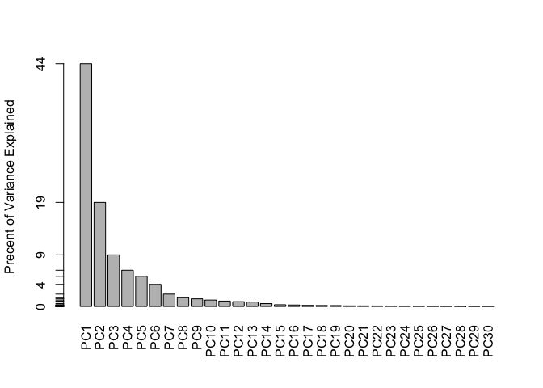
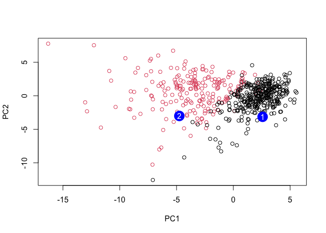

Class09mini
================
San Luc (PID: A59010657)
10/27/2021

# Exploratory data analysis

## Preparing the data

``` r
fna.data <- "WisconsinCancer.csv"

wisc.df <- read.csv(fna.data,row.names = 1)
```

### Examine your input data to ensure column names are set correctly. The id and diagnosis columns will not be used for most of the following steps (you can use the View() or head() functions here).

``` r
View(wisc.df,)
head(wisc.df, 1)
```

    ##        diagnosis radius_mean texture_mean perimeter_mean area_mean
    ## 842302         M       17.99        10.38          122.8      1001
    ##        smoothness_mean compactness_mean concavity_mean concave.points_mean
    ## 842302          0.1184           0.2776         0.3001              0.1471
    ##        symmetry_mean fractal_dimension_mean radius_se texture_se perimeter_se
    ## 842302        0.2419                0.07871     1.095     0.9053        8.589
    ##        area_se smoothness_se compactness_se concavity_se concave.points_se
    ## 842302   153.4      0.006399        0.04904      0.05373           0.01587
    ##        symmetry_se fractal_dimension_se radius_worst texture_worst
    ## 842302     0.03003             0.006193        25.38         17.33
    ##        perimeter_worst area_worst smoothness_worst compactness_worst
    ## 842302           184.6       2019           0.1622            0.6656
    ##        concavity_worst concave.points_worst symmetry_worst
    ## 842302          0.7119               0.2654         0.4601
    ##        fractal_dimension_worst  X
    ## 842302                  0.1189 NA

### Note that the first column here wisc.df$diagnosis is a pathologist provided expert diagnosis. We will not be using this for our unsupervised analysis as it is essentially the “answer” to the question which cell samples are malignant or benign.

### To make sure we don’t accidentally include this in our analysis, lets create a new data.frame that omits this first column

``` r
wisc.data <- wisc.df[,-1]
```

### Finally, setup a separate new vector called diagnosis that contains the data from the diagnosis column of the original dataset. We will store this as a factor (useful for plotting) and use this later to check our results.

``` r
diagnosis <- as.factor(wisc.df$diagnosis)
diagnosis
```

    ##   [1] M M M M M M M M M M M M M M M M M M M B B B M M M M M M M M M M M M M M M
    ##  [38] B M M M M M M M M B M B B B B B M M B M M B B B B M B M M B B B B M B M M
    ##  [75] B M B M M B B B M M B M M M B B B M B B M M B B B M M B B B B M B B M B B
    ## [112] B B B B B B M M M B M M B B B M M B M B M M B M M B B M B B M B B B B M B
    ## [149] B B B B B B B B M B B B B M M B M B B M M B B M M B B B B M B B M M M B M
    ## [186] B M B B B M B B M M B M M M M B M M M B M B M B B M B M M M M B B M M B B
    ## [223] B M B B B B B M M B B M B B M M B M B B B B M B B B B B M B M M M M M M M
    ## [260] M M M M M M M B B B B B B M B M B B M B B M B M M B B B B B B B B B B B B
    ## [297] B M B B M B M B B B B B B B B B B B B B B M B B B M B M B B B B M M M B B
    ## [334] B B M B M B M B B B M B B B B B B B M M M B B B B B B B B B B B M M B M M
    ## [371] M B M M B B B B B M B B B B B M B B B M B B M M B B B B B B M B B B B B B
    ## [408] B M B B B B B M B B M B B B B B B B B B B B B M B M M B M B B B B B M B B
    ## [445] M B M B B M B M B B B B B B B B M M B B B B B B M B B B B B B B B B B M B
    ## [482] B B B B B B M B M B B M B B B B B M M B M B M B B B B B M B B M B M B M M
    ## [519] B B B M B B B B B B B B B B B M B M M B B B B B B B B B B B B B B B B B B
    ## [556] B B B B B B B M M M M M M B
    ## Levels: B M

# Exploratory data analysis

The first step of any data analysis, unsupervised or supervised, is to
familiarize yourself with the data.

### Explore the data you created before (wisc.data and diagnosis) to answer the following questions:

Q1. How many observations are in this dataset?

``` r
nrow(wisc.data)
```

    ## [1] 569

569

Q2. How many of the observations have a malignant diagnosis?

``` r
table(diagnosis)
```

    ## diagnosis
    ##   B   M 
    ## 357 212

212

Q3. How many variables/features in the data are suffixed with \_mean?

``` r
length(grep("_mean", colnames(wisc.data)))
```

    ## [1] 10

10

# Principal Component Analysis

The next step in your analysis is to perform principal component
analysis (PCA) on wisc.data.

It is important to check if the data need to be scaled before performing
PCA. Recall two common reasons for scaling data include:

The input variables use different units of measurement. The input
variables have significantly different variances. Check the mean and
standard deviation of the features (i.e. columns) of the wisc.data to
determine if the data should be scaled. Use the colMeans() and apply()
functions like you’ve done before.

``` r
colMeans(wisc.data)
```

    ##             radius_mean            texture_mean          perimeter_mean 
    ##            1.412729e+01            1.928965e+01            9.196903e+01 
    ##               area_mean         smoothness_mean        compactness_mean 
    ##            6.548891e+02            9.636028e-02            1.043410e-01 
    ##          concavity_mean     concave.points_mean           symmetry_mean 
    ##            8.879932e-02            4.891915e-02            1.811619e-01 
    ##  fractal_dimension_mean               radius_se              texture_se 
    ##            6.279761e-02            4.051721e-01            1.216853e+00 
    ##            perimeter_se                 area_se           smoothness_se 
    ##            2.866059e+00            4.033708e+01            7.040979e-03 
    ##          compactness_se            concavity_se       concave.points_se 
    ##            2.547814e-02            3.189372e-02            1.179614e-02 
    ##             symmetry_se    fractal_dimension_se            radius_worst 
    ##            2.054230e-02            3.794904e-03            1.626919e+01 
    ##           texture_worst         perimeter_worst              area_worst 
    ##            2.567722e+01            1.072612e+02            8.805831e+02 
    ##        smoothness_worst       compactness_worst         concavity_worst 
    ##            1.323686e-01            2.542650e-01            2.721885e-01 
    ##    concave.points_worst          symmetry_worst fractal_dimension_worst 
    ##            1.146062e-01            2.900756e-01            8.394582e-02 
    ##                       X 
    ##                      NA

``` r
apply(wisc.data,2,sd)
```

    ##             radius_mean            texture_mean          perimeter_mean 
    ##            3.524049e+00            4.301036e+00            2.429898e+01 
    ##               area_mean         smoothness_mean        compactness_mean 
    ##            3.519141e+02            1.406413e-02            5.281276e-02 
    ##          concavity_mean     concave.points_mean           symmetry_mean 
    ##            7.971981e-02            3.880284e-02            2.741428e-02 
    ##  fractal_dimension_mean               radius_se              texture_se 
    ##            7.060363e-03            2.773127e-01            5.516484e-01 
    ##            perimeter_se                 area_se           smoothness_se 
    ##            2.021855e+00            4.549101e+01            3.002518e-03 
    ##          compactness_se            concavity_se       concave.points_se 
    ##            1.790818e-02            3.018606e-02            6.170285e-03 
    ##             symmetry_se    fractal_dimension_se            radius_worst 
    ##            8.266372e-03            2.646071e-03            4.833242e+00 
    ##           texture_worst         perimeter_worst              area_worst 
    ##            6.146258e+00            3.360254e+01            5.693570e+02 
    ##        smoothness_worst       compactness_worst         concavity_worst 
    ##            2.283243e-02            1.573365e-01            2.086243e-01 
    ##    concave.points_worst          symmetry_worst fractal_dimension_worst 
    ##            6.573234e-02            6.186747e-02            1.806127e-02 
    ##                       X 
    ##                      NA

Execute PCA with the prcomp() function on the wisc.data, scaling if
appropriate, and assign the output model to wisc.pr.

``` r
wisc.data <- wisc.data[,-31]
wisc.pr <- prcomp(wisc.data, scale = TRUE)
```

Inspect a summary of the results with the summary() function.

``` r
summary(wisc.pr)
```

    ## Importance of components:
    ##                           PC1    PC2     PC3     PC4     PC5     PC6     PC7
    ## Standard deviation     3.6444 2.3857 1.67867 1.40735 1.28403 1.09880 0.82172
    ## Proportion of Variance 0.4427 0.1897 0.09393 0.06602 0.05496 0.04025 0.02251
    ## Cumulative Proportion  0.4427 0.6324 0.72636 0.79239 0.84734 0.88759 0.91010
    ##                            PC8    PC9    PC10   PC11    PC12    PC13    PC14
    ## Standard deviation     0.69037 0.6457 0.59219 0.5421 0.51104 0.49128 0.39624
    ## Proportion of Variance 0.01589 0.0139 0.01169 0.0098 0.00871 0.00805 0.00523
    ## Cumulative Proportion  0.92598 0.9399 0.95157 0.9614 0.97007 0.97812 0.98335
    ##                           PC15    PC16    PC17    PC18    PC19    PC20   PC21
    ## Standard deviation     0.30681 0.28260 0.24372 0.22939 0.22244 0.17652 0.1731
    ## Proportion of Variance 0.00314 0.00266 0.00198 0.00175 0.00165 0.00104 0.0010
    ## Cumulative Proportion  0.98649 0.98915 0.99113 0.99288 0.99453 0.99557 0.9966
    ##                           PC22    PC23   PC24    PC25    PC26    PC27    PC28
    ## Standard deviation     0.16565 0.15602 0.1344 0.12442 0.09043 0.08307 0.03987
    ## Proportion of Variance 0.00091 0.00081 0.0006 0.00052 0.00027 0.00023 0.00005
    ## Cumulative Proportion  0.99749 0.99830 0.9989 0.99942 0.99969 0.99992 0.99997
    ##                           PC29    PC30
    ## Standard deviation     0.02736 0.01153
    ## Proportion of Variance 0.00002 0.00000
    ## Cumulative Proportion  1.00000 1.00000

Q4. From your results, what proportion of the original variance is
captured by the first principal components (PC1)? 44%

Q5. How many principal components (PCs) are required to describe at
least 70% of the original variance in the data? three. PC1-PC3

Q6. How many principal components (PCs) are required to describe at
least 90% of the original variance in the data? 7 PC1-PC7

Q7. What stands out to you about this plot? Is it easy or difficult to
understand? Why? it’s so hard to understand. I honestly almost cannot
see anything from the plot. What we can see is that there are PC1 and
PC2 are plot onto the coordinates and aremore abundance in one area than
the other.

``` r
biplot(wisc.pr)
```

<!-- -->

# Scatter plot observations by components 1 and 2

``` r
plot( wisc.pr$x[,1:2], col = diagnosis, 
     xlab = "PC1", ylab = "PC2")
```

<!-- -->

Q8.Generate a similar plot for principal components 1 and 3. What do you
notice about these plots?

``` r
plot(wisc.pr$x[, 1:3], col = diagnosis, 
     xlab = "PC1", ylab = "PC3")
```

<!-- -->
the graph above isn’t right so i did something worng with my code here.
However, the graph given in the assignment shows that PC1 and PC3 as
components doesnt provide clearer data and cluster then the one above.

### Because principal component 2 explains more variance in the original data than principal component 3, you can see that the first plot has a cleaner cut separating the two subgroups.

As this is such a striking result let’s see if we can use the ggplot2
package to make a more fancy figure of these results. \# Create a
data.frame for ggplot

``` r
df <- as.data.frame(wisc.pr$x)
df$diagnosis <- diagnosis
```

# Load the ggplot2 package

``` r
library(ggplot2)
```

# Make a scatter plot colored by diagnosis

``` r
ggplot(df) + 
  aes(PC1, PC2, col = diagnosis) + 
  geom_point()
```

<!-- -->

Variance explained

Calculate the variance of each principal component by squaring the sdev
component of wisc.pr \# Calculate variance of each component

``` r
pr.var <- wisc.pr$sdev^2
head(pr.var)
```

    ## [1] 13.281608  5.691355  2.817949  1.980640  1.648731  1.207357

# Variance explained by each principal component: pve

``` r
pve <- pr.var/sum(pr.var)
```

# Plot variance explained for each principal component

``` r
plot(pve, xlab = "Principal Component", 
     ylab = "Proportion of Variance Explained", 
     ylim = c(0, 1), type = "o")
```

<!-- -->

``` r
barplot(pve, ylab = "Precent of Variance Explained",
     names.arg=paste0("PC",1:length(pve)), las=2, axes = FALSE)
axis(2, at=pve, labels=round(pve,2)*100 )
```

<!-- -->

``` r
library(factoextra)
```

    ## Welcome! Want to learn more? See two factoextra-related books at https://goo.gl/ve3WBa

``` r
fviz_eig(wisc.pr, addlabels = TRUE)
```

<!-- -->

Communicating PCA results Q9. For the first principal component, what is
the component of the loading vector (i.e. wisc.pr$rotation\[,1\]) for
the feature concave.points\_mean?

``` r
wisc.pr$rotation[,1]
```

    ##             radius_mean            texture_mean          perimeter_mean 
    ##             -0.21890244             -0.10372458             -0.22753729 
    ##               area_mean         smoothness_mean        compactness_mean 
    ##             -0.22099499             -0.14258969             -0.23928535 
    ##          concavity_mean     concave.points_mean           symmetry_mean 
    ##             -0.25840048             -0.26085376             -0.13816696 
    ##  fractal_dimension_mean               radius_se              texture_se 
    ##             -0.06436335             -0.20597878             -0.01742803 
    ##            perimeter_se                 area_se           smoothness_se 
    ##             -0.21132592             -0.20286964             -0.01453145 
    ##          compactness_se            concavity_se       concave.points_se 
    ##             -0.17039345             -0.15358979             -0.18341740 
    ##             symmetry_se    fractal_dimension_se            radius_worst 
    ##             -0.04249842             -0.10256832             -0.22799663 
    ##           texture_worst         perimeter_worst              area_worst 
    ##             -0.10446933             -0.23663968             -0.22487053 
    ##        smoothness_worst       compactness_worst         concavity_worst 
    ##             -0.12795256             -0.21009588             -0.22876753 
    ##    concave.points_worst          symmetry_worst fractal_dimension_worst 
    ##             -0.25088597             -0.12290456             -0.13178394

-0.261

Q10. What is the minimum number of principal components required to
explain 80% of the variance of the data? 5, from the summary table

3.  Hierarchical clustering

# First scale the wisc.data data and assign the result to data.scaled.

## Scale the wisc.data data using the “scale()” function

``` r
data.scaled <- scale(wisc.data)
```

Calculate the (Euclidean) distances between all pairs of observations in
the new scaled dataset and assign the result to data.dist.

``` r
data.dist <- dist(data.scaled,"euclidean")
```

Create a hierarchical clustering model using complete linkage. Manually
specify the method argument to hclust() and assign the results to
wisc.hclust.

``` r
wisc.hclust <- hclust(data.dist, "complete")
```

Results of hierarchical clustering

Q11. Using the plot() and abline() functions, what is the height at
which the clustering model has 4 clusters?

``` r
plot(wisc.hclust)
abline(wisc.hclust, col= "Red", lty=2)
```

<!-- -->
I’m not sure why the red line isnt showing up… but it seems like at
around 20 where the plot has 4 clusters.

Selecting number of clusters

# This exercise will help you determine if, in this case, hierarchical clustering provides a promising new feature.

## Use cutree() to cut the tree so that it has 4 clusters. Assign the output to the variable wisc.hclust.clusters.

``` r
wisc.hclust.clusters <- cutree(wisc.hclust, k = 4)
```

We can use the table() function to compare the cluster membership to the
actual diagnoses.

``` r
table(wisc.hclust.clusters, diagnosis)
```

    ##                     diagnosis
    ## wisc.hclust.clusters   B   M
    ##                    1  12 165
    ##                    2   2   5
    ##                    3 343  40
    ##                    4   0   2

Before moving on, explore how different numbers of clusters affect the
ability of the hierarchical clustering to separate the different
diagnoses.

Q12. Can you find a better cluster vs diagnoses match by cutting into a
different number of clusters between 2 and 10?

I don’t think so, because we biologically have two diagnosis and its
false negative/false positive. I might be interpreting this wrong
though…

# Using different methods

As we discussed in our last class videos there are number of different
“methods” we can use to combine points during the hierarchical
clustering procedure. These include “single”, “complete”, “average” and
(my favorite) “ward.D2”.

Q13. Which method gives your favorite results for the same data.dist
dataset? Explain your reasoning. Based on the explanation of ward.D2, I
think I like ward.D2 the most, since they said to have an effect for
looking from individual clusters and slowly merge them into a big group,
and for our data set on cancer cell, i think it will start broad so all
clusters are merge inclusively.

# Combining methods

Clustering on PCA results

``` r
plot(wisc.pr$x[ ,1:2], col = diagnosis) 
```

<!-- -->

``` r
summary(wisc.pr)
```

    ## Importance of components:
    ##                           PC1    PC2     PC3     PC4     PC5     PC6     PC7
    ## Standard deviation     3.6444 2.3857 1.67867 1.40735 1.28403 1.09880 0.82172
    ## Proportion of Variance 0.4427 0.1897 0.09393 0.06602 0.05496 0.04025 0.02251
    ## Cumulative Proportion  0.4427 0.6324 0.72636 0.79239 0.84734 0.88759 0.91010
    ##                            PC8    PC9    PC10   PC11    PC12    PC13    PC14
    ## Standard deviation     0.69037 0.6457 0.59219 0.5421 0.51104 0.49128 0.39624
    ## Proportion of Variance 0.01589 0.0139 0.01169 0.0098 0.00871 0.00805 0.00523
    ## Cumulative Proportion  0.92598 0.9399 0.95157 0.9614 0.97007 0.97812 0.98335
    ##                           PC15    PC16    PC17    PC18    PC19    PC20   PC21
    ## Standard deviation     0.30681 0.28260 0.24372 0.22939 0.22244 0.17652 0.1731
    ## Proportion of Variance 0.00314 0.00266 0.00198 0.00175 0.00165 0.00104 0.0010
    ## Cumulative Proportion  0.98649 0.98915 0.99113 0.99288 0.99453 0.99557 0.9966
    ##                           PC22    PC23   PC24    PC25    PC26    PC27    PC28
    ## Standard deviation     0.16565 0.15602 0.1344 0.12442 0.09043 0.08307 0.03987
    ## Proportion of Variance 0.00091 0.00081 0.0006 0.00052 0.00027 0.00023 0.00005
    ## Cumulative Proportion  0.99749 0.99830 0.9989 0.99942 0.99969 0.99992 0.99997
    ##                           PC29    PC30
    ## Standard deviation     0.02736 0.01153
    ## Proportion of Variance 0.00002 0.00000
    ## Cumulative Proportion  1.00000 1.00000

I will use 4PCs and ‘hclust()’ and dist()

``` r
wisc.pr.hclust <- hclust(dist(wisc.pr$x[,1:4]), method = "ward.D2")
```

``` r
plot(wisc.pr.hclust)
abline(h=80, col= "Red")
```

<!-- -->

This looks much more promising than our previous clustering results on
the original scaled data. Note the two main branches of or dendrogram
indicating two main clusters - maybe these are malignant and benign.
Let’s find out!

``` r
grps <- cutree(wisc.pr.hclust, k=2)
table(grps)
```

    ## grps
    ##   1   2 
    ## 171 398

``` r
table(grps, diagnosis)
```

    ##     diagnosis
    ## grps   B   M
    ##    1   6 165
    ##    2 351  47

``` r
table(grps, diagnosis)
```

    ##     diagnosis
    ## grps   B   M
    ##    1   6 165
    ##    2 351  47

``` r
plot(wisc.pr$x[,1:2], col=grps)
```

<!-- -->

``` r
plot(wisc.pr$x[,1:2], col=diagnosis)
```

<!-- -->

## Use the distance along the first 7 PCs for clustering i.e. wisc.pr$x\[, 1:7\]

``` r
wisc.pr.hclust <- hclust(data.dist, method="ward.D2")
plot(wisc.pr.hclust)
```

<!-- -->

``` r
wisc.pr.hclust.clusters <- cutree(wisc.pr.hclust, k=2)

# Compare to actual diagnoses
table(wisc.pr.hclust.clusters, diagnosis)
```

    ##                        diagnosis
    ## wisc.pr.hclust.clusters   B   M
    ##                       1  20 164
    ##                       2 337  48

**Accuracy**, essentially how much did we get correct?

``` r
(165+351)/nrow(wisc.data)
```

    ## [1] 0.9068541

**Sensitivity** = True Positive/ (True positive+False Negative)

``` r
(165)/(6 + 165)
```

    ## [1] 0.9649123

**Specificity** = True Negative/ (True Negative+False Negative)

``` r
(351)/(351+47)
```

    ## [1] 0.8819095

Q17. Which of your analysis procedures resulted in a clustering model
with the best specificity? How about sensitivity?

``` r
plot(wisc.pr$x[,1:2], col=grps)
```

<!-- -->

``` r
plot(wisc.pr$x[,1:2], col=diagnosis)
```

<!-- -->

OPTIONAL: Note the color swap here as the hclust cluster 1 is mostly “M”
and cluster 2 is mostly “B” as we saw from the results of calling
table(grps, diagnosis). To match things up we can turn our groups into a
factor and reorder the levels so cluster 2 comes first and thus gets the
first color (black) and cluster 1 gets the second color (red).

# Prediction

We will use the predict() function that will take our PCA model from
before and new cancer cell data and project that data onto our PCA
space.

\#url &lt;- “new\_samples.csv”

``` r
url <- "https://tinyurl.com/new-samples-CSV"
new <- read.csv(url)
npc <- predict(wisc.pr, newdata=new)
npc
```

    ##            PC1       PC2        PC3        PC4       PC5        PC6        PC7
    ## [1,]  2.576616 -3.135913  1.3990492 -0.7631950  2.781648 -0.8150185 -0.3959098
    ## [2,] -4.754928 -3.009033 -0.1660946 -0.6052952 -1.140698 -1.2189945  0.8193031
    ##             PC8       PC9       PC10      PC11      PC12      PC13     PC14
    ## [1,] -0.2307350 0.1029569 -0.9272861 0.3411457  0.375921 0.1610764 1.187882
    ## [2,] -0.3307423 0.5281896 -0.4855301 0.7173233 -1.185917 0.5893856 0.303029
    ##           PC15       PC16        PC17        PC18        PC19       PC20
    ## [1,] 0.3216974 -0.1743616 -0.07875393 -0.11207028 -0.08802955 -0.2495216
    ## [2,] 0.1299153  0.1448061 -0.40509706  0.06565549  0.25591230 -0.4289500
    ##            PC21       PC22       PC23       PC24        PC25         PC26
    ## [1,]  0.1228233 0.09358453 0.08347651  0.1223396  0.02124121  0.078884581
    ## [2,] -0.1224776 0.01732146 0.06316631 -0.2338618 -0.20755948 -0.009833238
    ##              PC27        PC28         PC29         PC30
    ## [1,]  0.220199544 -0.02946023 -0.015620933  0.005269029
    ## [2,] -0.001134152  0.09638361  0.002795349 -0.019015820

### Plot

``` r
plot(wisc.pr$x[,1:2], col= diagnosis)
points(npc[,1], npc[,2], col="blue", pch=16, cex=3)
text(npc[,1], npc[,2], c(1,2), col="white")
```

<!-- -->

Q18. Which of these new patients should we prioritize for follow up
based on your results? patient 2 should be prioritized for follow up,
since their prediction are in the malignant group.
