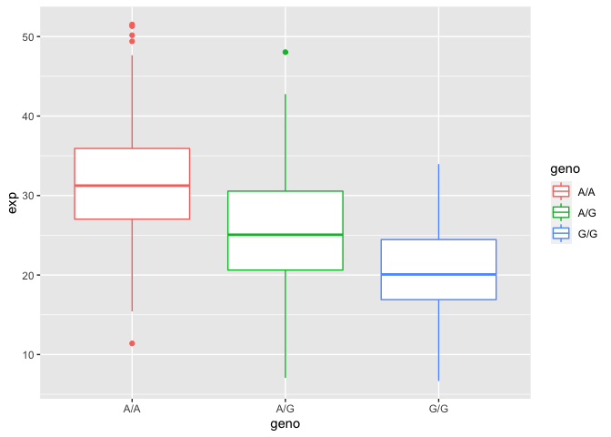

genetic\_informatic
================
San Luc (PID: A59010657)
12/4/2021

> Q13: Read this file into R and determine the sample size for each
> genotype and their corresponding median expression levels for each of
> these genotypes.

``` r
Expression <- read.table("expression.txt")
```

``` r
head(Expression)
```

    ##    sample geno      exp
    ## 1 HG00367  A/G 28.96038
    ## 2 NA20768  A/G 20.24449
    ## 3 HG00361  A/A 31.32628
    ## 4 HG00135  A/A 34.11169
    ## 5 NA18870  G/G 18.25141
    ## 6 NA11993  A/A 32.89721

``` r
nrow(Expression)
```

    ## [1] 462

``` r
table(Expression$geno)
```

    ## 
    ## A/A A/G G/G 
    ## 108 233 121

``` r
summary(Expression$exp)
```

    ##    Min. 1st Qu.  Median    Mean 3rd Qu.    Max. 
    ##   6.675  20.004  25.116  25.640  30.779  51.518

To creat box plot lets use ggplot

> Q14: Generate a boxplot with a box per genotype, what could you infer
> from the relative expression value between A/A and G/G displayed in
> this plot? Does the SNP effect the expression of ORMDL3?

``` r
library(ggplot2)
```

``` r
ggplot(Expression) + 
  aes(x = geno, y = exp, col = geno) + 
  geom_boxplot()
```

<!-- -->

looking at the graph it looks like blue has a lot lower expression than
red and green, and so it does seems like the SNP affect the epxression
of ORMDL3.
